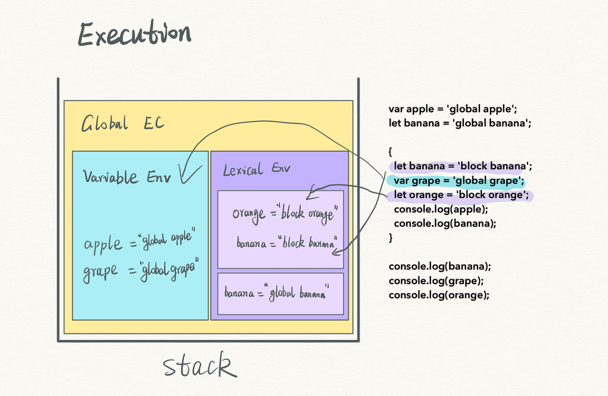
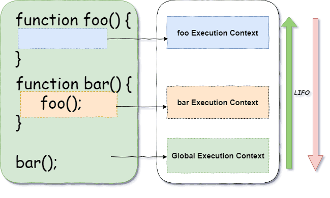

# **Scope Chain & Variable Environment**

## **1. The Core Mental Model**

JavaScript’s *scope chain* is the mechanism by which the engine **finds the value of an identifier** (variable, function, class name) at runtime.
It’s built on two key concepts from the ECMAScript spec:

* **Lexical Environment** → where block-scoped (`let`, `const`, `class`) variables live.
* **Variable Environment** → where function-scoped (`var`, function declarations) variables live.

Every time JavaScript executes code, it creates an **Execution Context** with:

1. A **Lexical Environment** (LE)
2. A **Variable Environment** (VE)
3. Other metadata (`this`, `super`, `new.target`, etc.)

The **scope chain** is a linked list of environments, starting at the current one and walking outward until the identifier is found or we hit `null` (global).

---

## **2. Lexical vs Variable Environment**

While many modern tutorials lump them together, the spec separates them because `var` behaves differently from `let`/`const`:

| Feature    | Variable Environment (VE)              | Lexical Environment (LE)                             |
| ---------- | -------------------------------------- | ---------------------------------------------------- |
| Holds      | `var` variables, function declarations | `let`, `const`, `class`, block-scoped function decls |
| Scope      | Function-level or global               | Block-level                                          |
| Hoisting   | Yes (initialized to `undefined`)       | Yes (but uninitialized → **TDZ**)                    |
| TDZ        | No                                     | Yes                                                  |
| Created at | Function or global context creation    | At block entry                                       |

---

## **3. Execution Context Lifecycle**

### **1st Phase: Creation (Hoisting)**

* Engine scans the code and creates bindings in the VE and LE.
* `var` → added to VE, initialized to `undefined`.
* Function declarations → added to VE, initialized to function object.
* `let`/`const`/`class` → added to LE, uninitialized (TDZ).
* Outer environment reference is set.


### **2nd Phase: Execution**

* Statements run top to bottom, assignments update the bindings in the current environment.
* When resolving a variable, the engine:

  1. Checks the current LE.
  2. If not found, checks the VE.
  3. If still not found, follows the **outer** reference to the next scope.
  4. Continues until found or throws `ReferenceError`.


> __Ref:__
> Pic 1
> 
> Pic 2
> 


---

## **4. Scope Chain Formation**

The scope chain is created *lexically* — by the physical nesting of code in the source, **not** by call location.

Example:

```js
const globalVar = 'global';

function outer() {
  const outerVar = 'outer';
  function inner() {
    const innerVar = 'inner';
    console.log(globalVar, outerVar, innerVar);
  }
  return inner;
}

const fn = outer();
fn(); // 'global', 'outer', 'inner'
```

Here’s the chain inside `inner()`:

```
Inner LE → Outer LE → Global LE
```

Because JavaScript uses **lexical scoping**, calling `inner` elsewhere still sees `outerVar`.

---

## **5. Closures & Environment Persistence**

When a function **returns** another function that uses outer variables, the environment is **kept alive** in memory.

```js
function makeCounter() {
  let count = 0; // in LE of makeCounter
  return function() {
    return ++count; // closes over count
  };
}
const counter = makeCounter();
counter(); // 1
counter(); // 2
```

The LE for `makeCounter` persists because `counter` still references it.

---

## **6. Block Scope and Per-Iteration Bindings**

`let` and `const` create a **new environment per block**. In loops, this can create *per-iteration* bindings.

```js
const funcs = [];
for (let i = 0; i < 3; i++) {
  funcs.push(() => console.log(i));
}
funcs[0](); // 0
funcs[1](); // 1
funcs[2](); // 2
```

With `var`, all closures would share the **same** binding → `[3, 3, 3]`.

---

## **7. Shadowing & Masking**

If a variable exists in an outer scope and you declare one with the same name in an inner scope, the inner one **shadows** the outer:

```js
let x = 1;
function test() {
  let x = 2; // shadows outer x
  console.log(x); // 2
}
```

⚠️ **TDZ + shadowing**:

```js
let y = 1;
{
  console.log(y); // ReferenceError (y in TDZ here)
  let y = 2;
}
```

---

## **8. Global Scope Differences (Script vs Module)**

* In a **script**, `var` creates a property on the `window` object; `let`/`const` don’t.
* In an **ES module**, *no* top-level declarations are added to `window`; each module has its own scope.
* Modules are **always strict mode** and have TDZ for imports.

---

## **9. `with`, `eval`, and Scope Mutation**

* `with(obj)` temporarily adds `obj` to the scope chain.
* `eval()` can inject new bindings into the current scope (non-strict).
  ⚠️ Both **break** predictability and block engine optimizations → avoid in production.

---

## **10. Variable Lookup Algorithm**

1. Start in the **current** execution context:

   * Check **Lexical Environment** first.
   * Check **Variable Environment** if not found.
2. If not found, move to the **outer** environment (the one stored when the function was created).
3. Repeat until the **global environment** is reached.
4. If still not found → `ReferenceError`.

---

## **11. Practical Gotchas Interviewers Love**

* **Calling a function before its `let` declaration** → TDZ error.
* **`var` in loops** causes closure bugs because it’s function-scoped.
* **Function in block** in strict mode → block-scoped, not hoisted to function scope.
* **Circular module imports** can give `undefined` because of TDZ in module environments.

---

## **12. Best Practices**

✅ Declare variables at the top of their scope to avoid confusion.
✅ Use `const` by default, `let` if reassignment is needed.
✅ Avoid `var` unless you *need* its function-scoped behavior.
✅ Minimize shadowing — especially for widely used names.
✅ Use ESLint rules like `no-undef`, `no-use-before-define`.

---

## **13. Mini Visual**

Example:

```js
let a = 1;
function f() {
  let b = 2;
  function g() {
    let c = 3;
    console.log(a, b, c);
  }
  g();
}
f();
```

**Scope Chain for `g()`**:

```
g’s LE { c: 3 }
↓
f’s LE { b: 2 }
↓
Global LE { a: 1 }
```


