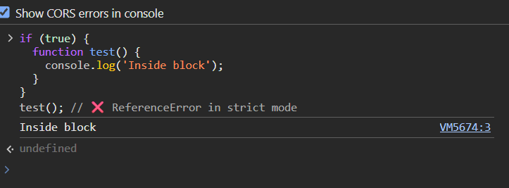
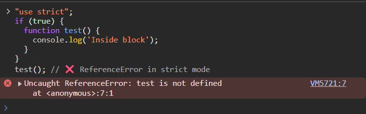

## **Common JavaScript Interview Questions — Functions**

---

### **Function Declaration vs Expression**


## **1. What is the difference between a function declaration and a function expression in JavaScript?**

### **Function Declaration**
- **Syntax:**
  ```js
  function greet() {
    console.log('Hello');
  }
  ```
- **Key Traits:**
  1. **Named** function.
  2. Processed *before* any code runs (during the **creation phase** of the execution context).
  3. Fully **hoisted** — you can call it before its definition.
  4. Always creates a binding in the **enclosing scope**.

---

### **Function Expression**
- **Syntax:**
  ```js
  const greet = function() {
    console.log('Hello');
  };
  ```
- **Key Traits:**
  1. Can be **anonymous** or **named**.
  2. Assigned to a variable at **runtime**.
  3. Only the variable is hoisted (with `var` → `undefined`; with `let`/`const` → Temporal Dead Zone).
  4. You cannot call it before the line where it’s defined.

---

### **Core Difference Table**

| Feature                          | Function Declaration | Function Expression |
|----------------------------------|----------------------|---------------------|
| **Hoisting**                     | Fully hoisted        | Only variable hoisted |
| **Execution Timing**             | Available before definition | Available after assignment |
| **Naming**                        | Always named         | Can be anonymous or named |
| **Scope**                         | Declared in enclosing scope | Declared in variable’s scope |
| **When Useful**                   | Utility/helper functions | Callbacks, conditional assignment |

---

## **2. Are function declarations hoisted differently than function expressions? Give an example.**

Yes — **declarations** are hoisted with their entire body, **expressions** are hoisted only as variables.

---

### **Example**
```js
// Function Declaration
sayHello(); // ✅ Works, full hoist
function sayHello() {
  console.log('Hello from declaration');
}

// Function Expression
sayHi(); // ❌ Error: sayHi is not a function
var sayHi = function() {
  console.log('Hi from expression');
};
```

---

### **Behind the Scenes (Hoisting in Memory Creation Phase)**

**Function Declaration:**
```
Environment Record:
  sayHello → function object { [[Code]]: console.log(...) }
```

**Function Expression (var):**
```
Environment Record:
  sayHi → undefined
```

**Function Expression (let/const):**
```
Environment Record:
  sayHi → <uninitialized>  // TDZ until assignment line
```

---

## **3. How does JavaScript handle function declarations inside if blocks?**

This is tricky because **ECMAScript spec and browser behavior differ historically**.

---

### **Modern ECMAScript (ES6+)**
- Function declarations inside blocks are **block-scoped**.
- They behave like `let` declarations in that block.
- Not hoisted to the parent scope unless explicitly intended.

**Example:**
```js
if (true) {
  function test() {
    console.log('Inside block');
  }
}
test(); // ❌ ReferenceError in strict mode
```






### **Non-Strict Mode in Older Browsers**
- Function declarations inside blocks may be **hoisted to the enclosing function scope**.
- This is **non-standard behavior** and should be avoided for portability.

---

### **Best Practice**
✅ If you need conditional logic for functions:
```js
let test;
if (condition) {
  test = function() { console.log('Condition true'); };
} else {
  test = function() { console.log('Condition false'); };
}
```

---

## **4. Can a function expression be named? What is the use case?**

Yes — **named function expressions (NFEs)** exist.

**Syntax:**
```js
const greet = function greetFunc() {
  console.log('Hello');
};
```

---

### **Why Use Them?**
1. **Better stack traces** in debugging:
   ```js
   const greet = function greetFunc() { throw new Error('Boom'); };
   greet();
   // Error stack will show "greetFunc"
   ```

2. **Self-referencing recursion** without using the outer variable:
   ```js
   const factorial = function fact(n) {
     return n <= 1 ? 1 : n * fact(n - 1);
   };
   console.log(factorial(5)); // 120
   ```

3. **Immutable internal reference**:
   - The internal name `fact` cannot be changed inside the function body, even if the outer variable changes.

---

## **Interview Tip**
If they ask: *"Can you call a function before it’s defined?"*, don’t just say **yes/no** —  
walk through **the hoisting mechanism**, show the **memory creation phase**, and explain how **TDZ** affects expressions with `let`/`const`. This depth shows you understand **execution context**.


---

### **Arrow Functions & Lexical `this`**

5. How do arrow functions handle the `this` keyword differently from regular functions?
6. Can arrow functions be used as constructors? Why or why not?
7. What happens if you use `.bind()` on an arrow function?
8. In what cases can arrow functions be problematic in **event listeners** or **object methods**?

---

### **Default Parameters**

9. How do default function parameters work in JavaScript?
10. What is the difference between default parameters and using `||` for default values?
11. Can default parameters reference other parameters in the same function? Give an example.
12. Are default parameters evaluated at function definition or at call time?

---

### **Rest & Spread Operators**

13. What is the difference between the **rest operator** and the **spread operator**?
14. How does the rest parameter behave with arrow functions?
15. Can the spread operator be used in function calls and array/object literals? Give examples.
16. Why can’t the rest parameter be used in the middle of a function’s parameter list?

---

### **Closures in Depth**

17. Explain what a closure is in JavaScript.
18. What are common use cases for closures?
19. How do closures help with **data privacy** in JavaScript?
20. What memory-related pitfalls can occur with closures?

---

### **IIFE (Immediately Invoked Function Expressions)**

21. What is an IIFE, and why was it widely used before ES6 modules?
22. How do you write an IIFE in JavaScript?
23. Can an IIFE be async?
24. What are the scoping benefits of an IIFE?

---

### **Higher-Order Functions**

#### `map`, `filter`, `reduce`

25. What is a higher-order function? Give examples from JavaScript.
26. How is `.map()` different from `.forEach()`?
27. How does `.reduce()` work? Write an example to flatten a nested array.
28. When would you use `.filter()` over `.reduce()`?

#### `forEach`

29. Does `.forEach()` return anything?
30. Can you break out early from `.forEach()`? If not, what’s the alternative?

---

### **Currying & Partial Application**

31. What is currying in JavaScript? How is it different from partial application?
32. How would you implement a curry function?
33. Why is currying useful in functional programming?
34. What’s a real-world example where partial application is more useful than currying?

---

### **Function Composition**

35. What is function composition?
36. How would you implement a `compose()` function in JavaScript?
37. How is `compose()` different from `pipe()` in functional programming?
38. Can function composition work with async functions?

