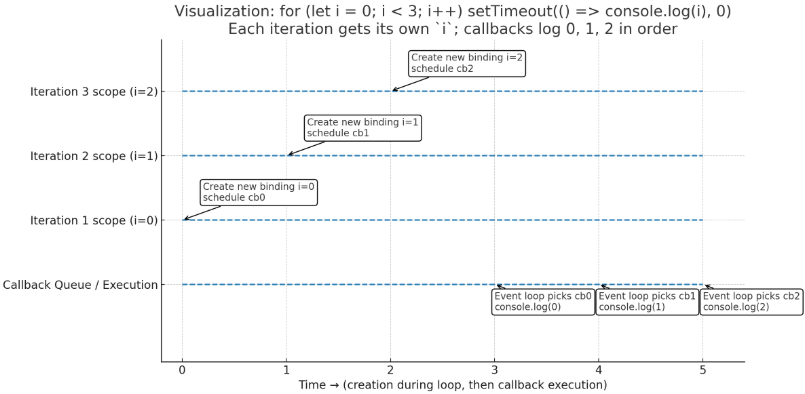
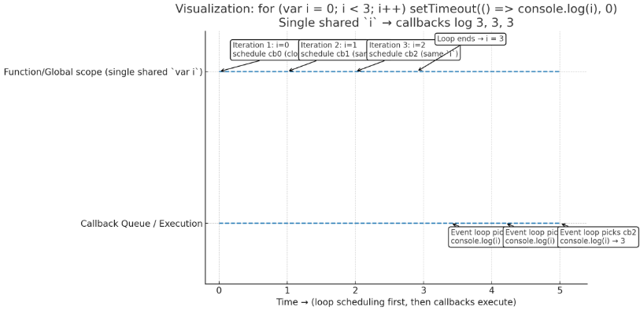

### The Closure Loop Problem (In Depth)
---

## **1. Understanding the Setup**

```js
for (var i = 0; i < 3; i++) {
  setTimeout(() => console.log(i), 0);
}
```

* The loop uses **`var`**, which is **function-scoped** (or global-scoped if not inside a function).
* This means **there is only one `i` variable** for the entire loop, shared by all iterations.
* Each iteration schedules a `setTimeout` callback.

---

## **2. Execution Context & Timeline**

Let’s walk through the loop **synchronously first** (before any timer fires):

| Iteration | i value (start) | What happens inside loop                                             | i value after iteration |
| --------- | --------------- | -------------------------------------------------------------------- | ----------------------- |
| 1         | `0`             | `setTimeout` schedules callback that will later run `console.log(i)` | `1`                     |
| 2         | `1`             | Another `setTimeout` scheduled                                       | `2`                     |
| 3         | `2`             | Another `setTimeout` scheduled                                       | `3`                     |

After the loop finishes:

* The **single `i` variable** now equals `3`.
* The `setTimeout` callbacks haven’t run yet because timers are **asynchronous**.

---

## **3. The Event Loop Kicks In**

* JavaScript finishes the loop and **only then** processes the **Callback Queue** (where the `setTimeout` callbacks are waiting).
* By the time the first callback runs, the loop is already done, and `i` is **3**.
* Since **all callbacks close over the same `i` variable**, they all see **`i = 3`**.

---

## **4. Visualizing the Closure Problem**

Think of it like this:

```js
// This is *roughly* what happens in memory
var i; // single variable

// loop schedules these:
function callback1() { console.log(i); }
function callback2() { console.log(i); }
function callback3() { console.log(i); }

// i ends up as 3 after loop
```

When each callback runs:

```js
console.log(i); // i is already 3
```

---

## **5. Why Doesn't It Print `0 1 2`?**

Because `var` does **not** create a new binding for each loop iteration.
All callbacks **share the same lexical environment**, and `i` keeps changing until the loop ends.

---

## **6. How to Fix It**

Two main ways:

**✅ Using `let` (block-scoped)**

```js
for (let i = 0; i < 3; i++) {
  setTimeout(() => console.log(i), 0);
}
// Prints: 0 1 2
```

Here, `let` creates a **new `i` for each iteration**, so each callback remembers its own value.

**✅ Using an IIFE (Immediately Invoked Function Expression)**

```js
for (var i = 0; i < 3; i++) {
  (function(iCopy) {
    setTimeout(() => console.log(iCopy), 0);
  })(i);
}
// Prints: 0 1 2
```

Here, `iCopy` is a new variable passed into each function.

---

Let’s **visualize** why the `let` version prints `0 1 2` instead of `3 3 3`.


## **1. Key Idea**

* `let` is **block-scoped**.
* In a `for` loop, JavaScript creates a **new binding of `i`** for **each iteration**.
* Each `setTimeout` callback **closes over its own copy** of `i`.

---

## **2. Step-by-Step Execution Timeline**

**Iteration 1**

```
i = 0  (new binding created for this iteration)
setTimeout stores callback_1 → remembers i=0
```

**Iteration 2**

```
i = 1  (new binding created for this iteration)
setTimeout stores callback_2 → remembers i=1
```

**Iteration 3**

```
i = 2  (new binding created for this iteration)
setTimeout stores callback_3 → remembers i=2
```

After the loop finishes, the **event loop** starts executing the queued callbacks:

**Callback Execution Order**

```
callback_1 → console.log(0)
callback_2 → console.log(1)
callback_3 → console.log(2)
```

---

## **3. Memory Visualization**

| Iteration | Scope Binding of `i` | Callback remembers |
| --------- | -------------------- | ------------------ |
| 1         | `i = 0`              | 0                  |
| 2         | `i = 1`              | 1                  |
| 3         | `i = 2`              | 2                  |

**Because each callback gets its own `i`, values stay separate.**

---

## **4. Diagram**

```
Global EC
 └── for-loop block
      ├── Iteration 1 EC → i=0 → setTimeout(cb0)
      ├── Iteration 2 EC → i=1 → setTimeout(cb1)
      ├── Iteration 3 EC → i=2 → setTimeout(cb2)
Event Loop →
      cb0 → log(0)
      cb1 → log(1)
      cb2 → log(2)
```

---


## Event-loop Timelines (let vs var)




Here’s a clean event-loop timeline that shows **why the `let` version prints `0, 1, 2`**—each loop iteration creates a **fresh binding** of `i`, and each callback closes over its own value.

* Iteration 1 schedules **cb0** with `i = 0`
* Iteration 2 schedules **cb1** with `i = 1`
* Iteration 3 schedules **cb2** with `i = 2`
* After the loop, the event loop runs the callbacks in turn → logs `0`, then `1`, then `2`


---



Here’s the **event loop timeline for the `var` version**—it shows why you get **3, 3, 3**:

* `var` is **function-scoped**, so all three callbacks **share the same `i`**.
* The loop finishes first; `i` becomes **3**.
* Then the event loop runs the queued callbacks—each reads the **same shared `i`** ⇒ logs **3**, **3**, **3**.


