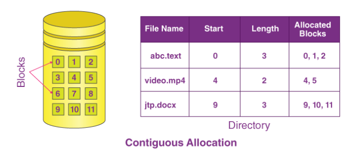
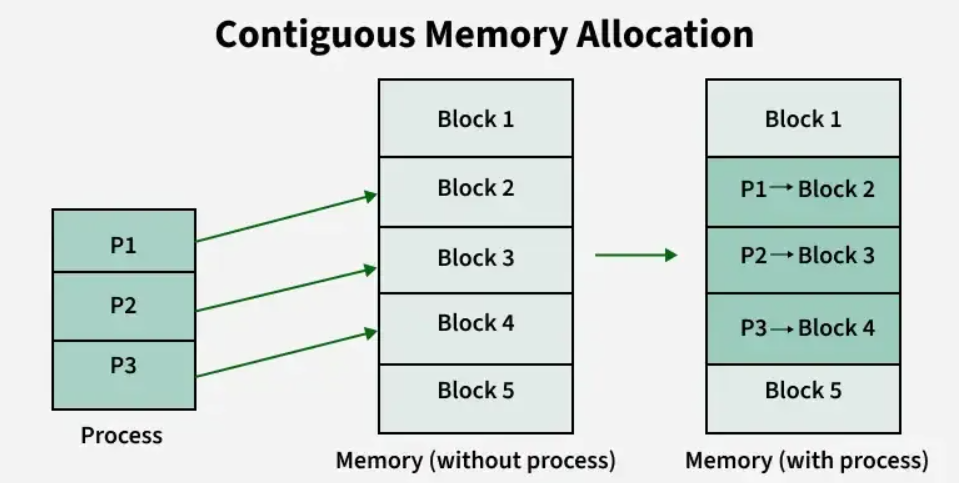

## **Memory Management – Contiguous Allocation**

### **1. Concept**

In an **Operating System**, *memory management* decides how to allocate main memory to processes and how to keep track of it.
**Contiguous allocation** is one of the simplest memory allocation schemes where **each process is stored in a single continuous block of physical memory**.

* **Definition:**
  In contiguous allocation, **all the instructions and data of a process are kept together** in one block of memory without any gaps in between.
* **Example:** If process `P1` needs 200 KB, the OS finds one continuous block of 200 KB in RAM and allocates it.
  





---

### **2. How Contiguous Allocation Works**

1. **Physical memory division**:

   * **OS region**: Usually kept at lower addresses.
   * **User processes region**: Rest of memory given to processes.
2. **Process placement**: When a process arrives, OS looks for a large enough **free contiguous block**.
3. **Base and limit registers**:

   * **Base register** → starting physical address of the process in RAM.
   * **Limit register** → size (length) of allocated block.
     These are used for **address translation** and **protection**.
4. **Memory release**: When process terminates, the entire block is freed.

---

### **3. Types of Contiguous Allocation Schemes**

There are **two main variations**:

#### **(A) Single Partition Allocation**

* Memory is split into **two parts**:

  1. OS memory (fixed, at start of RAM).
  2. One large block for **one process at a time**.
* Rarely used in multiprogramming OS because only one user program runs at a time.

#### **(B) Multiple Partition Allocation**

* The remaining memory is divided into **multiple partitions**.
* **Fixed partitioning**:

  * RAM divided into fixed-size blocks at system startup.
  * Each partition holds exactly one process.
  * **Internal fragmentation** occurs if process size < partition size.
* **Dynamic partitioning**:

  * Partitions created on the fly based on process size.
  * Eliminates internal fragmentation but introduces **external fragmentation** (small free holes between allocated blocks).

---

### **4. Placement Strategies (Dynamic Partitioning)**

When searching for a free block, OS may use:

1. **First Fit** → Allocate first block large enough to hold process.
2. **Best Fit** → Allocate smallest block large enough (minimizes leftover space but increases fragmentation).
3. **Worst Fit** → Allocate largest block (may reduce small unusable holes).
4. **Next Fit** → Like first fit but search starts from the last allocated position.

---

### **5. Fragmentation Issues**

**Fragmentation** = unusable wasted memory.

* **Internal Fragmentation**:

  * Wastage **inside** allocated partition (process smaller than partition size).
  * Common in **fixed partitioning**.
* **External Fragmentation**:

  * Wastage **between** allocated blocks (free memory scattered in small chunks).
  * Common in **dynamic partitioning**.
* **Compaction**:

  * Process of shifting allocated memory blocks to merge free spaces into one large block.
  * Requires process relocation support.

---

### **6. Advantages & Disadvantages**

| **Advantages**                                       | **Disadvantages**                                                          |
| ---------------------------------------------------- | -------------------------------------------------------------------------- |
| Simple to implement.                                 | External fragmentation in dynamic partitions.                              |
| Low overhead for address translation (base + limit). | Internal fragmentation in fixed partitions.                                |
| Fast access as all data is in one block.             | Processes may be limited by largest available hole, not total free memory. |
| Predictable performance.                             | Compaction required to combat fragmentation, which is costly.              |

---

### **7. GATE Exam Tips**

* **Formula** for calculating *Effective Access Time* is not directly relevant here (used in paging), but **fragmentation calculation** is common.
* GATE often gives:

  * **Free block sizes** + **process sizes** → asks you to simulate *First Fit*, *Best Fit*, *Worst Fit*.
  * Questions on **internal vs external fragmentation**.
  * **Compaction feasibility** questions.
* **Address translation in contiguous allocation**:

  ```
  Physical Address = Base Register + Logical Address
  ```

  (Valid if Logical Address < Limit Register)

---

### **8. Example**

**Memory (in KB)**:
`[OS: 0–99] [Free: 100–399] [P1: 400–799] [Free: 800–999]`

**Request**: Process P2 needs 250 KB.

* **First Fit**: Allocates 100–399 (300 KB available).
* **Best Fit**: Also allocates 100–399 (since it’s smallest available hole ≥ 250 KB).
* **Worst Fit**: Allocates 800–999 (only 200 KB → cannot fit).

---

If you want, I can also make you a **full GATE-style diagram** showing **contiguous allocation with fixed/dynamic partitions**, **fragmentation**, and **compaction process** so you can remember it visually in 30 seconds.
Do you want me to prepare that?
