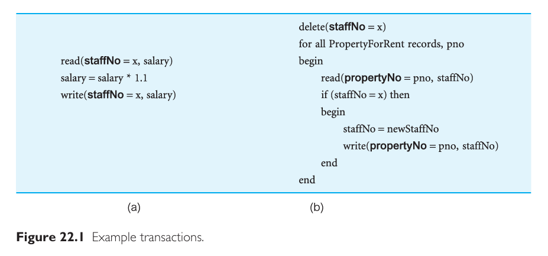
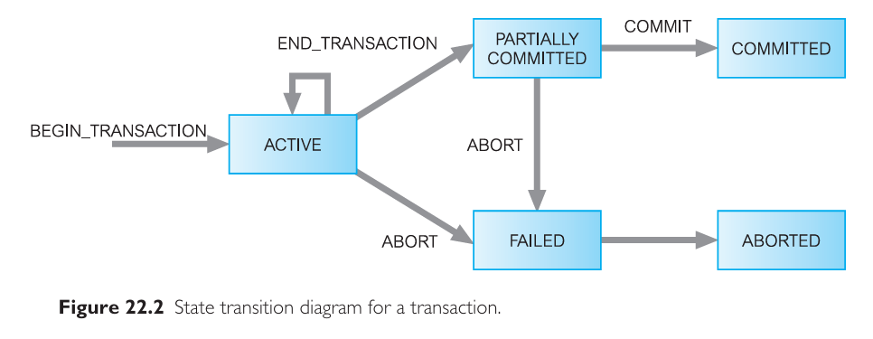

# **22.1 Transaction Support**

### Concept of a Transaction

* A **transaction** is a sequence of database operations (read, write, update, delete) treated as a **single logical unit of work**.
* Goal: ensure that either *all* operations are successfully applied to the database, or *none* at all.



### Properties of Transactions (ACID)

1. **Atomicity** – Either the whole transaction occurs, or nothing occurs. Partial effects must not remain.
2. **Consistency** – A transaction takes the database from one valid state to another valid state, preserving all rules, constraints, and relationships.
3. **Isolation** – Concurrent transactions must not interfere with each other. Execution should appear as if they ran one after another.
4. **Durability** – Once a transaction commits, its changes are permanent, even if the system crashes immediately afterward.

### Transaction States

1. **Active** – Transaction is currently executing.
2. **Partially Committed** – Final statement executed, but commit not yet confirmed.
3. **Committed** – Transaction completed successfully, effects made permanent.
4. **Failed** – Some error occurred, preventing completion.
5. **Aborted** – Transaction rolled back, changes undone.



---

# **22.2 Concurrency Control**

### Why Concurrency Control?

* Multiple transactions often execute at the same time to improve system performance.
* Without control, conflicts can occur, leading to data anomalies.

### Common Anomalies in Concurrent Transactions

1. **Lost Update** – Two transactions overwrite each other’s changes.
2. **Dirty Read** – A transaction reads uncommitted changes from another.
3. **Unrepeatable Read** – Same query gives different results when executed multiple times within a transaction.
4. **Phantom Read** – A transaction re-executes a query and sees new rows inserted by another transaction.

### Serializability

* **Goal**: Concurrent execution should be equivalent to some serial order of transactions.
* **Conflict Serializability** – Based on conflicting operations (Read-Write, Write-Read, Write-Write). Checked using a **precedence graph**.
* **View Serializability** – Weaker than conflict-based; focuses on preserving the same final read and write effects.

### Concurrency Control Techniques

**1. Lock-Based Protocols**

* **Shared Lock (S)** – For reading only.
* **Exclusive Lock (X)** – For both reading and writing.
* **Two-Phase Locking (2PL)** – Transactions acquire locks before releasing them, in two phases:

  * *Growing phase* (acquire locks)
  * *Shrinking phase* (release locks)
* Variants: Strict 2PL, Rigorous 2PL (ensures recoverability).

**2. Deadlocks**

* Occurs when transactions wait on each other indefinitely.
* Solutions:

  * Prevention (ordering transactions, pre-claiming locks).
  * Detection (wait-for graph cycle detection).
  * Recovery (abort one transaction to break the cycle).

**3. Timestamp Ordering**

* Each transaction gets a unique timestamp.
* Operations are executed in timestamp order to ensure serializability.
* Prevents deadlocks but may cause frequent rollbacks.

**4. Multiversion Concurrency Control (MVCC)**

* Maintains multiple versions of data items.
* Readers access older versions while writers update new ones.
* Eliminates read-write conflicts, improves concurrency.

---

# **22.3 Database Recovery**

### Need for Recovery

* Failures (system crash, disk failure, software errors, power outages) may interrupt transactions.
* Recovery ensures the database returns to a consistent state.

### Types of Failures

1. **Transaction Failure** – Logical error or input failure.
2. **System Crash** – Hardware/software crash before commit.
3. **Media Failure** – Disk crash causing permanent data loss.
4. **Communication Failure** – Network breakdown in distributed databases.

### Recovery Concepts

**1. Write-Ahead Logging (WAL)**

* All changes are first recorded in a log before being written to the database.
* Ensures that recovery can use the log to redo or undo changes.

**2. Checkpoints**

* Periodically save the current database state.
* During recovery, system starts from the latest checkpoint to reduce overhead.

**3. Deferred Update (No-Undo/Redo)**

* Updates are written to log but not applied to the database until commit.
* If crash occurs before commit → no changes needed.

**4. Immediate Update (Undo/Redo)**

* Updates are applied to the database as they occur.
* If crash happens:

  * For committed transactions → **redo** operations from log.
  * For uncommitted → **undo** operations.

**5. Steal vs No-Steal, Force vs No-Force**

* **Steal**: Buffer can write uncommitted changes to disk (needs undo).
* **No-Steal**: Only committed changes written.
* **Force**: Commit forces all changes to disk (needs redo).
* **No-Force**: Commit doesn’t guarantee immediate disk write (needs redo).

**6. ARIES Recovery Algorithm**

* Widely used in practice.
* Follows three phases:

  1. **Analysis** – Identify active transactions and dirty pages at crash.
  2. **Redo** – Reapply all actions to bring DB to latest state.
  3. **Undo** – Rollback incomplete transactions.

---

✅ This version now includes:

* ACID with states,
* Concurrency anomalies + serializability with conflict/view theory,
* Locking, deadlocks, timestamps, MVCC,
* Recovery models (deferred/immediate, WAL, ARIES).

This is the **complete depth** you need for exams.

---

## ==Real world examples (MySQL)==

Here’s how the **22.1–22.3** concepts look **in MySQL (InnoDB)** with hands-on snippets you can try. I’ll show everything as two terminals: **Session A** and **Session B**.

---

# 0) Quick setup

```sql
-- Create a playground schema and table
CREATE DATABASE IF NOT EXISTS demo_tx;
USE demo_tx;

DROP TABLE IF EXISTS accounts;
CREATE TABLE accounts (
  id INT PRIMARY KEY,
  name VARCHAR(50),
  balance INT NOT NULL
) ENGINE=InnoDB;

INSERT INTO accounts (id, name, balance) VALUES
(1, 'Alice', 1000),
(2, 'Bob',   1000);
```

---

# 1) Transactions & ACID (22.1)

### Atomic transfer with rollback/commit

**Session A**

```sql
SET autocommit = 0;
START TRANSACTION;

-- Move 200 from Alice -> Bob
UPDATE accounts SET balance = balance - 200 WHERE id = 1;
UPDATE accounts SET balance = balance + 200 WHERE id = 2;

-- Check intermediate view
SELECT * FROM accounts WHERE id IN (1,2);

-- Decide:
COMMIT;   -- or ROLLBACK;
```

### Savepoints (partial rollback)

```sql
START TRANSACTION;
UPDATE accounts SET balance = balance - 100 WHERE id = 1;
SAVEPOINT step1;

UPDATE accounts SET balance = balance + 100 WHERE id = 2;
-- Oops, want to undo the second step only:
ROLLBACK TO step1;

COMMIT;
```

---

# 2) Isolation, anomalies, and locks (22.2)

## Defaults & changing isolation

```sql
-- Check current isolation (InnoDB default is REPEATABLE READ)
SELECT @@tx_isolation, @@transaction_isolation;

-- Change for the session
SET SESSION TRANSACTION ISOLATION LEVEL READ COMMITTED;      -- or READ UNCOMMITTED / REPEATABLE READ / SERIALIZABLE
```

## Lost update (what it looks like without locking reads)

*Goal*: show why we lock when updating the same row from two sessions.

**Session A**

```sql
SET autocommit=0;
START TRANSACTION;
SELECT balance FROM accounts WHERE id=1;        -- say 1000
UPDATE accounts SET balance = balance + 50 WHERE id=1;  -- 1050 (not committed yet)
-- Don't commit yet
```

**Session B**

```sql
SET autocommit=0;
START TRANSACTION;
SELECT balance FROM accounts WHERE id=1;        -- might read 1000 (depends on isolation; see below)
UPDATE accounts SET balance = balance + 30 WHERE id=1;  -- 1030
COMMIT;
```

**Session A**

```sql
COMMIT;
```

Depending on isolation and lock timing, one update can overwrite the other’s basis (a classic lost-update pattern). **Prevent it** by using **locking reads** before computing the new balance:

```sql
-- Correct pattern (use locking read)
START TRANSACTION;
SELECT balance FROM accounts WHERE id=1 FOR UPDATE;   -- X-lock on row
UPDATE accounts SET balance = balance + 50 WHERE id=1;
COMMIT;
```

## Dirty read / non-repeatable read / phantom

* **READ UNCOMMITTED** can see uncommitted changes (dirty reads).
* **READ COMMITTED** prevents dirty reads but allows non-repeatable reads.
* **REPEATABLE READ** (MySQL default) prevents non-repeatable reads via MVCC snapshot; may allow phantoms unless you use locking reads.
* **SERIALIZABLE** prevents phantoms by converting reads to range locks.

### Non-repeatable read demo

**Session A (READ COMMITTED)**

```sql
SET SESSION TRANSACTION ISOLATION LEVEL READ COMMITTED;
START TRANSACTION;
SELECT balance FROM accounts WHERE id=2;  -- returns 1000
-- keep txn open
```

**Session B**

```sql
START TRANSACTION;
UPDATE accounts SET balance = balance + 500 WHERE id=2;
COMMIT;
```

**Session A (again)**

```sql
SELECT balance FROM accounts WHERE id=2;  -- returns 1500 now (non-repeatable read)
COMMIT;
```

Under **REPEATABLE READ**, Session A would keep seeing its original snapshot (1000) for plain `SELECT`, unless it used locking reads.

### Phantom prevention with locking (next-key locks)

Suppose we block inserts into a range we’re analyzing.

**Session A (REPEATABLE READ)**

```sql
START TRANSACTION;
-- Lock the range so new rows in [balance >= 1000] can’t “appear”
SELECT id FROM accounts WHERE balance >= 1000 FOR UPDATE;
```

**Session B**

```sql
-- This insert that fits the locked range will block until A commits/rolls back
INSERT INTO accounts(id, name, balance) VALUES (3, 'Carol', 1200);
```

**InnoDB** uses **next-key locks (gap + record locks)** for `FOR UPDATE` on range predicates to prevent phantoms.

## Locking read flavors (important)

```sql
-- Lock for writers (exclusive-intent)
SELECT ... FOR UPDATE;

-- Shared lock for readers (others may also read; writers blocked)
SELECT ... LOCK IN SHARE MODE;        -- MySQL 5.7
SELECT ... FOR SHARE;                  -- MySQL 8.0+ (preferred)
```

## Deadlocks: detection & handling

Two transactions take locks in opposite order → deadlock. InnoDB **detects and aborts one** with error **1213**.

**What you’ll see**

```txt
ERROR 1213 (40001): Deadlock found when trying to get lock; try restarting transaction
```

**Inspect**

```sql
SHOW ENGINE INNODB STATUS\G   -- look at the latest deadlock section
```

**Good practice**

* Lock rows in a **consistent order** (e.g., smaller id first).
* Keep transactions **short**; avoid user think-time inside a txn.
* Use **indexing** to lock fewer rows.

---

# 3) Recovery & durability (22.3)

## What protects what

* **Undo log** ⇒ atomicity (roll back incomplete transactions).
* **Redo log** (InnoDB log) ⇒ durability (replay committed changes).
* **Binary log** ⇒ replication & point-in-time recovery.
* **Checkpoints** ⇒ faster crash recovery.

## Durability settings (trade-offs)

```sql
-- Full durability (safer, slower)
SELECT @@innodb_flush_log_at_trx_commit;   -- 1 = flush log at each COMMIT
SELECT @@sync_binlog;                       -- 1 = sync binlog on each write

-- Safer defaults for critical systems:
-- innodb_flush_log_at_trx_commit = 1
-- sync_binlog = 1
```

For higher throughput (with small risk on power loss), some use:

* `innodb_flush_log_at_trx_commit = 2` (fs cache flush per second),
* `sync_binlog = 100` (batch fsyncs).

## Point-in-time recovery (binlog)

**Backup**

```bash
# Logical backup
mysqldump --single-transaction --routines --triggers --databases demo_tx > demo_tx.sql
```

**Restore + replay**

1. Restore dump,
2. Apply binary logs using `mysqlbinlog` up to a timestamp/position.

```bash
mysqlbinlog --start-datetime="2025-08-20 10:00:00" --stop-datetime="2025-08-20 12:00:00" /var/lib/mysql/binlog.000123 | mysql
```

> Ensure `log_bin` is enabled and you retain binlogs long enough (`expire_logs_days` / `binlog_expire_logs_seconds` or MySQL 8.0’s `binlog_expire_logs_seconds`/`binlog_expire_logs_auto_purge`).

## Crash recovery (automatic)

On restart after a crash, InnoDB:

* Replays **redo log** to bring pages current,
* Uses **undo** to roll back incomplete transactions.

You usually just start `mysqld`; InnoDB does the recovery automatically.

---

# 4) Practical patterns (copy-paste ready)

### Safe balance update (lock + compute)

```sql
START TRANSACTION;

-- Lock the row to prevent lost updates
SELECT balance FROM accounts WHERE id = 1 FOR UPDATE;

-- Business rule checks here (e.g., prevent negative balances)
UPDATE accounts SET balance = balance - 300 WHERE id = 1 AND balance >= 300;

COMMIT;
```

### Prevent phantoms on aggregated reads

```sql
START TRANSACTION;

-- Lock the range to keep aggregation stable against inserts/updates in range
SELECT SUM(balance) FROM accounts WHERE balance >= 1000 FOR UPDATE;

COMMIT;
```

### Idempotent transfers

```sql
-- idempotency token pattern
CREATE TABLE IF NOT EXISTS transfers (
  id BIGINT PRIMARY KEY,
  from_id INT, to_id INT, amount INT,
  created_at TIMESTAMP DEFAULT CURRENT_TIMESTAMP
) ENGINE=InnoDB;

-- Try once; duplicates will fail the PK, so application can retry safely
START TRANSACTION;
INSERT INTO transfers (id, from_id, to_id, amount) VALUES (123456, 1, 2, 250);

UPDATE accounts SET balance = balance - 250 WHERE id = 1;
UPDATE accounts SET balance = balance + 250 WHERE id = 2;

COMMIT;
```

---

# 5) Quick checklist

* Use **`START TRANSACTION` / `COMMIT` / `ROLLBACK`** (turn off autocommit for multi-step work).
* For read-modify-write on the **same row**, use **`SELECT … FOR UPDATE`**.
* For **range stability** (avoid phantoms), use **locking reads** (`FOR UPDATE`/`FOR SHARE`) or **SERIALIZABLE**.
* Keep transactions **short**; lock in a **consistent order**; handle **1213** by retrying.
* For durability: set **`innodb_flush_log_at_trx_commit=1`** and **`sync_binlog=1`** for critical systems.
* Take **regular backups** and keep **binary logs** for point-in-time recovery.

---

> Q. __So as a Java developer in modern days how  these transactions are written in pure sql or any other definitive way?__

How *application developers* (like Java devs) actually handle transactions today. Let's break it down clearly:

---

## 1. Transactions in Pure SQL

At the database level, transactions are always SQL-based:

```sql
START TRANSACTION;
UPDATE accounts SET balance = balance - 100 WHERE id=1;
UPDATE accounts SET balance = balance + 100 WHERE id=2;
COMMIT;
```

or with error handling:

```sql
START TRANSACTION;
UPDATE ...;
IF ERROR THEN
    ROLLBACK;
ELSE
    COMMIT;
END IF;
```

That’s the **raw form** (like you just tried in MySQL Workbench).

---

## 2. How Java Developers Actually Write Them

==In **modern applications**, you don’t usually write raw `START TRANSACTION`/`COMMIT` SQL in your code. Instead, you rely on **transaction managers** in frameworks like **JDBC, JPA/Hibernate, or Spring**.==

---

### ✅ Option A: JDBC (low-level)

Manually manage the transaction:

```java
Connection conn = dataSource.getConnection();
try {
    conn.setAutoCommit(false); // START TRANSACTION
    
    PreparedStatement stmt1 = conn.prepareStatement(
        "UPDATE accounts SET balance = balance - ? WHERE id=?");
    stmt1.setInt(1, 100);
    stmt1.setInt(2, 1);
    stmt1.executeUpdate();

    PreparedStatement stmt2 = conn.prepareStatement(
        "UPDATE accounts SET balance = balance + ? WHERE id=?");
    stmt2.setInt(1, 100);
    stmt2.setInt(2, 2);
    stmt2.executeUpdate();
    
    conn.commit(); // COMMIT
} catch (Exception e) {
    conn.rollback(); // ROLLBACK
} finally {
    conn.close();
}
```

Here, `autoCommit=false` = `START TRANSACTION`.
`commit()` = `COMMIT`.
`rollback()` = `ROLLBACK`.

---

### ✅ Option B: JPA/Hibernate (ORM)

ORMs abstract away transaction handling. You use an `EntityManager`:

```java
EntityManager em = emf.createEntityManager();
EntityTransaction tx = em.getTransaction();

try {
    tx.begin(); // START TRANSACTION
    
    Account acc1 = em.find(Account.class, 1);
    acc1.setBalance(acc1.getBalance() - 100);

    Account acc2 = em.find(Account.class, 2);
    acc2.setBalance(acc2.getBalance() + 100);

    tx.commit(); // COMMIT
} catch (Exception e) {
    tx.rollback(); // ROLLBACK
}
```

---

### ✅ Option C: Spring Framework (==most common today==)

==Developers rarely write `commit()`/`rollback()` manually. They use **`@Transactional`**:==

```java
@Service
public class TransferService {

    @Transactional
    public void transfer(int fromId, int toId, int amount) {
        Account from = accountRepository.findById(fromId).get();
        from.setBalance(from.getBalance() - amount);

        Account to = accountRepository.findById(toId).get();
        to.setBalance(to.getBalance() + amount);

        accountRepository.save(from);
        accountRepository.save(to);
    }
}
```

* Spring opens a transaction at method start.
* If the method completes: `COMMIT`.
* If it throws an exception: `ROLLBACK`.

==Developers just annotate and forget — Spring + JDBC/JPA handle SQL transaction boundaries.==

---

## 3. Modern Best Practice

* ==**You rarely write raw SQL transactions** in app code unless doing something very custom.==
* Instead:

  * Use **ORM + @Transactional** (Spring Boot apps).
  * Or **JDBC template / transaction manager** if you need raw SQL.
* SQL transaction control (`START TRANSACTION`, `COMMIT`, etc.) is left to the framework.

---

 So, as a **modern Java dev**, you usually declare intent (`@Transactional`) and ==let the framework handle commits/rollbacks==. Under the hood, ==it still translates to SQL transaction commands.==


