__Mock data setup__: 

```sql

-- Create db
CREATE DATABASE company_db;

-- Select that db
USE company_db;

-- Create Department Table
CREATE TABLE Department (
    dept_id INT PRIMARY KEY,
    dept_name VARCHAR(50) NOT NULL
);

-- Create Employee Table
CREATE TABLE Employee (
    emp_id INT PRIMARY KEY,
    name VARCHAR(50) NOT NULL,
    salary DECIMAL(10,2),
    dept_id INT,
    FOREIGN KEY (dept_id) REFERENCES Department(dept_id)
);


-- CS and Math Students
CREATE TABLE CS_Students (
    roll_no INT PRIMARY KEY
);
CREATE TABLE Math_Students (
    roll_no INT PRIMARY KEY
);


-- SAMPLE DATA

-- Department Data
INSERT INTO Department VALUES 
(1, 'HR'),
(2, 'Finance'),
(3, 'IT'),
(4, 'Sales');

-- Employee Data
INSERT INTO Employee VALUES
(101, 'Alice', 60000, 1),
(102, 'Bob', 45000, 1),
(103, 'Charlie', 55000, 2),
(104, 'David', 70000, 2),
(105, 'Eva', 30000, 3),
(106, 'Frank', 80000, 3),
(107, 'Grace', NULL, 3),  -- salary = NULL (for NULL queries)
(108, 'Hank', 40000, 4),
(109, 'Ivy', 90000, 4),
(110, 'Jack', 20000, 4);

-- CS Students
INSERT INTO CS_Students VALUES
(1), (2), (3), (4), (5);

-- Math Students
INSERT INTO Math_Students VALUES
(3), (4), (6), (7), (8);

-- Verify 
SELECT * FROM Department;
SELECT * FROM Employee;
SELECT * FROM CS_Students;
SELECT * FROM Math_Students;
```

---

> ```sql 
> SELECT * FROM Department;
> ```
> 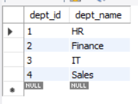

> ```sql 
> SELECT * FROM Employee;
> ```
> 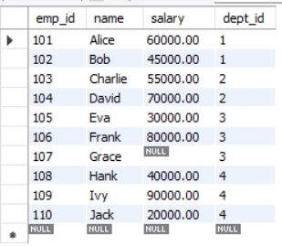

> ```sql 
> SELECT * FROM CS_Students;
> ```
> 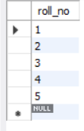


> ```sql 
> SELECT * FROM Math_Students;
> ```
> 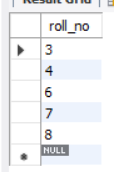

--- 

## **SET - 1**

# 📘 SQL Questions and Answers (GATE Level)

### **1. Basic SELECT Query**

**Q:** Consider the relation `Employee(emp_id, name, salary, dept_id)`.
Write a query to display names of employees earning more than ₹50,000.

**A:**

```sql
SELECT name 
FROM Employee
WHERE salary > 50000;
```
> 

---

### **2. Aggregate Functions**

**Q:** Find the average salary of employees in each department.

**A:**

```sql
SELECT dept_id, AVG(salary) AS avg_salary
FROM Employee
GROUP BY dept_id;
```

> 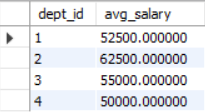

---

### **3. Nested Query**

**Q:** Find employees who earn the maximum salary in their department.

**A:**

```sql
SELECT name, dept_id
FROM Employee e
WHERE salary = (
    SELECT MAX(salary)
    FROM Employee
    WHERE dept_id = e.dept_id
);
```
> 

---

### **4. JOIN Query**

**Q:** Given relations:

* `Employee(emp_id, name, dept_id)`
* `Department(dept_id, dept_name)`

Write a query to display employees along with their department name.

**A:**

```sql
SELECT e.name, d.dept_name
FROM Employee e
JOIN Department d ON e.dept_id = d.dept_id;
```
> 

---

### **5. Set Operations**

**Q:** Suppose there are two relations:

* `CS_Students(roll_no)`
* `Math_Students(roll_no)`

Find students who study **both CS and Math**.

**A:**

```sql
SELECT roll_no
FROM CS_Students
INTERSECT
SELECT roll_no
FROM Math_Students;
```

> 

---

### **6. Integrity Constraint**

**Q:** What happens if we try to insert a duplicate value into a column declared as `PRIMARY KEY`?

**A:**
The insertion fails, because a **PRIMARY KEY** enforces both **uniqueness** and **NOT NULL** constraints.

---

### **7. SQL with EXISTS**

**Q:** Find employees who work in departments that have more than 2 employees.

**A:**

```sql
SELECT name
FROM Employee e
WHERE EXISTS (
    SELECT 1
    FROM Employee e2
    WHERE e.dept_id = e2.dept_id
    GROUP BY e2.dept_id
    HAVING COUNT(*) > 2
);
```
> 

---

### **8. DELETE with Subquery** ==[Not working in MySQL workbench...need to check]==

**Q:** Delete employees who earn less than the average salary.

**A:**

```sql
DELETE FROM Employee
WHERE salary < (SELECT AVG(salary) FROM Employee);
```


---

### **9. SQL and Null Handling**

**Q:** What will be the result of the query?

```sql
SELECT * 
FROM Employee
WHERE salary = NULL;
```

**A:**
It will return **no rows**, because comparison with `NULL` using `=` always results in **UNKNOWN**.
The correct way:

```sql
WHERE salary IS NULL;
```

---

### **10. GATE-Style Conceptual Question**

**Q:** Suppose relation `R(a, b)` has tuples:

```
(1, 2), (2, NULL), (3, 5), (4, NULL)
```

What will be the result of:

```sql
SELECT COUNT(b) FROM R;
```

**A:**

* `COUNT(b)` counts only **non-NULL values of b**.
* Here, `b` values are `{2, NULL, 5, NULL}` → **2 values are non-null**.
* **Answer: 2**

---


## **SET - 2**


# 🔥 SQL Practice Questions (MySQL-Compatible)

---

### **1. Highest Paid Employee in Each Department**

```sql
SELECT e.name, e.salary, d.dept_name
FROM Employee e
JOIN Department d ON e.dept_id = d.dept_id
WHERE e.salary = (
    SELECT MAX(salary)
    FROM Employee
    WHERE dept_id = e.dept_id
);
```

> 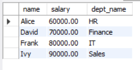

---

### **2. Employees Whose Salary is Below Department Average**

```sql
SELECT e.name, e.salary, d.dept_name
FROM Employee e
JOIN Department d ON e.dept_id = d.dept_id
WHERE e.salary < (
    SELECT AVG(salary)
    FROM Employee
    WHERE dept_id = e.dept_id
);
```
> 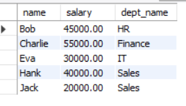


---

### **3. Find Departments with More than 2 Employees**

```sql
SELECT d.dept_name, COUNT(*) AS emp_count
FROM Employee e
JOIN Department d ON e.dept_id = d.dept_id
GROUP BY d.dept_id, d.dept_name
HAVING COUNT(*) > 2;
```
> 

---

### **4. Employees Without a Salary Assigned (NULL handling)**

```sql
SELECT name, dept_id
FROM Employee
WHERE salary IS NULL;
```
> 

---

### **5. Find Students Who Study Both CS and Math (No INTERSECT in MySQL)**

```sql
SELECT roll_no
FROM CS_Students
WHERE roll_no IN (SELECT roll_no FROM Math_Students);
```
> 

---

### **6. Find Students Who Study CS But Not Math (EXCEPT equivalent)**

```sql
SELECT roll_no
FROM CS_Students
WHERE roll_no NOT IN (SELECT roll_no FROM Math_Students);
```
> 


> __Note__:
> ```sql
> SELECT roll_no FROM Math_Students; 
> ```
> 
> and
> ```sql
> SELECT roll_no FROM CS_Students; 
> ```
> 

---

### **7. Employees with the Top 3 Salaries**

```sql
SELECT name, salary
FROM Employee
ORDER BY salary DESC
LIMIT 3;
```
> 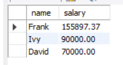

---

### **8. Second Highest Salary**

```sql
SELECT DISTINCT salary
FROM Employee
ORDER BY salary DESC
LIMIT 1 OFFSET 1;
```

> 

---

### **9. Delete Employees Below Average Salary (Fixed for MySQL)** ==[Query not working..will check later]==

```sql
DELETE FROM Employee
WHERE salary < (
    SELECT avg_salary
    FROM (SELECT AVG(salary) AS avg_salary FROM Employee) AS temp
);
```

Here

```sql
SELECT AVG(salary) AS avg_salary FROM Employee
```


---

### **10. Increase Salary of Employees in IT Department by 10%**

```sql
UPDATE Employee
SET salary = salary * 1.10
WHERE dept_id = (SELECT dept_id FROM Department WHERE dept_name = 'IT');
```

before 
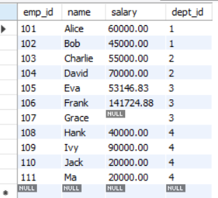

after IT dept (dept_id=3) hike

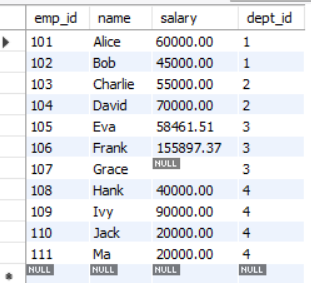

---

### **11. Display Employees Working in More Than One Department (Hypothetical Multi-Dept Case)**


*(Right now our schema allows 1 dept per employee, but this query works if you extend it.)*

Let's modify, 

```sql

-- Allow an employee to belong to multiple departments
CREATE TABLE EmployeeDepartment (
  emp_id  INT NOT NULL,
  dept_id INT NOT NULL,
  assigned_on DATE DEFAULT (CURRENT_DATE),
  PRIMARY KEY (emp_id, dept_id),
  FOREIGN KEY (emp_id)  REFERENCES Employee(emp_id)  ON DELETE CASCADE,
  FOREIGN KEY (dept_id) REFERENCES Department(dept_id) ON DELETE RESTRICT
);

-- Backfill existing single-dept assignments into the junction table
INSERT INTO EmployeeDepartment (emp_id, dept_id)
SELECT emp_id, dept_id FROM Employee WHERE dept_id IS NOT NULL;


-- Add some multi-department examples
INSERT INTO EmployeeDepartment (emp_id, dept_id) VALUES
  (101, 3),  -- Alice also in IT
  (106, 4);  -- Frank also in Sales
  
SELECT * FROM EmployeeDepartment;
```
> __EmployeeDepartment__ table
> 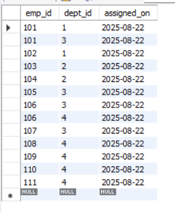


Now the query: 

```sql
SELECT emp_id, COUNT(DISTINCT dept_id) AS dept_count
FROM EmployeeDepartment
GROUP BY emp_id
HAVING COUNT(DISTINCT dept_id) > 1;
```


---

### **12. Employees with Names Starting with ‘A’**

```sql
SELECT *
FROM Employee
WHERE name LIKE 'A%';
```
> 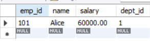

---

### **13. Employees Who Earn the Same Salary as Someone Else**

```sql
SELECT e1.emp_id, e1.name, e1.salary
FROM Employee e1
JOIN Employee e2 ON e1.salary = e2.salary AND e1.emp_id <> e2.emp_id;
```
> Note: `<>` means not equal. Same as `!=`

> adding a new row 
> ```sql
> INSERT INTO Employee VALUES (111, 'Ma', 20000, 4);
> ``` 
> new table 
> 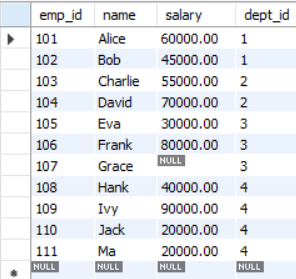
> Then after running the query, 
> output
> 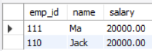

---

### **14. Department with Maximum Total Salary Expense**

```sql
SELECT d.dept_name, SUM(e.salary) AS total_salary
FROM Employee e
JOIN Department d ON e.dept_id = d.dept_id
GROUP BY d.dept_id, d.dept_name
ORDER BY total_salary DESC
LIMIT 1;
```
> 

---

### **15. Employees in Departments That Have at Least One Employee with Salary > 80,000**

```sql
SELECT DISTINCT e.name, e.dept_id
FROM Employee e
WHERE e.dept_id IN (
    SELECT dept_id
    FROM Employee
    WHERE salary > 80000
);
```
> 
> The DISTINCT keyword in SQL is used to retrieve only unique values, eliminating duplicates from query results
---

👉 This set is **15 queries** covering:

* Joins
* Aggregates
* Subqueries
* Set operations (MySQL-friendly)
* Updates & Deletes
* NULL handling
* Ranking queries (LIMIT, OFFSET)

---

