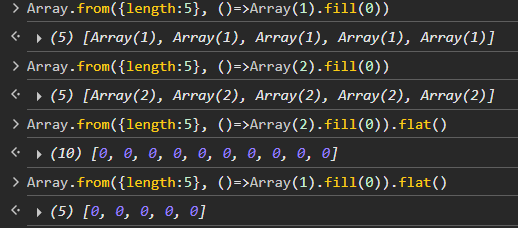
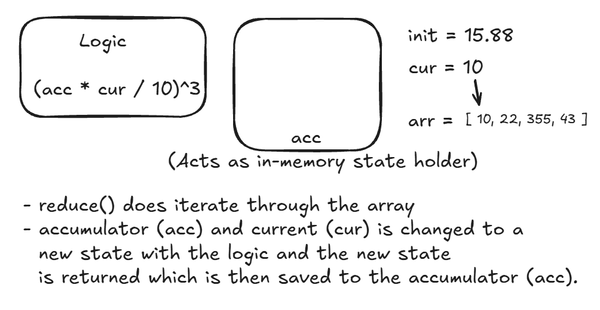
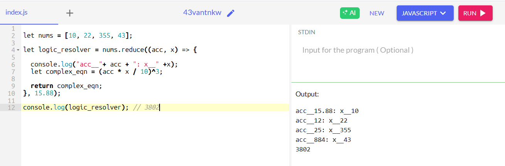
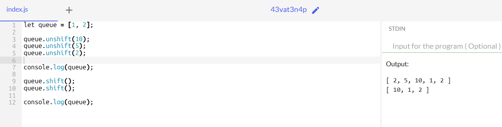

## **Important JavaScript functions and built-ins** that are very handy for **competitive coding** (fast problem solving, array/string manipulation, math, etc.):

---

## 🔹 Array Functions

* `map(fn)`, `filter(fn)`, `reduce(fn, init)` → functional programming tricks.
* `forEach(fn)` → quick iteration (though loops are often faster).
* `sort((a,b) => a-b)` → sorting numbers correctly.
* `reverse()`, `slice(start, end)`, `splice(start, count, ...items)` → subarray handling.
* `concat(arr)`, `flat(depth)`, `flatMap(fn)` → merging and flattening arrays.
* `find(fn)`, `findIndex(fn)`, `some(fn)`, `every(fn)` → quick checks.
* `includes(x)`, `indexOf(x)`, `lastIndexOf(x)` → searching.
* `push()`, `pop()`, `shift()`, `unshift()` → stack/queue behavior.

---

## 🔹 String Functions

* `split(separator)`, `join(separator)` → switching between strings/arrays.
* `substring(start, end)`, `slice(start, end)` → substrings.
* `replace(pattern, replacement)`, `replaceAll(pattern, replacement)` → substitutions.
* `match(regex)`, `matchAll(regex)` → regex extraction.
* `toUpperCase()`, `toLowerCase()`, `trim()` → cleaning input.
* `charCodeAt(i)`, `String.fromCharCode(x)` → char ↔ ASCII conversions.
* `includes(substring)`, `startsWith(x)`, `endsWith(x)` → pattern checks.

---

## 🔹 Math Functions

* `Math.max(...arr)`, `Math.min(...arr)` → extremes.
* `Math.floor(x)`, `Math.ceil(x)`, `Math.round(x)`, `Math.trunc(x)` → rounding.
* `Math.abs(x)`, `Math.sqrt(x)`, `Math.pow(a, b)` → basics.
* `Math.log(x)`, `Math.log2(x)`, `Math.log10(x)` → logarithms.
* `Math.random()` → random numbers.
* `Number.MAX_SAFE_INTEGER`, `Number.MIN_SAFE_INTEGER` → boundaries.

---

## 🔹 Object & Utility Functions

* `Object.keys(obj)`, `Object.values(obj)`, `Object.entries(obj)` → iterating over objects/maps.
* `Object.fromEntries(entries)` → convert back to object.
* `JSON.stringify(obj)`, `JSON.parse(str)` → serialization/deserialization.

---

## 🔹 Set & Map

* `new Set(arr)` → remove duplicates quickly.
* `set.add(x)`, `set.has(x)`, `set.delete(x)` → membership checks.
* `new Map()`, `map.set(k, v)`, `map.get(k)`, `map.has(k)` → hash maps.

---

## 🔹 ES6+ Tricks Useful in Contests

* Spread operator: `[...arr]`, `{...obj}` → copy/merge.
* Destructuring: `const [a, b] = arr;`, `const {x, y} = obj;`.
* Default params: `function f(a=0, b=1) { … }`.
* Arrow functions: `arr.map(x => x*2)`.
* Template literals: `` `${a}+${b}=${a+b}` ``.

---

## 🔹 Competitive Coding Quick Hacks

* **Unique elements**: `Array.from(new Set(arr))`.
* **Frequency map**:

  ```js
  const freq = {};
  for (let x of arr) freq[x] = (freq[x] || 0) + 1;
  ```
* **Sorting numbers**: `arr.sort((a, b) => a - b)`.
* **String reversal**: `str.split('').reverse().join('')`.
* **2D Array init**: `Array.from({length:n}, ()=>Array(m).fill(0))`. You can use flat() for convenience. 
  

* **Modulo fix (positive)**: `((x % m) + m) % m`.


> __More on Modulo fix:__

The **positive modulo fix** `((x % m) + m) % m` is a classic trick in contests because in JavaScript, `%` is a **remainder operator**, not a true modulo.

That means if `x` is negative, `x % m` can also be negative.
This trick forces it into the **\[0, m-1] range**.

---

# 🔹 Example Without Fix

```js
let m = 5;

console.log(-7 % m);  // -2 ❌ (negative, not proper modulo)
console.log(7 % m);   // 2 ✅
```

---

# 🔹 Example With Fix

```js
let m = 5;

function mod(x, m) {
  return ((x % m) + m) % m;
}

console.log(mod(-7, m)); // 3 ✅
console.log(mod(7, m));  // 2 ✅
```

📌 Why?

* `-7 % 5 = -2`
* Add `m`: `-2 + 5 = 3`
* Then `% 5 = 3` (correct positive modulo)

---

# 🔹 Real Competitive Coding Use Cases

### 1. Cyclic Arrays

```js
let arr = ["A", "B", "C", "D"];
function getElement(idx) {
  return arr[((idx % arr.length) + arr.length) % arr.length];
}
console.log(getElement(-1)); // "D"
console.log(getElement(5));  // "B"
```

### 2. Rotating Indices

```js
function rotateRight(idx, shift, n) {
  return ((idx + shift) % n + n) % n;
}
console.log(rotateRight(0, -1, 5)); // 4
console.log(rotateRight(2, 3, 5));  // 0
```

---

✅ In short:

* Use `%` directly only when inputs are guaranteed **non-negative**.
* Use `((x % m) + m) % m` when inputs can be **negative** to always get a positive index/number.


---

⚡ **Tip**: In contests, speed > fancy functions. Master `for`, `while`, and the above **array/string tricks**, since 90% of problems boil down to **loops + hash maps + sorting + math functions**.


---

## ==Examples Set 1==


## 🔹 Functional Programming Tricks

### `map(fn)`

Transforms each element.

```js
let nums = [1, 2, 3];
let squared = nums.map(x => x * x);  
console.log(squared); // [1, 4, 9]
```

### `filter(fn)`

Keeps only elements that match a condition.

```js
let nums = [5, 12, 8, 20];
let greater10 = nums.filter(x => x > 10);
console.log(greater10); // [12, 20]
```

### `reduce(fn, init)`

Reduces array into a single value.

```js
let nums = [1, 2, 3, 4];
let sum = nums.reduce((acc, x) => acc + x, 0);
console.log(sum); // 10
```

### In brief: 






---

## 🔹 Iteration

### `forEach(fn)`

Executes for each element.

```js
let arr = ["a", "b", "c"];
arr.forEach((x, i) => console.log(i, x));
// 0 'a', 1 'b', 2 'c'
```

---

## 🔹 Sorting

### `sort((a,b)=>a-b)`

Correct way to sort numbers.

```js
let nums = [10, 2, 30, 1];
nums.sort((a, b) => a - b);
console.log(nums); // [1, 2, 10, 30]
```

---

## 🔹 Subarray Handling

### `reverse()`

Reverses array.

```js
let arr = [1, 2, 3];
arr.reverse();
console.log(arr); // [3, 2, 1]
```

### `slice(start, end)`

Returns part (non-mutating).

```js
let arr = [10, 20, 30, 40];
console.log(arr.slice(1, 3)); // [20, 30]
```

### `splice(start, count, ...items)`

Removes/replaces (mutating).

```js
let arr = [1, 2, 3, 4];
arr.splice(1, 2, 99);  
console.log(arr); // [1, 99, 4]
```

---

## ==Slice vs Splice==


# 🔹 `slice(start, end)` → Copy Only (non-destructive)

Suppose we have:

```
Index:   0    1    2    3    4
Array: [10,  20,  30,  40,  50]
```

### Example → `arr.slice(1, 4)`

* Start = **1** → element at index `1` → `20`
* End = **4** → stop *before* index `4` → element at index `3` → `40`

📌 Result = `[20, 30, 40]`
📌 Original unchanged.

```
Original: [10, 20, 30, 40, 50]
Result:   [20, 30, 40]
```

---

# 🔹 `splice(start, deleteCount, ...items)` → Modify (destructive)

Same starting array:

```
Index:   0    1    2    3    4
Array: [10,  20,  30,  40,  50]
```

### Example → `arr.splice(1, 2)`

* Start = **1** → element at index `1` → `20`
* DeleteCount = **2** → remove `20` and `30`

📌 Removed = `[20, 30]`
📌 Remaining = `[10, 40, 50]`

```
Before: [10, 20, 30, 40, 50]
After:  [10, 40, 50]
```

---

### Example → `arr.splice(2, 1, 99, 100)`

* Start = **2** → element at index `2` → `30`
* DeleteCount = **1** → remove `30`
* Insert = `99, 100`

📌 Removed = `[30]`
📌 Modified = `[10, 20, 99, 100, 40, 50]`

```
Before: [10, 20, 30, 40, 50]
After:  [10, 20, 99, 100, 40, 50]
```

---

✅ **Quick memory hack**

* `slice` → **non-destructive**
* `splice` → **destructive (changes original)**

---


---

## 🔹 Merging & Flattening

### `concat(arr)`

Merges arrays.

```js
let a = [1, 2], b = [3, 4];
console.log(a.concat(b)); // [1, 2, 3, 4]
```

### `flat(depth)`

Flattens nested arrays.

```js
let arr = [1, [2, [3]]];
console.log(arr.flat(2)); // [1, 2, 3]
```

### `flatMap(fn)`

Map + flatten in one step.

```js
let arr = [1, 2, 3];
console.log(arr.flatMap(x => [x, x*2]));
// [1, 2, 2, 4, 3, 6]
```

==Note:== 

```js
  const deeplyNested = [1, [2, [3, 4]], 5];

  // flatMap only flattens one level
  const result1 = deeplyNested.flatMap(item => item);
  console.log(result1); // Output: [1, 2, [3, 4], 5]

  // To flatten completely, use flat() with a depth
  const result2 = deeplyNested.flat(Infinity);
  console.log(result2); // Output: [1, 2, 3, 4, 5]
```

---

## 🔹 Quick Checks

### `find(fn)`

Finds first matching element.

```js
let arr = [5, 12, 8];
console.log(arr.find(x => x > 10)); // 12
```

### `findIndex(fn)`

Finds index of first match.

```js
let arr = [5, 12, 8];
console.log(arr.findIndex(x => x > 10)); // 1
```

### `some(fn)`

True if __any__ element passes.

```js
let arr = [1, 3, 5];
console.log(arr.some(x => x % 2 === 0)); // false
```

### `every(fn)`

True if __all__ elements pass.

```js
let arr = [2, 4, 6];
console.log(arr.every(x => x % 2 === 0)); // true
```

---

## 🔹 Searching

### `includes(x)`

Checks existence.

```js
let arr = [1, 2, 3];
console.log(arr.includes(2)); // true
```

### `indexOf(x)`

First index of element.

```js
let arr = [1, 2, 3, 2];
console.log(arr.indexOf(2)); // 1
```

### `lastIndexOf(x)`

Last index of element.

```js
let arr = [1, 2, 3, 2];
console.log(arr.lastIndexOf(2)); // 3
```

---

## 🔹 Stack / Queue Behavior

### `push(), pop()` → Stack

```js
let stack = [];
stack.push(10);
stack.push(20);
console.log(stack.pop()); // 20
```

### `unshift(), shift()` → Queue

```js
let queue = [1, 2];
queue.unshift(0);  
console.log(queue); // [0, 1, 2]
console.log(queue.shift()); // 0
```



---

## ==Examples Set 2==

# 🔹 Switching Between Strings & Arrays

### `split(separator)`

Breaks string into an array.

```js
let s = "apple,banana,grape";
console.log(s.split(",")); 
// ["apple", "banana", "grape"]
```

### `join(separator)`

Joins array into a string.

```js
let arr = ["apple", "banana", "grape"];
console.log(arr.join(" - ")); 
// "apple - banana - grape"
```

---

# 🔹 Substrings

### `substring(start, end)`

Extracts part of string (end **excluded**).

```js
let s = "JavaScript";
console.log(s.substring(4, 10)); 
// "Script"
```

### `slice(start, end)`

Works similarly but supports **negative indexes**.

```js
let s = "JavaScript";
console.log(s.slice(-6, -1)); 
// "Scrip"
```

## <ins>In brief: `substring` vs `slice`

`substring` and `slice` look similar in JavaScript when used on strings, but they have some **key differences**. Let’s break them down:

---

# 🔹 `substring(start, end)`

* Extracts characters from `start` to **end (exclusive)**.
* **Swaps arguments** if `start > end`.
* **Does not support negative indexes** (treats them as `0`).

### Example:

```js
let str = "JavaScript";

console.log(str.substring(4, 10)); 
// "Script"  (from index 4 to 9)

console.log(str.substring(10, 4)); 
// "Script"  (same result, because it swaps)

console.log(str.substring(-3, 4)); 
// "Java" (negative treated as 0)
```

---

# 🔹 `slice(start, end)`

* Extracts characters from `start` to **end (exclusive)**.
* **Does NOT swap** if `start > end` → returns `""`.
* **Supports negative indexes** (counts from end).

### Example:

```js
let str = "JavaScript";

console.log(str.slice(4, 10)); 
// "Script" (from index 4 to 9)

console.log(str.slice(10, 4)); 
// "" (empty, no swap like substring)

console.log(str.slice(-6, -1)); 
// "Scrip" (negative index counts from end)
```

---

# ✅ Quick Comparison

| Feature                   | `substring`       | `slice`                                            |
| ------------------------- | ----------------- | -------------------------------------------------- |
| End index **exclusive**   | ✅                 | ✅                                                  |
| Swaps args if start > end | ✅ Yes             | ❌ No (returns `""`)                                |
| Negative indexes          | ❌ Treated as `0`  | ✅ Supported                                        |
| Common use                | Simple extraction | Flexible (supports negatives, substrings from __end__) |

---

👉 **Rule of thumb**:

* Use **`slice`** when you want more power (negative indexes, strict control).
* Use **`substring`** for simple cases (safe if you’re not sure about order of arguments).


---

# 🔹 Substitutions

### `replace(pattern, replacement)`

Replaces **first match** only.

```js
let s = "I love Java. Java is great!";
console.log(s.replace("Java", "JS")); 
// "I love JS. Java is great!"
```

### `replaceAll(pattern, replacement)`

Replaces **all matches**.

```js
let s = "I love Java. Java is great!";
console.log(s.replaceAll("Java", "JS")); 
// "I love JS. JS is great!"
```

---

# 🔹 Regex Extraction

### `match(regex)`

Returns first match or array of matches.

```js
let s = "abc123def456";
console.log(s.match(/\d+/));    
// ["123"]
console.log(s.match(/\d+/g));  
// ["123", "456"]
```

### `matchAll(regex)`

Iterator for **all matches with details**.

```js
let s = "test1 test2";
let matches = [...s.matchAll(/test(\d)/g)];
console.log(matches[0][0]); // "test1"
console.log(matches[0][1]); // "1"
console.log(matches[1][0]); // "test2"
console.log(matches[1][1]); // "2"
```

---

# 🔹 Cleaning Input

### `toUpperCase()` / `toLowerCase()`

```js
let s = "Hello";
console.log(s.toUpperCase()); // "HELLO"
console.log(s.toLowerCase()); // "hello"
```

### `trim()`

Removes spaces from **both ends**.

```js
let s = "   spaced out   ";
console.log(s.trim()); 
// "spaced out"
```

---

# 🔹 Char ↔ ASCII

### `charCodeAt(i)` → char → ASCII

```js
let s = "ABC";
console.log(s.charCodeAt(0)); // 65
console.log(s.charCodeAt(1)); // 66
```

### `String.fromCharCode(x)` → ASCII → char

```js
console.log(String.fromCharCode(65)); // "A"
console.log(String.fromCharCode(66)); // "B"
```

---

# 🔹 Pattern Checks

### `includes(substring)`

```js
let s = "JavaScript";
console.log(s.includes("Script")); // true
```

### `startsWith(x)`

```js
let s = "JavaScript";
console.log(s.startsWith("Java")); // true
```

### `endsWith(x)`

```js
let s = "JavaScript";
console.log(s.endsWith("Script")); // true
```

---

✅ That covers **all the major string helpers** you’ll use in competitive coding.


---

## ==Examples Set 3==

Let’s go through **all those Math functions** with clear **examples and outputs** (as if you’re coding in a contest).

---

# 🔹 Extremes

### `Math.max(...arr)`, `Math.min(...arr)`

Finds the largest or smallest number.

```js
let arr = [3, 7, 2, 9, 5];
console.log(Math.max(...arr)); // 9
console.log(Math.min(...arr)); // 2
```

---

# 🔹 Rounding

### `Math.floor(x)` → round **down**

```js
console.log(Math.floor(4.9)); // 4
console.log(Math.floor(-4.9)); // -5
```

### `Math.ceil(x)` → round **up**

```js
console.log(Math.ceil(4.1)); // 5
console.log(Math.ceil(-4.1)); // -4
```

### `Math.round(x)` → nearest integer

```js
console.log(Math.round(4.4)); // 4
console.log(Math.round(4.6)); // 5
```

### `Math.trunc(x)` → remove decimal (towards 0)

```js
console.log(Math.trunc(4.9));  // 4
console.log(Math.trunc(-4.9)); // -4
```

---

# 🔹 Basics

### `Math.abs(x)` → absolute value

```js
console.log(Math.abs(-10)); // 10
```

### `Math.sqrt(x)` → square root

```js
console.log(Math.sqrt(25)); // 5
```

### `Math.pow(a, b)` → exponentiation (a^b)

```js
console.log(Math.pow(2, 3)); // 8
```

⚡ (Shortcut: `2 ** 3` also works → 8)

---

# 🔹 Logarithms

### `Math.log(x)` → natural log (==base **e**==)

```js
console.log(Math.log(1)); // 0
```

### `Math.log2(x)` → log base 2

```js
console.log(Math.log2(8)); // 3
```

### `Math.log10(x)` → log base 10

```js
console.log(Math.log10(1000)); // 3
```

---

# 🔹 Random Numbers

### `Math.random()` → random float \[0, 1)

```js
console.log(Math.random()); // e.g., 0.374829...
```

**Random integer in range \[min, max]:**

```js
function randInt(min, max) {
  return Math.floor(Math.random() * (max - min + 1)) + min;
}
console.log(randInt(1, 6)); // random dice roll 1–6
```

---

# 🔹 Number Boundaries

### `Number.MAX_SAFE_INTEGER` & `Number.MIN_SAFE_INTEGER`

```js
console.log(Number.MAX_SAFE_INTEGER); // 9007199254740991
console.log(Number.MIN_SAFE_INTEGER); // -9007199254740991
```

⚡ Beyond this range, integers may lose precision.

---

✅ These cover the most **contest-relevant Math helpers**.

---

## ==Examples Set 4==

Let’s go through **Object & Utility Functions** with clear **examples and outputs**.

---

# 🔹 Iterating Over Objects

### `Object.keys(obj)` → array of keys

```js
let person = { name: "Alice", age: 25, city: "Paris" };
console.log(Object.keys(person)); 
// ["name", "age", "city"]
```

### `Object.values(obj)` → array of values

```js
console.log(Object.values(person)); 
// ["Alice", 25, "Paris"]
```

### `Object.entries(obj)` → array of \[key, value] pairs

```js
console.log(Object.entries(person)); 
// [["name", "Alice"], ["age", 25], ["city", "Paris"]]

// Example: iterating
for (let [key, value] of Object.entries(person)) {
  console.log(`${key}: ${value}`);
}
// name: Alice
// age: 25
// city: Paris
```

### ==More on `Object.entires`==

When you use **`Object.entries()`** on a nested object, it only gives the **top-level keys with their values**. If a value is itself an object, it won’t automatically flatten it — you’ll just get the object reference.


### Example: Nested Object

```js
let person = { 
  name: "Alice", 
  age: 25, 
  address: { city: "Paris", country: "France" }
};

console.log(Object.entries(person));
```

**Output:**

```js
[
  ["name", "Alice"],
  ["age", 25],
  ["address", { city: "Paris", country: "France" }]
]
```

👉 Notice how `"address"` just maps to the inner object, not its entries.

---

### Iterating Nested

If you want to go inside:

```js
for (let [key, value] of Object.entries(person)) {
  if (typeof value === "object" && value !== null) {
    console.log(`${key}:`);
    for (let [subKey, subVal] of Object.entries(value)) {
      console.log("   ", subKey, "=>", subVal);
    }
  } else {
    console.log(`${key} => ${value}`);
  }
}
```

**Output:**

```
name => Alice
age => 25
address:
    city => Paris
    country => France
```

---

### Flattening Trick

If you want a **flat representation** (like for competitive coding / data handling):

```js
function flatten(obj, parentKey = "", res = {}) {
  for (let [key, val] of Object.entries(obj)) {
    let newKey = parentKey ? `${parentKey}.${key}` : key;
    if (typeof val === "object" && val !== null) {
      flatten(val, newKey, res);
    } else {
      res[newKey] = val;
    }
  }
  return res;
}

let flatPerson = flatten(person);
console.log(flatPerson);
```

**Output:**

```js
{
  "name": "Alice",
  "age": 25,
  "address.city": "Paris",
  "address.country": "France"
}
```

---

✅ So:

* **Default** `Object.entries()` → shallow (top-level only).
* To handle **nested** objects → you either loop recursively or flatten.


---

# 🔹 Converting Back to Object

### `Object.fromEntries(entries)`

```js
let entries = [["name", "Bob"], ["age", 30]];
let obj = Object.fromEntries(entries);
console.log(obj); 
// { name: "Bob", age: 30 }
```

---

# 🔹 Serialization / Deserialization

### `JSON.stringify(obj)` → object → JSON string

```js
let user = { name: "Charlie", age: 28, active: true };
let jsonStr = JSON.stringify(user);
console.log(jsonStr); 
// '{"name":"Charlie","age":28,"active":true}'
```

### `JSON.parse(str)` → JSON string → object

```js
let parsed = JSON.parse(jsonStr);
console.log(parsed); 
// { name: "Charlie", age: 28, active: true }
console.log(parsed.name); // "Charlie"
```

---

✅ **Quick Hack**: Convert `Map`/`Object` back and forth

```js
let map = new Map([["a", 1], ["b", 2]]);
let objFromMap = Object.fromEntries(map);
console.log(objFromMap); // { a: 1, b: 2 }

let obj = { x: 10, y: 20 };
let mapFromObj = new Map(Object.entries(obj));
console.log(mapFromObj); // Map(2) { 'x' => 10, 'y' => 20 }
```

---


## ==Examples Set 5==


Let’s go step by step with **detailed examples** on **Set** and **Map** in JavaScript — these are super useful for competitive coding because they give you **O(1) average-time lookups**.

---

# 🔹 **Set**

### 1. `new Set(arr)` → remove duplicates quickly

```js
let nums = [1, 2, 2, 3, 4, 4, 5];
let unique = new Set(nums);

console.log(unique);        // Set {1, 2, 3, 4, 5}
console.log([...unique]);   // [1, 2, 3, 4, 5] → converted back to array
```

---

### 2. `set.add(x)` → insert element

```js
let s = new Set();
s.add(10);
s.add(20);
s.add(10); // duplicate → ignored
console.log(s); // Set {10, 20}
```

---

### 3. `set.has(x)` → check membership

```js
console.log(s.has(10)); // true
console.log(s.has(30)); // false
```

---

### 4. `set.delete(x)` → remove element

```js
s.delete(10);
console.log(s); // Set {20}
```

---

### 5. Iterating over a Set

```js
let set = new Set([1, 2, 3]);
for (let val of set) {
  console.log(val);
}
// 1
// 2
// 3
```

✅ **Contest usage**: Removing duplicates, checking existence fast, or representing visited nodes in graph problems.

---

# 🔹 **Map**

Unlike objects, **Map keys can be any type** (numbers, strings, objects, functions).

### 1. `new Map()`

```js
let m = new Map();
```

---

### 2. `map.set(k, v)` → insert key-value pair

```js
m.set("name", "Alice");
m.set("age", 25);
m.set(100, "score");    // number key
m.set({x:1}, "point");  // object key
console.log(m);
```

---

### 3. `map.get(k)` → get value

```js
console.log(m.get("name")); // "Alice"
console.log(m.get(100));    // "score"
```

---

### 4. `map.has(k)` → check key existence

```js
console.log(m.has("age")); // true
console.log(m.has("city")); // false
```

---

### 5. Iterating over a Map

```js
for (let [key, value] of m) {
  console.log(key, "=>", value);
}
// name => Alice
// age => 25
// 100 => score
// {x:1} => point
```

---

### 6. Map vs Object (quick difference)

```js
let obj = { name: "Bob", age: 30 };
console.log(Object.keys(obj));   // ["name", "age"]

let map = new Map(Object.entries(obj));
console.log(map); // Map(2) { 'name' => 'Bob', 'age' => 30 }
```

✅ **Contest usage**:

* `Set` → uniqueness, visited tracking
* `Map` → frequency counting, adjacency lists, custom hash maps

---

⚡ Quick Competitive Coding Example → **Frequency Counter with Map**

```js
function frequency(arr) {
  let map = new Map();
  for (let x of arr) {
    map.set(x, (map.get(x) || 0) + 1);
  }
  return map;
}

console.log(frequency([1,1,2,3,3,3]));
// Map { 1 => 2, 2 => 1, 3 => 3 }
```

---


## ==Examples Set 6==

Here are **detailed ES6+ examples** for contest-useful tricks, with outputs and quick notes so you see how they help in fast coding.

---

# 🔹 1. Spread Operator (`...`)

### Copying arrays/objects

```js
let arr = [1, 2, 3];
let copyArr = [...arr];
console.log(copyArr); // [1, 2, 3]

let obj = { a: 1, b: 2 };
let copyObj = { ...obj };
console.log(copyObj); // { a: 1, b: 2 }
```

### Merging arrays/objects

```js
let arr1 = [1, 2], arr2 = [3, 4];
let mergedArr = [...arr1, ...arr2];
console.log(mergedArr); // [1, 2, 3, 4]

let o1 = { x: 1 }, o2 = { y: 2 };
let mergedObj = { ...o1, ...o2 };
console.log(mergedObj); // { x: 1, y: 2 }
```

---

# 🔹 2. Destructuring

### Arrays

```js
let nums = [10, 20, 30];
const [a, b] = nums;
console.log(a, b); // 10 20
```

### Skipping + Rest

```js
const [first, , third] = nums;
console.log(first, third); // 10 30

const [head, ...rest] = nums;
console.log(head); // 10
console.log(rest); // [20, 30]
```

### Objects

```js
let person = { name: "Alice", age: 25 };
const { name, age } = person;
console.log(name, age); // Alice 25
```

---

# 🔹 3. Default Params

```js
function multiply(a, b = 2) {
  return a * b;
}
console.log(multiply(5));    // 10 (b defaults to 2)
console.log(multiply(5, 3)); // 15
```

---

# 🔹 4. Arrow Functions

Short and handy inside higher-order functions:

```js
let arr = [1, 2, 3];
let doubled = arr.map(x => x * 2);
console.log(doubled); // [2, 4, 6]
```

⚡ With multiple params:

```js
let add = (a, b) => a + b;
console.log(add(3, 4)); // 7
```

---

# 🔹 5. Template Literals

String interpolation & multiline strings:

```js
let a = 5, b = 3;
console.log(`${a} + ${b} = ${a+b}`); 
// "5 + 3 = 8"
```

Multiline:

```js
let poem = `
Roses are red,
Violets are blue,
Coding is fun,
And so are you!`;
console.log(poem);
```

---

✅ **Why useful in contests?**

* Spread → quick copy/merge without loops.
* Destructuring → easy extraction of inputs (e.g., from arrays).
* Default params → no need for manual checks.
* Arrow functions → shorter code in `map/filter/reduce`.
* Template literals → fast string building (instead of concatenation).


---


## **“Cheat Sheet” format (short + categorized one-pager)**


Here’s a **one-page JavaScript Competitive Coding Cheat Sheet** — short, categorized, and quick to glance at during contests:


---

# 🚀 JavaScript Competitive Coding Cheat Sheet

## 🔹 Arrays

```js
arr.push(x), arr.pop()           // stack
arr.shift(), arr.unshift(x)      // queue
arr.slice(i, j), arr.splice(i, c) // subarray
arr.concat(b), arr.flat(d)       // merge/flatten
arr.sort((a,b)=>a-b), arr.reverse() // sorting/reverse
arr.map(f), arr.filter(f), arr.reduce(f, init) // FP tricks
arr.find(f), arr.findIndex(f)   // search
arr.includes(x), arr.indexOf(x) // membership
```

---

## 🔹 Strings

```js
s.split(''), arr.join('')        // convert
s.substring(i,j), s.slice(i,j)   // substring
s.replace(/x/g,'y'), s.replaceAll('a','b')
s.match(/regex/), s.matchAll(/regex/g)
s.includes(sub), s.startsWith(x), s.endsWith(x)
s.toUpperCase(), s.toLowerCase(), s.trim()
s.charCodeAt(i), String.fromCharCode(x) // ASCII ↔ char
```

---

## 🔹 Math

```js
Math.max(...arr), Math.min(...arr)
Math.floor(x), Math.ceil(x), Math.round(x), Math.trunc(x)
Math.abs(x), Math.sqrt(x), Math.pow(a,b)
Math.log(x), Math.log2(x), Math.log10(x)
Math.random()                    // random [0,1)
Number.MAX_SAFE_INTEGER, Number.MIN_SAFE_INTEGER
```

---

## 🔹 Objects / Maps / Sets

```js
Object.keys(obj), Object.values(obj), Object.entries(obj)
Object.fromEntries(entries)

let set = new Set(arr)            // unique
set.add(x), set.has(x), set.delete(x)

let map = new Map()
map.set(k,v), map.get(k), map.has(k)
```

---

## 🔹 Quick Hacks

```js
// Unique array
let unique = [...new Set(arr)]

// Frequency map
let freq = {}
for (let x of arr) freq[x] = (freq[x]||0)+1

// String reverse
let rev = str.split('').reverse().join('')

// 2D array init
let grid = Array.from({length:n}, ()=>Array(m).fill(0))

// Positive modulo
let mod = ((x % m) + m) % m
```

---

## 🔹 ES6+ Essentials

```js
const [a,b] = arr;                // destructuring
const {x,y} = obj;
let copy = [...arr], obj2 = {...obj} // spread
function f(a=0,b=1){...}          // default params
arr.map(x => x*2)                 // arrow functions
`${a}+${b}=${a+b}`                // template literal
```

---

⚡ **Remember:**

* Use **loops + hash maps + sorting** for most problems.
* `Set` → uniqueness, `Map`/object → frequencies, `sort` → greedy/DP prep.
* Avoid TLE by preferring **O(n log n)** tricks over nested loops.
