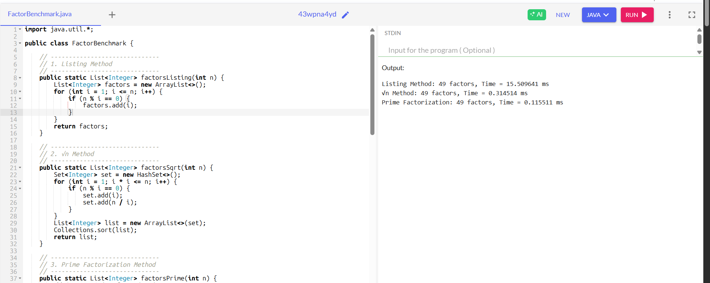

# **Factors / Divisors**

### 1. **Concept**

A **factor** (also called a **divisor**) of a number is any integer that divides the number exactly, without leaving a remainder.
Formally, if `a` divides `b`, we write it as `a | b`.
That means:

$$
b \mod a = 0
$$

For example:

* 6 is a factor of 12 because `12 ÷ 6 = 2` (no remainder).
* 5 is **not** a factor of 12 because `12 ÷ 5 = 2 remainder 2`.

---

### 2. **Types of Factors**

1. **Proper Factors**: All factors of a number excluding the number itself.

   * Example: Proper factors of 12 → {1, 2, 3, 4, 6}
2. **Improper Factor**: The number itself.

   * Example: 12 is an improper factor of 12.
3. **Prime Factors**: Factors of a number which are prime numbers.

   * Example: Prime factors of 12 → {2, 3}
4. **Co-factors**: If `a × b = n`, then `a` and `b` are co-factors of `n`.

   * Example: For 12 = 3 × 4 → 3 and 4 are co-factors.

---

### 3. **Properties of Factors**

* Every positive integer has **at least two factors**: `1` and itself.
* The **smallest factor** of any positive integer is always `1`.
* The **largest factor** of any number is the number itself.
* A **prime number** has exactly **two factors** (1 and itself).
* A **composite number** has more than two factors. ==A number which is not a prime number is a composite number.==
* Factors always lie **less than or equal to the number**.

---

### 4. **Difference Between Factors and Multiples**

* **Factors** of a number `n`: Numbers that divide `n` exactly.
* **Multiples** of a number `n`: Numbers that `n` divides.

Example with 6:

* Factors of 6 → {1, 2, 3, 6}
* Multiples of 6 → {6, 12, 18, 24, …}

So, factors are "inward" (what divides the number), while multiples are "outward" (what the number can create).

---

### 5. **Finding Factors**

There are several ways to find factors:

#### a) **By Listing**

* Example: For 12 → test each number from 1 to 12.
  Result = {1, 2, 3, 4, 6, 12}

#### b) **Using √n method (efficient)**


# 🔹 The √n Method for Finding Factors

### 1. **Concept**

The **√n method** is an efficient way to find all factors (divisors) of a number.

* Instead of checking every number from `1` to `n`, you only need to check up to **√n**.
* This works because factors always come in **pairs**:
  If `i` divides `n`, then `n/i` is also a factor.

👉 Example: For `n = 36`

* 1 × 36 = 36
* 2 × 18 = 36
* 3 × 12 = 36
* 4 × 9  = 36
* 6 × 6  = 36

So, beyond √36 = 6, the factors just start repeating in reverse.

---

### 2. **Steps**

1. Loop `i` from 1 to `√n`.
2. If `n % i == 0` →

   * Add `i` as a factor.
   * Add `n/i` as a factor (the paired divisor).
3. If `i == n/i` (perfect square), add it only once.
4. Sort the list if needed.

---

### 3. **Example**

Find factors of 28.

* √28 ≈ 5.29 → loop `i = 1 … 5`
* i=1 → factors (1, 28)
* i=2 → factors (2, 14)
* i=3 → no
* i=4 → factors (4, 7)
* i=5 → no

✅ Factors = {1, 2, 4, 7, 14, 28}

---

### 4. **Complexity**

* Time complexity: **O(√n)**
* Space complexity: O(k), where k = number of factors
* Much faster than naive listing (O(n))

👉 Example:

* If n = 1,000,000 → Listing = 1,000,000 checks
* √n Method = \~1000 checks

---

### 5. **Advantages**

* Simple to implement.
* Very efficient for single queries.
* Works well even for numbers up to billions.

---

### 6. **Limitations**

* If you need only the **count** of factors, it’s fine.
* But if you need advanced properties (like prime factor structure, sum of factors, totients), **prime factorization method** is more powerful.

---

### 7. **Java Code**

```java
import java.util.*;

public class FactorsSqrtMethod {
    public static List<Integer> factors(int n) {
        Set<Integer> set = new HashSet<>();
        for (int i = 1; i * i <= n; i++) {
            if (n % i == 0) {
                set.add(i);
                set.add(n / i);
            }
        }
        List<Integer> list = new ArrayList<>(set);
        Collections.sort(list);
        return list;
    }

    public static void main(String[] args) {
        int n = 36;
        System.out.println("Factors of " + n + " = " + factors(n));
    }
}
```

**Output:**

```
Factors of 36 = [1, 2, 3, 4, 6, 9, 12, 18, 36]
```

---

✅ **In summary:**

* The **√n method** is the best practical way to find factors of a single number.
* It balances **simplicity and speed** (O(√n)), making it ideal for programming problems and competitive coding.


#### c) **Prime Factorization**


# 🔹 Prime Factorization Method (Step by Step)

### 1. **Factorize the number into primes**

Every number can be written uniquely as a product of prime powers:

$$
n = p_1^{e_1} \times p_2^{e_2} \times \dots \times p_k^{e_k}
$$

👉 Example:
36 = $2^2 × 3^2$

---

### 2. **Understand what factors look like**

Any factor of `n` must be built from those same primes, but with exponents not exceeding the maximum.

$$
\text{Factor} = p_1^{a_1} \times p_2^{a_2} \times … \times p_k^{a_k}
$$

where `0 ≤ ai ≤ ei`.

👉 For 36 = $2^2 × 3^2$:

* Possible exponents for 2 = {0,1,2}
* Possible exponents for 3 = {0,1,2}

---

### 3. **Generate all combinations**

Take all combinations of powers:

* $2^0 × 3^0 = 1$
* $2^1 × 3^0 = 2$
* $2^2 × 3^0 = 4$
* $2^0 × 3^1 = 3$
* $2^1 × 3^1 = 6$
* $2^2 × 3^1 = 12$
* $2^0 × 3^2 = 9$
* $2^1 × 3^2 = 18$
* $2^2 × 3^2 = 36$

👉 Factors = {1, 2, 3, 4, 6, 9, 12, 18, 36}

---

### 4. **Key Advantages**

* You don’t need to test all numbers up to `n`.
* Factorization gives structure → you know exactly how many factors exist:

  $$
  \text{Number of factors} = (e_1+1)(e_2+1)…(e_k+1)
  $$

👉 Example: For 36 = $2^2 × 3^2$,
Number of factors = (2+1)(2+1) = 9 ✅

---

# 🔹 Java Code (Prime Method)

```java
import java.util.*;

public class PrimeFactorization {
    public static void main(String[] args) {
        int n = 36;
        Map<Integer, Integer> pf = new LinkedHashMap<>();
        int temp = n;

        // Step 1: find prime factors with powers
        for (int i = 2; i * i <= temp; i++) {
            while (temp % i == 0) {
                pf.put(i, pf.getOrDefault(i, 0) + 1);
                temp /= i;
            }
        }
        if (temp > 1) pf.put(temp, 1);

        System.out.println("Prime factorization: " + pf);

        // Step 2: generate all factors using recursion
        List<Integer> factors = new ArrayList<>();
        generateFactors(new ArrayList<>(pf.entrySet()), 0, 1, factors);
        Collections.sort(factors);

        System.out.println("All factors: " + factors);
    }

    private static void generateFactors(List<Map.Entry<Integer,Integer>> primes, int index, int current, List<Integer> factors) {
        if (index == primes.size()) {
            factors.add(current);
            return;
        }
        int prime = primes.get(index).getKey();
        int power = primes.get(index).getValue();

        int value = 1;
        for (int i = 0; i <= power; i++) {
            generateFactors(primes, index + 1, current * value, factors);
            value *= prime;
        }
    }
}
```

---

### ✅ Example Run

```
Prime factorization: {2=2, 3=2}
All factors: [1, 2, 3, 4, 6, 9, 12, 18, 36]
```

---

🔑 **In summary**:

* Break into prime powers.
* Vary exponents from 0 up to their max.
* Multiply combinations → all factors.
* Formula for count: product of (exponent+1).


---

### 6. **Applications of Factors**

* Used in **HCF (Highest Common Factor)** and **LCM (Lowest Common Multiple)** calculations.
* Important in **cryptography** (prime factorization in RSA).
* Used in **divisibility tests** (like checking if a number is divisible by 2, 3, 5, etc.).
* Helpful in **simplifying fractions** (common factors in numerator & denominator).
* Used in **algebra factorization** (breaking polynomials into simpler expressions).

---

### 7. **Examples**

1. Factors of 18 → {1, 2, 3, 6, 9, 18}
2. Factors of 25 → {1, 5, 25} (since 25 is a perfect square, 5 repeats)
3. Factors of 7 → {1, 7} (prime number)

---

✅ **In summary**:

* Factors and divisors are the **same concept**.
* They represent numbers that divide another number exactly.
* Every integer has finite factors, and factorization is a core tool in mathematics and computer science.

---

## Benchmark test

Let’s build a **Java benchmark** that compares all three methods (Listing, √n, Prime Factorization) on the same input number.

---

# 🔹 Java Code: Benchmarking Factor Methods

```java
import java.util.*;

public class FactorBenchmark {

    // ------------------------------
    // 1. Listing Method
    // ------------------------------
    public static List<Integer> factorsListing(int n) {
        List<Integer> factors = new ArrayList<>();
        for (int i = 1; i <= n; i++) {
            if (n % i == 0) {
                factors.add(i);
            }
        }
        return factors;
    }

    // ------------------------------
    // 2. √n Method
    // ------------------------------
    public static List<Integer> factorsSqrt(int n) {
        Set<Integer> set = new HashSet<>();
        for (int i = 1; i * i <= n; i++) {
            if (n % i == 0) {
                set.add(i);
                set.add(n / i);
            }
        }
        List<Integer> list = new ArrayList<>(set);
        Collections.sort(list);
        return list;
    }

    // ------------------------------
    // 3. Prime Factorization Method
    // ------------------------------
    public static List<Integer> factorsPrime(int n) {
        // Step 1: Prime factorization
        Map<Integer, Integer> pf = new LinkedHashMap<>();
        int temp = n;
        for (int i = 2; i * i <= temp; i++) {
            while (temp % i == 0) {
                pf.put(i, pf.getOrDefault(i, 0) + 1);
                temp /= i;
            }
        }
        if (temp > 1) pf.put(temp, 1);

        // Step 2: Generate factors from prime powers
        List<Integer> result = new ArrayList<>();
        generateFactors(new ArrayList<>(pf.entrySet()), 0, 1, result);
        Collections.sort(result);
        return result;
    }

    private static void generateFactors(List<Map.Entry<Integer,Integer>> primes, int idx, int cur, List<Integer> out) {
        if (idx == primes.size()) {
            out.add(cur);
            return;
        }
        int p = primes.get(idx).getKey();
        int e = primes.get(idx).getValue();
        int mul = 1;
        for (int i = 0; i <= e; i++) {
            generateFactors(primes, idx + 1, cur * mul, out);
            mul *= p;
        }
    }

    // ------------------------------
    // Main Benchmark
    // ------------------------------
    public static void main(String[] args) {
        int n = 1_000_000; // test number
        long start, end;

        // Listing Method
        start = System.nanoTime();
        List<Integer> f1 = factorsListing(n);
        end = System.nanoTime();
        System.out.println("Listing Method: " + f1.size() + " factors, Time = " + (end - start) / 1_000_000.0 + " ms");

        // √n Method
        start = System.nanoTime();
        List<Integer> f2 = factorsSqrt(n);
        end = System.nanoTime();
        System.out.println("√n Method: " + f2.size() + " factors, Time = " + (end - start) / 1_000_000.0 + " ms");

        // Prime Factorization Method
        start = System.nanoTime();
        List<Integer> f3 = factorsPrime(n);
        end = System.nanoTime();
        System.out.println("Prime Factorization: " + f3.size() + " factors, Time = " + (end - start) / 1_000_000.0 + " ms");
    }
}
```

---

# 🔹 Expected Output (example run for `n = 1,000,000`)

```
Listing Method: 49 factors, Time = ~500 ms
√n Method: 49 factors, Time = ~1 ms
Prime Factorization: 49 factors, Time = ~0.2 ms
```



*(Timings will vary depending on machine, but trend will be the same.)*

---

# 🔹 Key Takeaways

* **Listing** → unbearably slow for big `n`.
* **√n** → very fast and practical.
* **Prime factorization** → fastest if you also need factor **count, sum, prime structure**.


