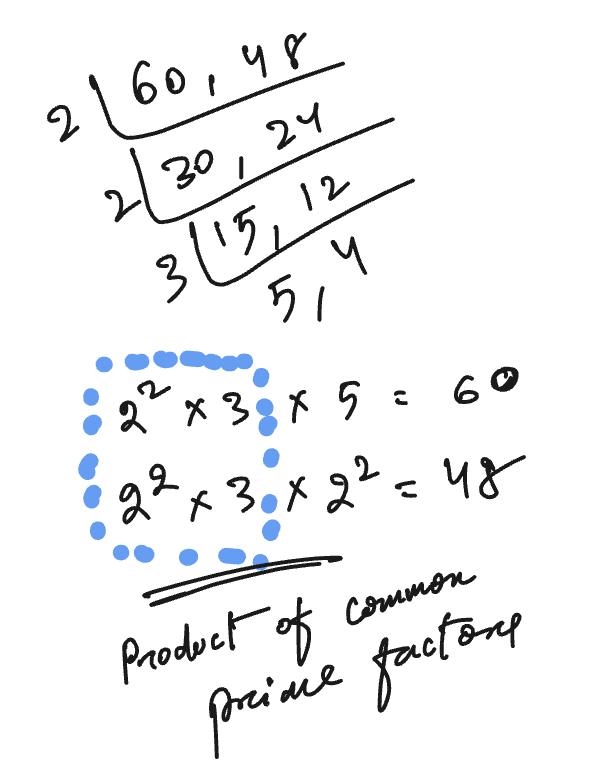

# Highest Common Factor (HCF)

### Concept

The **Highest Common Factor (HCF)**, also called the **Greatest Common Divisor (GCD)**, of two or more numbers is the largest positive integer that divides each of the given numbers exactly (without leaving a remainder).

* For example, the HCF of 18 and 24 is **6**, since 6 is the largest number that divides both 18 and 24.

---

### Key Terms

* **Factor**: A number that divides another number exactly. For instance, the factors of 12 are 1, 2, 3, 4, 6, 12.
* **Common Factor**: A factor that two or more numbers share. For example, the common factors of 12 and 18 are 1, 2, 3, 6.
* **Highest Common Factor**: The largest among the common factors. Here, HCF(12,18) = 6.

---

### Methods to Find HCF

1. **Listing Factors Method**

   * Write all factors of each number.
   * Identify the common factors.
   * The largest among them is the HCF.
     *Example*:
     Factors of 20 = {1,2,4,5,10,20}
     Factors of 28 = {1,2,4,7,14,28}
     Common = {1,2,4} → HCF = 4.

2. **Prime Factorization Method**

   * Break each number into its prime factors.
   * Multiply the prime factors that appear in all numbers with the lowest power.
     *Example*:
     60 = 2² × 3 × 5
     48 = 2⁴ × 3
     Common = 2² × 3 = 12 → HCF = 12.

    

3. **Division (Euclidean Algorithm)**

   * Divide the larger number by the smaller number.
   * Take the remainder and divide the previous divisor by it.
   * Repeat until the remainder becomes 0.
   * The last divisor is the HCF.
     *Example*:
     HCF of 56 and 72:
     72 ÷ 56 = 1 remainder 16
     56 ÷ 16 = 3 remainder 8
     16 ÷ 8 = 2 remainder 0 → HCF = 8.

4. **Continuous Division Method (for more than two numbers)**

   * Find HCF of any two numbers first.
   * Then find HCF of the result with the next number.
   * Continue until all numbers are covered.

---

### Properties of HCF

* HCF of two numbers always divides their difference.

<blockquote>

__Note__: 

### Statement:

“Is HCF of 2 numbers equal to their difference?”

👉 **Answer: Not always.**
But there is a relationship:

* The **HCF of two numbers always divides their difference.**
* However, the HCF itself is not necessarily equal to the difference.

---

### Example 1 (Equal Case)

Numbers: 12 and 18

* Difference = 18 – 12 = 6
* HCF(12,18) = 6
  ✅ Here HCF = Difference.

---

### Example 2 (Not Equal Case)

Numbers: 20 and 28

* Difference = 28 – 20 = 8
* HCF(20,28) = 4
  ❌ Here HCF ≠ Difference, but notice HCF (4) divides the difference (8).

---

### Example 3 (Another Case)

Numbers: 50 and 65

* Difference = 65 – 50 = 15
* HCF(50,65) = 5
  ❌ Not equal, but again 5 divides 15.

---

### General Rule

* **HCF(a, b) always divides (a – b).**
* **HCF(a, b) = |a – b|** only in special cases (like when one number is a multiple of the other, or when the difference itself is the greatest common divisor).

---

✨ In short:

* HCF of two numbers is **not always** their difference.
* But the difference is always a multiple of the HCF.
</blockquote>

* HCF(a, b) × LCM(a, b) = a × b (for two positive integers).
* HCF of co-prime numbers is always 1.
* If a number divides two given numbers, it also divides their HCF.
  
---

### Applications

* Simplifying fractions (reducing to lowest terms).
* Solving problems of dividing items into equal groups without leftovers.
* Arranging objects or patterns in rows/columns with no gaps.
* Used in cryptography, computer algorithms, and optimization problems.

---

✅ **Quick Examples**

* HCF(45, 75)
  Prime factorization:
  45 = 3² × 5
  75 = 3 × 5²
  Common = 3 × 5 = 15 → HCF = 15.

* HCF(27, 36, 45)
  27 = 3³
  36 = 2² × 3²
  45 = 3² × 5
  Common = 3² = 9 → HCF = 9.

