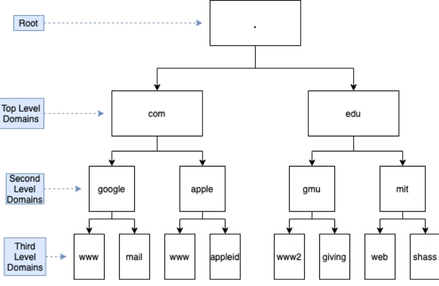
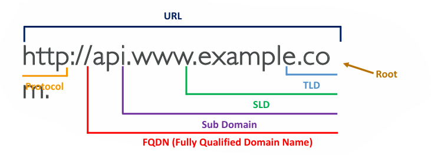
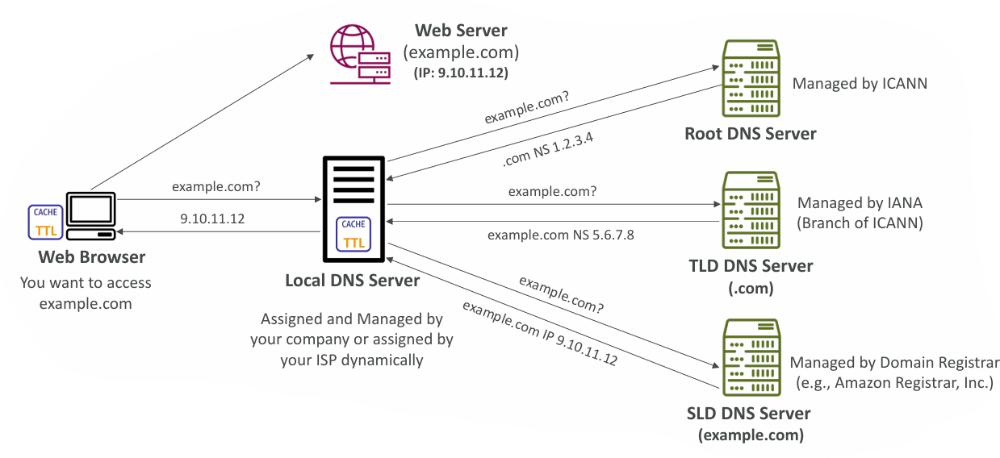
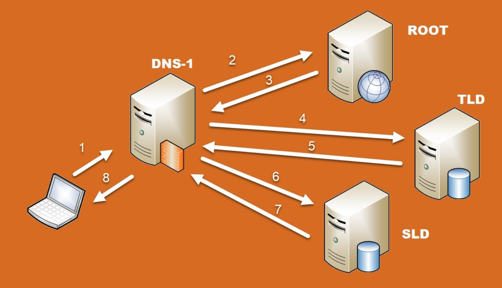

## 🔹 Introduction: Amazon Route 53

Amazon Route 53 is a scalable and highly available **Domain Name System (DNS) web service** by AWS. It is designed to route end-user requests to Internet applications by translating human-friendly domain names into machine-readable IP addresses.

---

## 🔹 What is DNS?

* **Definition:** The **Domain Name System (DNS)** translates human-friendly hostnames (like `www.google.com`) into IP addresses (like `172.217.18.36`) that computers use to communicate.
* **Importance:** DNS is often referred to as the *backbone of the Internet*, as it allows users to access websites using simple names instead of numeric IPs.
* **Hierarchical Naming:**

  * `.com` (Top-Level Domain)
  * `example.com` (Second-Level Domain)
  * `www.example.com` (Subdomain or 3rd level domain)
  * `api.example.com` (Another Subdomain)

---

## 🔹 Role of ICANN in DNS

* **ICANN (Internet Corporation for Assigned Names and Numbers)** is the global nonprofit organization responsible for coordinating the **Domain Name System (DNS)**.
* ICANN doesn’t provide DNS services directly. Instead, it:

  * Oversees the **root DNS servers**.
  * Manages the **top-level domains (TLDs)** like `.com`, `.org`, `.in`.
  * Delegates authority to registries and registrars (e.g., Verisign manages `.com`).
  * Sets policies for how domains are registered and managed globally.

Think of ICANN as the **governing body** that ensures the DNS system works consistently worldwide.

---

## 🔹 Role of DNS Providers (like Amazon Route 53, GoDaddy, Cloudflare)

* DNS providers are the **practical service operators** you interact with when buying or managing a domain.
* They:

  * Act as **registrars** (selling domains on behalf of registries authorized by ICANN).
  * Provide **name servers** that resolve queries for your domain.
  * Let you create and manage **DNS records** (A, AAAA, CNAME, MX, etc.).
  * Offer extra features like **load balancing, failover, geo-routing, caching**.

Think of DNS providers as **service shops** where you register and configure your domain under ICANN’s rules.

---

## 🔹 Why They’re Related

* **ICANN provides the governance & rules.**
* **DNS providers (Amazon Route 53, GoDaddy, etc.) provide the actual service to users.**
* Without ICANN, there would be no global coordination—domains could clash, and the internet would break.
* Without DNS providers, end users couldn’t easily buy domains or resolve them.

👉 **In short:**

* ICANN = the **referee and coordinator** of the global DNS system.
* DNS Providers = the **players** who deliver DNS services to businesses and individuals, following ICANN’s framework.

---

==Step by step on how the responsibility flows== in the **DNS ecosystem** from **ICANN → Registry → Registrar → DNS Provider → End User**.

## 🔹 1. ICANN – The Global Coordinator

* **Role:** Governs the entire DNS system.
* **Responsibilities:**

  * Manages the **Root DNS servers**.
  * Approves and delegates authority for **Top-Level Domains (TLDs)** like `.com`, `.org`, `.in`.
  * Works with IANA (Internet Assigned Numbers Authority), its operational arm, to keep things standardized.

👉 Think of ICANN as the **United Nations of DNS**.

---

## 🔹 2. Registry – The TLD Manager

* **Role:** Operates a specific TLD under ICANN’s authority.
* **Example Registries:**

  * **Verisign** manages `.com` and `.net`.
  * **Public Interest Registry (PIR)** manages `.org`.
  * **NIXI (India)** manages `.in`.
* **Responsibilities:**

  * Stores all registered domains for that TLD (e.g., all `*.com` names).
  * Provides access to registrars.
  * Maintains the **authoritative TLD name servers**.

👉 Think of the registry as the **landlord** for each TLD.

---

## 🔹 3. Registrar – The Domain Seller

* **Role:** Accredited by ICANN to sell domains to the public on behalf of registries.
* **Examples:** GoDaddy, Namecheap, Google Domains, Amazon Registrar (Route 53).
* **Responsibilities:**

  * Provides the interface for you to **buy/manage a domain**.
  * Submits your domain details to the registry.
  * Ensures compliance with ICANN policies (like WHOIS records, ownership verification).

👉 Registrars are like the **real estate agents** who let you buy a plot (domain) from the landlord (registry).

---

## 🔹 4. DNS Provider – The Domain Manager

* **Role:** Hosts your DNS records and resolves them into IPs.
* **Examples:** Amazon Route 53, Cloudflare, GoDaddy DNS, DigitalOcean DNS.
* **Responsibilities:**

  * Runs **authoritative name servers** for your domain.
  * Lets you configure records like:

    * `A` (IPv4 mapping)
    * `AAAA` (IPv6 mapping)
    * `MX` (Mail server)
    * `CNAME` (Aliases)
  * May provide **extra services** like load balancing, health checks, geo-routing.

👉 DNS Providers are the **caretakers** who maintain your property (domain) so people can find it.

---

## 🔹 5. End User – The Website Owner / Visitor

* **As Owner:**

  * Registers a domain through a registrar.
  * Manages DNS settings through a DNS provider (e.g., Route 53).
  * Points the domain to their web servers.

* **As Visitor:**

  * Types `www.example.com` into a browser.
  * Browser queries DNS (through recursive resolvers).
  * DNS providers + registries + ICANN coordination resolve the name into an IP.

👉 End users are the **residents and visitors** of the digital property (website).

---

## 🔹 Summary Flow (Chain of Responsibility)

1. **ICANN** → Sets global rules & delegates TLDs.
2. **Registry** → Manages each TLD (`.com`, `.org`, etc.).
3. **Registrar** → Sells domains to the public (e.g., `example.com`).
4. **DNS Provider** → Hosts DNS records for the domain and resolves them.
5. **End User** → Registers domains, configures DNS, and accesses websites.

---

✅ That’s why ICANN and DNS providers are connected — **ICANN ensures order, registries manage TLDs, registrars sell domains, and DNS providers make them usable.**

---

## 🔹 DNS Terminologies

1. **Domain Registrar:**
   A service where domains are registered. Examples: Amazon Route 53, GoDaddy, etc.

2. **DNS Records:**

   * **A Record:** Maps a domain to an IPv4 address.
   * **AAAA Record:** Maps a domain to an IPv6 address.
   * **CNAME Record:** Maps one domain to another.
   * **NS Record:** Specifies the authoritative name servers.

3. **Zone File:**
   A file containing all DNS records for a domain.

4. **Name Server:**
   Resolves DNS queries. Can be **authoritative** (has final info for a domain) or **non-authoritative** (relies on caching or other servers).

5. **TLD (Top-Level Domain):**
   The suffix like `.com`, `.us`, `.org`, `.in`, etc.

6. **SLD (Second-Level Domain):**
   The domain just before the TLD, e.g., `google.com`, `amazon.com`.

7. **FQDN (Fully Qualified Domain Name):**
   The complete domain name including subdomains. Example: `api.www.example.com.`

---

## 🔹 How DNS Works

The DNS resolution process follows a **hierarchical lookup model**:

1. **User Request (Web Browser):**

   * The browser asks for `example.com`.
   * If cached, the result is returned immediately; otherwise, it queries a DNS server.

2. **Local DNS Server (Resolver):**

   * Managed by your ISP or company.
   * If not cached, it queries the root DNS server.

3. **Root DNS Server:**

   * Managed by **ICANN**.
   * Provides the address of the TLD DNS server (e.g., for `.com` domains).

4. **TLD (Top Level Domain) DNS Server (.com):**

   * Managed by **IANA** (a branch of ICANN).
   * Provides the address of the authoritative DNS server for `example.com`.

5. **SLD (Second Level Domain) DNS Server (Authoritative for example.com):**

   * Managed by the domain registrar (e.g., Amazon Route 53).
   * Returns the final IP address of the requested domain.

6. **Response to Browser:**

   * The IP address (e.g., `9.10.11.12`) is returned to the local resolver and cached for future use.
   * The browser uses this IP to connect to the web server and load the website.

---

## 🔹 Key Points

* DNS provides a **hierarchical and distributed naming system**.
* It relies on **caching** (TTL – Time To Live) to improve performance.
* Route 53 not only provides DNS resolution but also supports **health checks, routing policies (latency-based, geo DNS, failover, weighted round robin), and domain registration.**

---

✅ In short, **Amazon Route 53** is AWS’s DNS service that builds upon the fundamentals of DNS, offering scalability, reliability, and advanced routing features for global applications.

