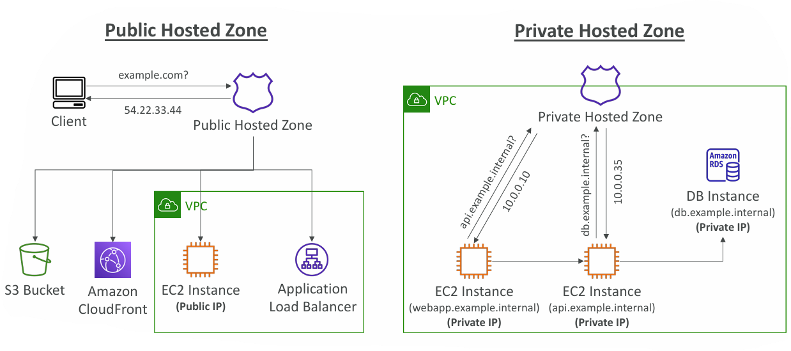
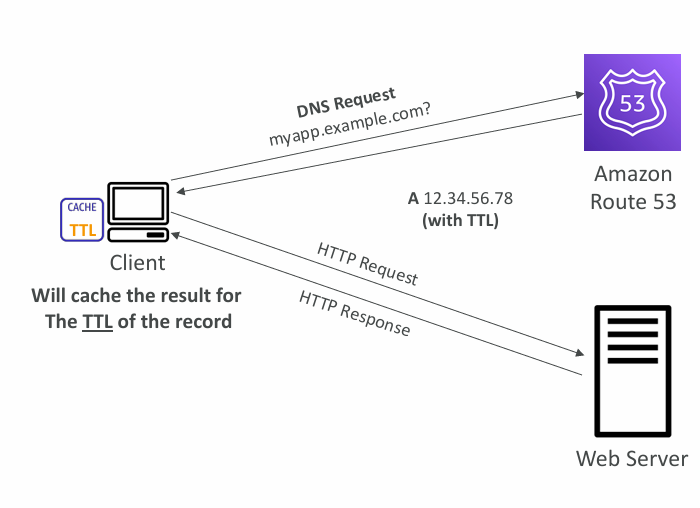

## **Amazon Route 53 – Hosted Zones, Public vs Private Zones, and TTL (Time to Live)**

---

## 1. Route 53 – Hosted Zones

* A **Hosted Zone** in Route 53 is essentially a **container for DNS records**.
* These records define **how traffic should be routed** to a domain (e.g., example.com) and its subdomains (e.g., app.example.com).

### Types of Hosted Zones:

1. **Public Hosted Zones**

   * Used for **public-facing domains** (e.g., `application1.mypublicdomain.com`).
   * The DNS records specify how to route internet traffic to AWS resources such as:

     * EC2 Instances with public IPs
     * Application Load Balancers
     * Amazon S3 static websites
     * CloudFront distributions

2. **Private Hosted Zones**

   * Used inside a **VPC (Virtual Private Cloud)**.
   * Only accessible **internally** within one or more VPCs (not exposed to the internet).
   * Useful for private services like:

     * Internal APIs
     * Database endpoints (e.g., `db.company.internal`)
   * Example: `application1.company.internal`

💲 **Cost**: You pay **\$0.50/month per hosted zone**.

---

## 2. Public vs Private Hosted Zones (Architecture View)

### **Public Hosted Zone**

* **Client → Public DNS**:
  A client queries the public domain (e.g., `example.com`).
  Route 53 resolves it to a **public IP address** (e.g., 54.22.33.44).
* Targets can include:

  * S3 Bucket (for static sites)
  * CloudFront CDN
  * EC2 instances (with public IPs)
  * Application Load Balancer

📌 Key Point: Accessible **from the internet**.

---

### **Private Hosted Zone**

* Queries for **private domains** (e.g., `api.example.internal`) resolve only inside the VPC.
* Example setup:

  * `webapp.example.internal` → EC2 instance with **private IP (10.0.0.10)**
  * `db.example.internal` → Amazon RDS with **private IP (10.0.0.35)**
* No public exposure — enhances **security** and keeps internal services hidden from the internet.

📌 Key Point: Accessible **only within the VPC**.

---

## 3. Route 53 – Records TTL (Time To Live)

**TTL = Time duration (in seconds) that a DNS resolver caches a record before re-querying Route 53.**

### High TTL (e.g., 24 hours)

* **Pros:**

  * Less DNS query traffic to Route 53 (cheaper).
* **Cons:**

  * ==If you change the DNS record, clients may still use **outdated cached records** until TTL expires.==

### Low TTL (e.g., 60 seconds)

* **Pros:**

  * Records update faster; clients switch quickly when DNS changes.
* **Cons:**

  * ==More frequent DNS lookups → **higher Route 53 costs**.==

### Behavior

* Client caches the DNS record for the TTL duration.
* After expiry, the client queries Route 53 again.
* Except for **Alias Records** (special AWS-specific records pointing to resources like ELB, CloudFront), TTL is **mandatory**.

---

## 4. Key Takeaways

* **Public Hosted Zone** → Internet-facing applications.
* **Private Hosted Zone** → Internal apps within AWS VPCs.
* **TTL setting** impacts **performance, cost, and freshness** of DNS data.
* **Best practice**:

  * Use **high TTL** for stable records (e.g., static assets).
  * Use **low TTL** for frequently updated records (e.g., failover, load balancers).

---

# 📌 TTL Decision Guide for Route 53

| **Scenario**                                                                                 | **Recommended TTL**                                                                            | **Reason / Benefit**                                                                           |
| -------------------------------------------------------------------------------------------- | ---------------------------------------------------------------------------------------------- | ---------------------------------------------------------------------------------------------- |
| **Static websites or rarely changing records** (e.g., S3 static site, CDN, corporate domain) | **High TTL (1–24 hrs)**                                                                        | Fewer DNS lookups → cheaper and faster. Changes are rare, so caching is safe.                  |
| **Load Balancers (ALB/ELB) with DNS names**                                                  | **Medium TTL (5–10 min)**                                                                      | ELBs rotate IPs often. Medium TTL balances cost and freshness.                                 |
| **Auto Scaling EC2 Instances (IP-based records)**                                            | **Low TTL (30–60 sec)**                                                                        | New instances get new IPs on scaling. Low TTL ensures quick updates.                           |
| **Failover & Disaster Recovery**                                                             | **Very Low TTL (30–60 sec)**                                                                   | Clients switch quickly to backup region or standby server.                                     |
| **Blue/Green or Canary Deployments**                                                         | **Low TTL (1–2 min)**                                                                          | When switching versions/environments, clients need to resolve new targets quickly.             |
| **Internal Services in VPC (Private Hosted Zone)**                                           | **Medium TTL (1–5 min)**                                                                       | Balances query load with the need for up-to-date internal IPs (especially for ECS/EKS pods).   |
| **Database Endpoints (e.g., RDS)**                                                           | **Medium TTL (5–10 min)**                                                                      | AWS rotates IPs occasionally for maintenance. Too low TTL isn’t needed since changes are rare. |
| **API Gateway / CloudFront / Global Accelerator**                                            | **High TTL (1–24 hrs)**                                                                        | Endpoints are stable DNS names managed by AWS. No need for frequent refresh.                   |
| **Frequent Manual DNS Changes (CNAME, A, AAAA, NS)**                                         | **Low TTL (1–5 min)**                                                                          | Ensures clients adopt your manual changes quickly.                                             |
| **Migration (Domain Cutover)**                                                               | **Very Low TTL (30–60 sec)** before migration, then revert to **High TTL** after stabilization | Minimizes downtime during cutover, but avoids cost after migration is done.                    |

---

## ✅ General Best Practices

* **High TTL** → Stable records, cost savings, fewer DNS queries.
* **Low TTL** → Dynamic, changing records, failover, or migrations.
* **Alias Records** → TTL is managed by AWS (no need to tune manually).
* Change TTL **before** planned migrations or DNS switches, then **raise it back** afterward to avoid high costs.

---

⚡ Quick Rule of Thumb:

* **Stable resource? → High TTL (hours)**
* **Changing resource? → Low TTL (seconds/minutes)**

---

## Discussions:

> Q. In which scenario low TTL is used. Is it when manually CNAME, A, AAAA or NS are changed very frequently?

Let’s clarify when **low TTL** is useful.

---

## 📌 Scenarios for Low TTL in Route 53

Low TTL (like **30–60 seconds**) is typically used when you expect **frequent DNS changes** or when **fast failover** is required.

### 1. **DNS Failover & High Availability**

* When using **health checks and failover routing** in Route 53.
* If one endpoint goes down, clients should quickly stop using its cached IP.
* A low TTL ensures clients re-query Route 53 often and pick up the new healthy endpoint.

---

### 2. **Blue/Green Deployments or Canary Releases**

* If you are **migrating traffic** between environments (e.g., `v1.api.example.com` → `v2.api.example.com`).
* With a low TTL, DNS changes propagate quickly, and users hit the new version without long delays.

---

### 3. **Dynamic IPs or Elastic IP Reassignments**

* If your backend resources (EC2, ELB, etc.) are **frequently reassigned new IPs**.
* A low TTL ensures clients fetch the latest IP soon after a change.

---

### 4. **CNAME, A, AAAA, or NS Records That Change Often**

* Exactly like you asked ✅ — when you manually update or automate updates for these records.
* Example:

  * You’re pointing `api.example.com` to different load balancers at different times.
  * If TTL were high (say 24h), old clients might continue calling the outdated target.
  * With a low TTL (60s), they quickly resolve the new target.

---

### 5. **Disaster Recovery (DR) and Multi-Region Routing**

* If a region fails, traffic must shift quickly to another region.
* A low TTL ensures minimal downtime due to cached, stale DNS records.

---

## ⚖️ Trade-Off

* **Low TTL** = fast updates, but **more queries** → higher Route 53 costs.
* **High TTL** = fewer queries, but stale data lingers longer.

👉 Best practice:

* Use **high TTL (hours)** for static records (like static websites, CDN, S3).
* Use **low TTL (seconds/minutes)** for records that **change often or need quick failover**.

---

> Q. Why IPs are changed frequently? is there real time use case for frequent changes?

Let’s go deeper into **why IP addresses can change frequently** and whether this happens in real-time.

---

## 🔄 Why IPs Change Frequently in AWS & Real-World Use Cases

### 1. **Elastic Load Balancers (ELB / ALB / NLB)**

* AWS **does not give a fixed IP** for most load balancers (except NLB with static IP mode).
* Instead, they use **DNS names** (`myapp-123.elb.amazonaws.com`) that resolve to **different IPs at different times** for:

  * **Scaling up/down** (adding/removing backend servers)
  * **Cross-AZ balancing**
  * **Infrastructure maintenance** by AWS

👉 **Real-time impact**: If you point to the IP directly instead of the DNS name, your app may break because that IP could be recycled.

---

### 2. **Auto Scaling Groups**

* When EC2 instances are scaled in/out, **new instances get new private and public IPs**.
* If DNS records point directly to EC2 IPs, they must be updated as scaling happens.

👉 **Use case**: Auto scaling web servers behind Route 53 or ALB.

---

### 3. **Elastic IP Reassociation**

* Even with **Elastic IPs (EIP)**, you might **reassign** the EIP to another instance during:

  * Failover
  * Disaster recovery
  * Maintenance window

👉 **Real-time impact**: DNS needs to reflect the reassignment quickly.

---

### 4. **Container Orchestration (ECS / EKS / Kubernetes)**

* Pods and tasks in Kubernetes or ECS get **ephemeral IPs**.
* When they restart or reschedule, IPs change.
* Services like AWS Cloud Map or Route 53 help manage these mappings.

👉 **Real-time use case**: A microservice `api.example.internal` points to different ECS tasks at different times.

---

### 5. **Multi-Region Failover**

* If traffic shifts from **US-East-1** to **EU-West-1** during failover, the DNS may need to resolve to new IPs in seconds.
* AWS Global Accelerator or Route 53 health checks handle this, but low TTL ensures clients respect the switch quickly.

---

### 6. **Cloud Provider Internal Changes**

* AWS, Azure, GCP all **rotate backend IPs** for managed services like:

  * RDS endpoints (`db.xxxxx.rds.amazonaws.com`)
  * API Gateway endpoints
  * S3 bucket URLs
* They do this to maintain availability and security without user intervention.

---

## 📌 Key Point

In the **cloud world**, IPs are considered **dynamic, not static**.

* Real-time use cases **absolutely exist**, especially for:

  * Load balancers
  * Auto scaling
  * Disaster recovery
  * Containers/microservices

That’s why AWS strongly recommends:
✅ Always use **DNS names (CNAME, A, AAAA)** instead of hardcoding IPs.
✅ Use **low TTL** when pointing to resources where IPs may change frequently.

---

> Q. Instead of low TTL, why not subscriptions like webhook or any other solution is used?

Instead of relying on **low TTL with DNS polling**, why don’t we just use **push-based mechanisms** like **subscriptions, webhooks, or event-driven notifications**? Let’s unpack this.

---

## 🔎 Why DNS Uses TTL Instead of Subscriptions

### 1. **Nature of DNS Protocol**

* DNS is one of the **oldest internet protocols** (1980s).
* It was designed as a **distributed, cache-heavy, pull-based system** where clients periodically check records, not as a publish/subscribe system.
* There’s no built-in channel for “pushing” updates from authoritative DNS servers to millions of clients worldwide.

---

### 2. **Scale Problem**

* ==Imagine Google or AWS having to **push DNS changes** to every ISP resolver, enterprise DNS server, and client device on Earth in real-time.==
* ==That’s billions of endpoints → **not feasible at internet scale**.==
* TTL caching reduces load by letting resolvers hold answers locally until expiration.

---

### 3. **Decoupling & Simplicity**

* TTL ensures **loose coupling**: clients don’t need to stay subscribed to anything.
* Any resolver (your ISP, corporate DNS, cloud resolver, browser cache) can independently cache results.
* Subscriptions would require persistent connections or stateful protocols → harder to scale and maintain globally.

---

### 4. **==Security Considerations==**

* A global push system would be a **massive attack surface** (e.g., forged updates could redirect entire internet traffic).
* With TTL + polling, security mechanisms like **DNSSEC** can verify responses independently.

---

## ✅ Where Subscriptions / Event Models *Do* Exist

While DNS itself is **pull-based**, in **application-level networking** we sometimes use push/event-driven models instead of low TTL:

1. **AWS Cloud Map / Service Discovery**

   * ECS/EKS apps can subscribe to service registry changes internally.
   * Pushes new IPs/targets faster than waiting for DNS TTL expiration.

2. **Consul, Etcd, or Zookeeper**

   * Service discovery tools that allow apps to “watch” for updates to service endpoints.

3. **Webhooks**

   * Useful for API event notifications (like “new commit pushed to GitHub”), but not suitable for DNS-scale infrastructure.

4. **Global Traffic Managers (like AWS Global Accelerator)**

   * They don’t rely on DNS TTL at all. Instead, clients connect to static IPs, and AWS routes internally.

---

## ⚖️ Trade-off

* **DNS TTL** = simple, decentralized, globally scalable, but **eventually consistent**.
* **Webhooks/Subscriptions** = real-time, but require **persistent infra** and don’t scale to the **entire internet**.

---

### 📌 Key Insight

Low TTL is used because DNS is **foundational internet plumbing**.
If you need **real-time endpoint awareness**, you typically combine DNS (for global resolution) with a **service discovery mechanism** (for internal/microservices) or use **AWS-managed solutions like Global Accelerator or Cloud Map**.

