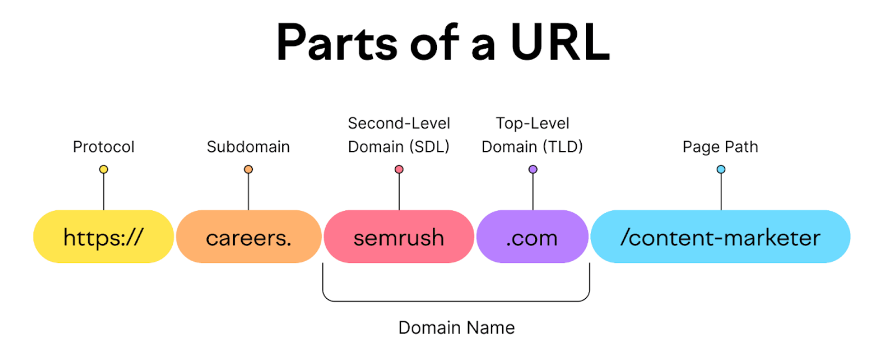
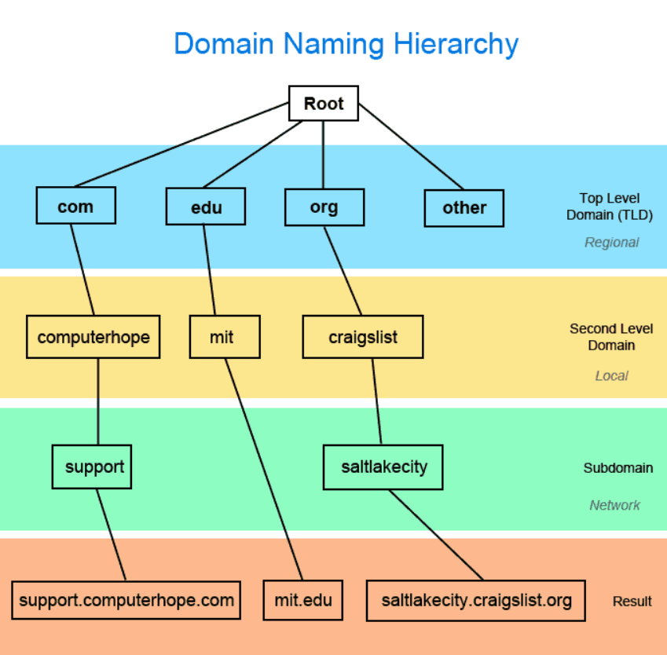

### **CNAME vs Alias, Alias Records, and Alias Record Targets in AWS Route 53**

---

## 1. CNAME vs Alias

### **CNAME Record**

* A **CNAME (Canonical Name)** record points one hostname to another hostname.
  Example:

  ```
  app.mydomain.com → blabla.anything.com
  ```
* **Limitations:**

  * CNAMEs **cannot be used at the root domain** (Zone Apex).

    * For example, you can’t have `mydomain.com → something.otherdomain.com`.
    * CNAMEs only work for **non-root subdomains** like `www.mydomain.com` or `app.mydomain.com`.

---

### **Alias Record**

* Alias records are an **AWS-specific extension** to DNS, designed to overcome the limitations of CNAME.
* They map a hostname to **AWS resources** such as:

  * Load Balancers
  * CloudFront distributions
  * S3 static websites
  * API Gateway, etc.
* **Advantages over CNAME:**

  * Can be used at **both root domain and non-root domain** (e.g., `mydomain.com` or `app.mydomain.com`).
  * **Free of charge** (you don’t pay extra for Alias queries in Route 53).
  * **Native health checks**: Alias records can integrate with Route 53 health checks for routing decisions.

---

## 2. Route 53 – Alias Records (How They Work)

* Alias records **map a hostname to an AWS resource** (not another hostname like CNAME).
* They **automatically track IP address changes** in AWS resources.

  * Example: If a Load Balancer changes backend IPs, the Alias record updates automatically.
* Can be used at the **top node (Zone Apex)** of a DNS namespace.
  Example:

  ```
  example.com → myALB-123456789.us-east-1.elb.amazonaws.com
  ```
* Alias records are always of type **A (IPv4)** or **AAAA (IPv6)**.
* **TTL management**:

  * You **cannot set TTL manually** for Alias records.
  * AWS manages TTL internally, ensuring the record stays fresh.

---

## 3. Route 53 – Alias Records Targets

Alias records can point to the following AWS resources:

* **Elastic Load Balancers** (ALB, NLB, CLB)
* **Amazon CloudFront distributions**
* **Amazon API Gateway** endpoints
* **Elastic Beanstalk environments**
* **Amazon S3 Websites** (static hosting)
* **VPC Interface Endpoints** (PrivateLink)
* **AWS Global Accelerator**
* **Route 53 record in the same hosted zone**

⚠️ **Limitation:**

* Alias records **cannot point to an EC2 DNS name** (only to managed AWS resources).

---

## 4. Key Differences (Quick Recap)

| Feature                          | **CNAME**            | **Alias (AWS-only)** |
| -------------------------------- | -------------------- | -------------------- |
| Works at root domain (Zone Apex) | ❌ No                 | ✅ Yes                |
| Works at subdomains              | ✅ Yes                | ✅ Yes                |
| Targets                          | Any hostname         | AWS resources only   |
| TTL configurable?                | ✅ Yes                | ❌ No (AWS-managed)   |
| Cost                             | Standard DNS charges | Free in Route 53     |
| Health check support             | ❌ No                 | ✅ Yes (native)       |
| Auto-updates for IPs             | ❌ No                 | ✅ Yes                |

---

## 5. When to Use Alias vs CNAME

* Use **Alias** when pointing to AWS-managed services (ALB, CloudFront, S3, API Gateway, etc.).
* Use **CNAME** when pointing to external domains outside AWS.
* At the **root domain**, only Alias works.

---

## Case studies: 


## 🔹 Case Study 1: Hosting a Website with Root Domain

**Background:**
A company wants its main website to be available at **`mycompany.com`** (root domain), but it’s using an **AWS Application Load Balancer (ALB)** for hosting.

**Problem:**

* A **CNAME record cannot be used** at the root domain (`mycompany.com`).
* Only subdomains like `www.mycompany.com` can point via CNAME.



---
Before we dive in to this case studies, let's take this example in the figure, 



Here,

Let’s connect the **Domain Naming Hierarchy** in the image with where a **CNAME record** can be used.

---

## 📌 Key Rule for CNAME

* **CNAME can only be used for subdomains (non-root domains).**
* **CNAME cannot be used at the Root Domain (Zone Apex).**

---

## 🔹 Looking at the Diagram

1. **Root domain (TLD + Second Level Domain)**

   * Examples:

     * `mit.edu`
     * `computerhope.com`
     * `craigslist.org`
   * ❌ **CNAME not allowed here.**
   * At root, you can only use **A/AAAA records** or **Alias records (AWS-specific)**.

---

2. **Subdomains**

   * Examples in the diagram:

     * `support.computerhope.com`
     * `saltlakecity.craigslist.org`
   * ✅ **CNAME can be used here.**
   * For instance:

     * `support.computerhope.com → support.zendesk.com`
     * `saltlakecity.craigslist.org → app.craigslistcdn.net`

---

3. **Further nested subdomains**

   * You could also have deeper subdomains, e.g.:

     * `api.support.computerhope.com`
     * `cdn.saltlakecity.craigslist.org`
   * ✅ **CNAME can work here too.**

---

## 🔹 Example Usage

* **support.computerhope.com** → CNAME → `helpdesk.externalvendor.com`
* **saltlakecity.craigslist.org** → CNAME → `cityapp.craigslist.net`

---

✅ **Summary**

* **CNAME can be used at:** Subdomains (`support.computerhope.com`, `saltlakecity.craigslist.org`).
* **CNAME cannot be used at:** Root domains (`mit.edu`, `computerhope.com`, `craigslist.org`).

---

Let's get back to the case study,

**Solution:**

* They used a **Route 53 Alias Record** that maps `mycompany.com` directly to the ALB’s DNS name (e.g., `myapp-12345.us-east-1.elb.amazonaws.com`).
* Alias allows root-domain mapping, unlike CNAME.

**Broader Impact:**

* Users can type **`mycompany.com`** instead of `www.mycompany.com`.
* Auto IP updates from AWS ensure zero downtime when the ALB changes backend IPs.

---

## 🔹 Case Study 2: CloudFront + Custom Domain

**Background:**
An e-commerce platform serves static assets (images, JS, CSS) via **Amazon CloudFront**. They want assets available at **`cdn.mystore.com`**.

**Problem:**

* CloudFront provides a long AWS hostname (e.g., `d111111abcdef8.cloudfront.net`).
* They want a clean custom domain (`cdn.mystore.com`).

**Solution:**

* Added an **Alias Record** in Route 53 for `cdn.mystore.com → CloudFront distribution`.
* Alias was chosen instead of CNAME because it’s **free of charge** and **works at scale**.

**Broader Impact:**

* No extra cost for DNS lookups.
* Automatic adaptation when CloudFront edge IPs change.
* Better branding with custom domain.

---

## 🔹 Case Study 3: Multi-Region Failover with Health Checks

**Background:**
A fintech company deployed services in **US-East-1** and **EU-West-1** with **two ALBs** for redundancy.

**Problem:**

* They needed a single domain (`api.fintech.com`) to route to the healthy ALB.
* CNAME would work, but it **cannot integrate with Route 53 health checks**.

**Solution:**

* Used **Alias Record with Health Check**:

  * Primary alias → US-East ALB
  * Failover alias → EU-West ALB
* Route 53 detects health failure and routes traffic accordingly.

**Broader Impact:**

* Automatic failover without manual DNS changes.
* Low downtime during outages.
* Customers always hit a healthy backend.

---

## 🔹 Case Study 4: Hybrid Setup (Alias + CNAME)

**Background:**
A SaaS startup used both **AWS ALB** for its app (`app.saas.com`) and an **external analytics provider** (`analytics.saas.com`).

**Problem:**

* Needed to point `app.saas.com → ALB` (AWS resource).
* Needed to point `analytics.saas.com → external vendor domain`.

**Solution:**

* Used **Alias Record** for the app (to ALB).
* Used **CNAME Record** for analytics (to vendor domain).

**Broader Impact:**

* Unified management in Route 53.
* Leveraged both record types based on target type.
* Simplified migrations without user disruption.

---

✅ **Summary:**

* **Alias Records** → Best for AWS-managed resources (ALB, CloudFront, S3, API Gateway) and root domains.
* **CNAME Records** → Best for external domains, only at subdomains.

