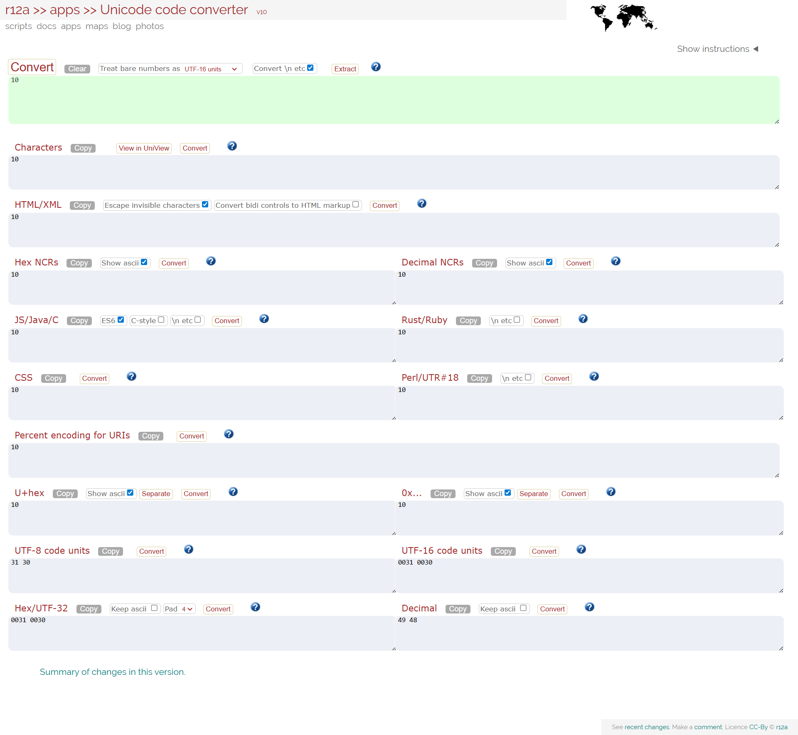
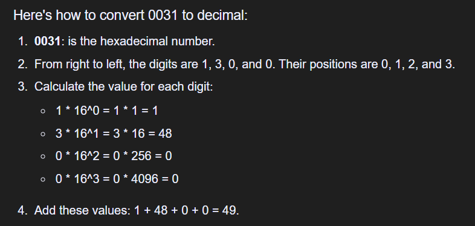
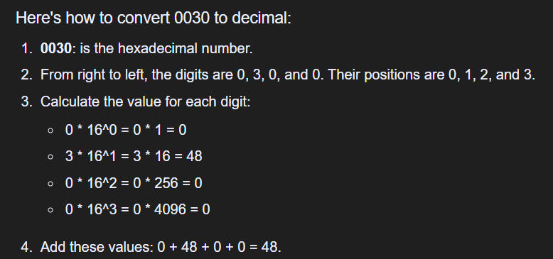

# 📘 Node.js Coding Essentials for LeetCode

*(Comparisons & Sorting → `Array.sort()` with Comparator)*

---

## 1. Why Sorting Matters in LeetCode / Interviews

* Sorting is the **backbone** of many problems:

  * Interval problems (merge intervals, meeting rooms).
  * Greedy algorithms (activity selection, job scheduling).
  * Graph algorithms (Kruskal’s MST requires edge sorting).
  * String problems (anagrams, lexicographic order).

* JavaScript’s `Array.sort()` has **quirks**:

  * Default is **lexicographic (string-based)**.
  * You must pass a **comparator function** for numeric or custom sorts.

---

## 2. Default Behavior (Lexicographic Trap)

```js
let nums = [5, 1, 10, 2];
nums.sort();
console.log(nums); // [1, 10, 2, 5] ❌ Wrong (compares as strings)
```

* Without comparator → `"10" < "2"` because `'1'` comes before `'2'`. [Explained in details below..](#why-10--2-in-default-arraysort)
* Always define a comparator for numeric sorts.

---

## 3. Comparator Function Basics

`arr.sort(compareFn)`

* `compareFn(a, b)` must return:

  * `< 0` → keep `a` before `b`
  * `= 0` → keep order unchanged (stable since ES2019)
  * `> 0` → put `b` before `a`

### Example: Numeric Ascending

```js
nums.sort((a, b) => a - b);
// [1, 2, 5, 10]
```

### Example: Numeric Descending

```js
nums.sort((a, b) => b - a);
// [10, 5, 2, 1]
```

---

## 4. Multi-Key Sorting

Many LeetCode problems need **sorting by multiple criteria**.

```js
let intervals = [[1,3], [2,2], [2,1], [1,2]];

// Sort by first element, break ties with second
intervals.sort((a, b) => a[0] - b[0] || a[1] - b[1]);
console.log(intervals);
// [[1,2],[1,3],[2,1],[2,2]]
```

* Trick: Use **logical OR (`||`)** to cascade comparators.

---

## 5. Sorting Strings (Lexicographic / Custom Order)

```js
let words = ["leetcode", "apple", "banana"];
words.sort(); 
// ["apple","banana","leetcode"] ✅ lexicographic
```

### Custom Comparator: By Length, then Alphabet

```js
words.sort((a, b) => a.length - b.length || a.localeCompare(b));
// ["apple", "banana", "leetcode"]
```

* `localeCompare` ensures proper dictionary order across locales.

---

## 6. Complexity & Implementation Details

* **Algorithm**: V8 (Node.js engine) uses **Timsort** (hybrid of merge + insertion sort).
* **Time Complexity**:

  * Average: `O(n log n)`
  * Best case (partially sorted): close to `O(n)`
* **Space Complexity**: `O(n)` (depends on implementation).
* **Stability**:

  * ✅ Stable since **ES2019**.
  * Important for problems where equal keys must preserve input order.

---

## 7. Gotchas & Pitfalls

1. **Lexicographic by Default**

   * Forgetting comparator → wrong order for numbers.

2. **Comparator Must Return a Number**

   ```js
   arr.sort((a, b) => a > b); // ❌ returns true/false, coerced to 1/0
   arr.sort((a, b) => a - b); // ✅ returns numeric difference
   ```

3. **Mutates Original Array**

   * `sort()` sorts **in-place**. Clone first if you need original:

     ```js
     let sorted = [...arr].sort((a, b) => a - b);
     ```

4. **NaN / Mixed Types**

   * `NaN`, `undefined`, `null` can break ordering. Clean inputs first.

5. **Large Arrays (~10^6)**

   * Sorting is `O(n log n)` → feasible but expensive.
   * For top-k problems, use **heap/quickselect** instead of full sort.

---

## 8. Common LeetCode Patterns with `sort()`

### 🔹 Sort to Apply Greedy

```js
// Non-overlapping intervals
intervals.sort((a, b) => a[1] - b[1]);
```

### 🔹 Sort + Two Pointers

```js
nums.sort((a, b) => a - b);
let l = 0, r = nums.length - 1;
```

### 🔹 Sort Characters by Frequency

```js
let s = "tree";
let freq = {};
for (let c of s) freq[c] = (freq[c] || 0) + 1;

let sorted = Object.entries(freq).sort((a, b) => b[1] - a[1]);
console.log(sorted); // [['e',2],['t',1],['r',1]]
```

### 🔹 Custom Sort for Graph/Heap

```js
edges.sort((a, b) => a[2] - b[2]); // Kruskal’s MST
```

---

## 9. Comparator Patterns Cheat Sheet

```js
// Ascending numbers
(a, b) => a - b

// Descending numbers
(a, b) => b - a

// Ascending by property
(a, b) => a.prop - b.prop

// Descending by property
(a, b) => b.prop - a.prop

// Multi-key sort
(a, b) => a[0] - b[0] || a[1] - b[1]

// String length
(a, b) => a.length - b.length

// Alphabetical (locale safe)
(a, b) => a.localeCompare(b)
```

---

## ✅ In Summary

* Always use a **numeric comparator** for numbers (`a - b`).
* Use **multi-key comparators** (`||`) for interval / tuple problems.
* Remember: `sort()` is **in-place & stable (ES2019+)**.
* Sorting is `O(n log n)` → fine for most LeetCode inputs (`n ≤ 10^5`). For larger/top-k → prefer heaps.
* Pitfall: Comparator must return a number, not a boolean.

---

# ⚡ Node.js Sorting Toolkit (LeetCode)

```javascript
// ===============================
// 📘 Sorting Toolkit
// ===============================

// 1️⃣ Numbers
const asc = (a, b) => a - b;
const desc = (a, b) => b - a;

// 2️⃣ Strings
const byLengthAsc = (a, b) => a.length - b.length;
const byLengthDesc = (a, b) => b.length - a.length;
const lexAsc = (a, b) => a.localeCompare(b);    // dictionary order
const lexDesc = (a, b) => b.localeCompare(a);

// 3️⃣ Arrays / Tuples
const byFirstAsc = (a, b) => a[0] - b[0];
const byFirstDesc = (a, b) => b[0] - a[0];

const bySecondAsc = (a, b) => a[1] - b[1];
const bySecondDesc = (a, b) => b[1] - a[1];

// Multi-key (first, then second)
const byFirstThenSecond = (a, b) => a[0] - b[0] || a[1] - b[1];

// 4️⃣ Objects
const byPropAsc = prop => (a, b) => a[prop] - b[prop];
const byPropDesc = prop => (a, b) => b[prop] - a[prop];

// 5️⃣ Special Patterns
// Intervals: sort by start, then end
const byInterval = (a, b) => a[0] - b[0] || a[1] - b[1];

// Kruskal's MST: sort edges by weight
const byEdgeWeight = (a, b) => a[2] - b[2];

// Frequency sorting: [char, freq]
const byFrequency = (a, b) => b[1] - a[1];

// Custom comparator for mixed cases
const custom = (a, b) => {
  // Example: prioritize even numbers first, then sort ascending
  if ((a % 2) !== (b % 2)) return a % 2 === 0 ? -1 : 1;
  return a - b;
};
```

---

## 🔑 Usage Examples

### 1. Sort Numbers
```js
let nums = [5, 1, 10, 2];
nums.sort(asc);  // [1,2,5,10]
nums.sort(desc); // [10,5,2,1]
```

---

### 2. Sort Strings
```js
let words = ["apple", "banana", "kiwi", "pear"];
words.sort(byLengthAsc); // ["kiwi","pear","apple","banana"]
words.sort(lexDesc);     // ["pear","kiwi","banana","apple"]
```

---

### 3. Sort Intervals
```js
let intervals = [[1,3],[2,2],[2,1],[1,2]];
intervals.sort(byInterval);
// [[1,2],[1,3],[2,1],[2,2]]
```

---

### 4. Sort Edges (Graph)
```js
let edges = [[0,1,5],[0,2,3],[1,2,4]];
edges.sort(byEdgeWeight);
// [[0,2,3],[1,2,4],[0,1,5]]
```

---

### 5. Frequency Sort
```js
let freq = [["a",3],["b",1],["c",2]];
freq.sort(byFrequency);
// [["a",3],["c",2],["b",1]]
```

---

## ✅ Why This is Interview-Ready
- Covers **numeric, string, tuple, and object sorting**.  
- Includes **LeetCode patterns** (intervals, edges, frequency).  
- Avoids common pitfalls (lexicographic sorting bug, boolean comparator mistake).  
- Reusable — just copy into your solution and call `.sort(comparator)`.  

---


# Why `"10" < "2"` in Default `Array.sort()`?


## 1. How `Array.sort()` Works by Default

* If **no comparator** is provided, JavaScript:

  1. **Converts all elements to strings**.
  2. Compares them **lexicographically** using UTF-16 code unit values.

👉 This means sorting is done like words in a **dictionary**, not like numbers.

> The sort() method of Array instances sorts the elements of an array in place and returns the reference to the same array, now sorted. The default sort order is ascending, built upon converting the elements into strings, then comparing their sequences of __UTF-16 code unit values__.
> __src__: https://developer.mozilla.org/en-US/docs/Web/JavaScript/Reference/Global_Objects/Array/sort

---

## 2. Lexicographic Comparison Rule

For two strings `a` and `b`:

* Compare the **first character** of `a` and `b` (using UTF-16 code units).
* If they differ, the smaller code unit wins.
* If they are equal, continue with the next character.
* If one string runs out of characters, the shorter string comes first.

---

## 3. Applying to `"10"` vs `"2"`

* `"10"` has two characters:

  * `'1'` → Unicode `U+0031` → UTF-16 `0x0031` → decimal **49**
  * `'0'` → Unicode `U+0030` → UTF-16 `0x0030` → decimal **48**

* `"2"` has one character:

  * `'2'` → Unicode `U+0032` → UTF-16 `0x0032` → decimal **50**

> Converter: https://r12a.github.io/app-conversion/
> 
> 
> 

Comparison:

1. Compare first characters:

   * `"10"[0] = '1' = 49`
   * `"2"[0] = '2' = 50`

2. Since **49 < 50**, `"10"` is considered **smaller** than `"2"`.

Result:

```js
let arr = [5, 1, 10, 2];
console.log(arr.sort()); 
// [1, 10, 2, 5]
```

---

## 4. Why `"10"` Comes Before `"2"`

* `"10"` is treated as `"1"` followed by `"0"`.
* Lexicographically, any string starting with `'1'` comes before any string starting with `'2'`, regardless of length.
* Just like in a dictionary:

  ```
  "1"
  "10"
  "2"
  "5"
  ```

---

## 5. Fixing for Numeric Sort

To sort as **numbers**, always pass a comparator:

```js
nums.sort((a, b) => a - b);
console.log(nums); 
// [1, 2, 5, 10]
```

---

## ✅ Key Takeaways

* Default `Array.sort()` is **string-based, not numeric**.
* `"10" < "2"` because `'1' (49)` is smaller than `'2' (50)` in UTF-16.
* Always use a comparator `(a, b) => a - b` for numbers.
