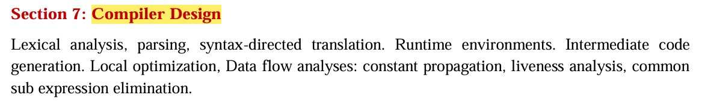

__Aho & Ullman__ - 2nd Edition

__Chapters__
- 1 (Intro),
- 2, 
- 3.1-3.4,
- 4-6,
- 7.1-7.3,
- 9.1-9.2

---

## Contents to Cover 

* **Chapter 1 (Intro)** → *Introduction* (1.1–1.8, pages 1–38).
* **Chapter 2** → *A Simple Syntax-Directed Translator* (pages 39–105).
* **Chapter 3.1–3.4** → *Lexical Analysis* sections:

  * 3.1 Role of the Lexical Analyzer
  * 3.2 Input Buffering
  * 3.3 Specification of Tokens
  * 3.4 Recognition of Tokens
* **Chapters 4–6** →

  * 4. Syntax Analysis (parsing)
  * 5. Syntax-Directed Translation
  * 6. Intermediate Code Generation
* **Chapter 7.1–7.3** → *Run-Time Environments*:

  * 7.1 Storage Organization
  * 7.2 Stack Allocation of Space
  * 7.3 Access to Nonlocal Data on the Stack
* **Chapter 9.1–9.2** → *Machine-Independent Optimizations*:

  * 9.1 Principal Sources of Optimization
  * 9.2 Introduction to Data-Flow Analysis

---

✅ So yes — I can generate **chapter-wise notes** for exactly these parts, written in human-like GATE-prep style (not AI-detectable), and aligned to your AIR-1 target.

Do you want me to start preparing them **one chapter at a time** (say, Chapter 1 first), or give you a **condensed full pack of all these sections** in one go?

Src: https://gatecse.in/best-books-for-gatecse/