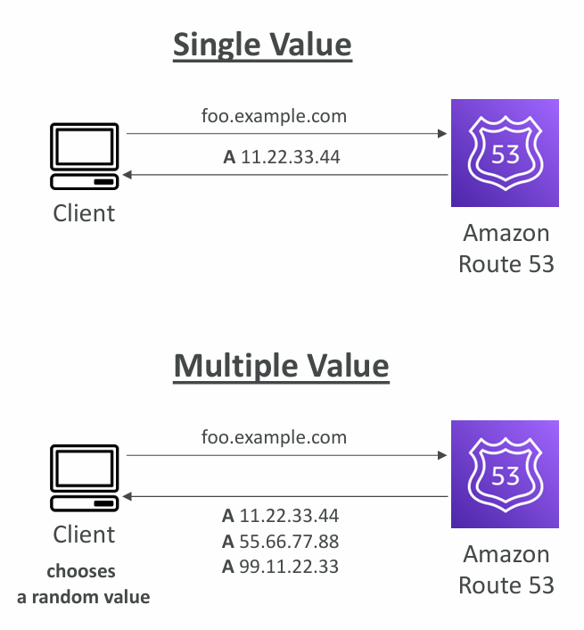
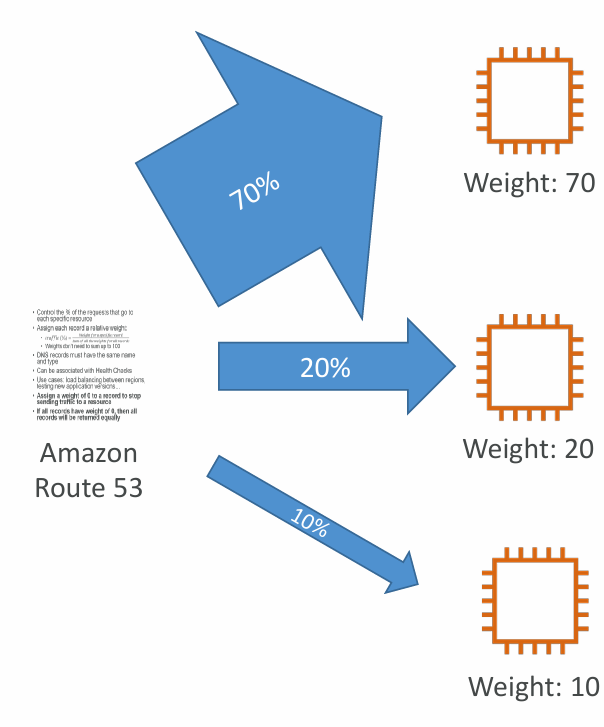
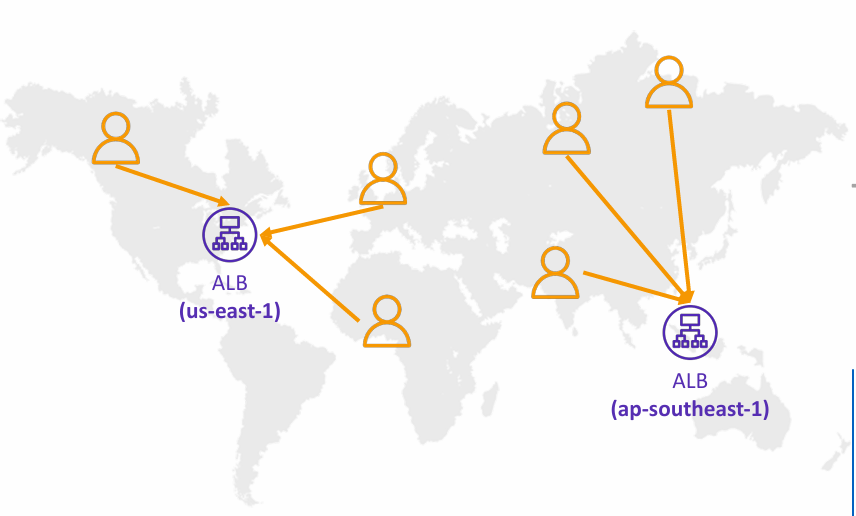

# 📌 Route 53 Routing Policies

## 1. What are Routing Policies?
- Routing policies define **how Route 53 responds to DNS queries**.  
- Important to note:  
  - It’s **not the same as load balancer routing**.  
  - DNS does not route traffic itself; it only **responds with DNSRoute 53 Routing Policies records** (like IP addresses).  
  - The **client/browser** decides where to send traffic after resolving the DNS query.  

---

## 2. Types of Routing Policies in Route 53

### 🔹 a) **Simple Routing Policy**




- Default routing type.  
- Typically routes to **a single resource** (one IP, one load balancer, etc.).  
- You can specify **multiple values** in one record:  
  - If multiple are returned, the **client randomly chooses one**.  
- If using **Alias**, can only specify **one AWS resource**.  
- **Limitations:**  
  - Cannot be associated with health checks.  
  - No failover or routing intelligence.  

**Example:**  
`foo.example.com` → returns `A 11.22.33.44`  
If multiple records:  
`foo.example.com` → returns `A 11.22.33.44`, `A 55.66.77.88`, `A 99.11.22.33` → client randomly picks one.  

---

### 🔹 b) **Weighted Routing Policy**



- Allows splitting traffic **by percentage** between multiple resources.  
- Each record is assigned a **weight** (e.g., 70, 20, 10).  
- Traffic distribution =  
  ```
  Traffic % = (Weight for a specific record) / (Sum of all weights)
  ```
- Weights **don’t need to sum up to 100** (Route 53 calculates percentages automatically).  
- Can be associated with **Health Checks**.  
- **Use cases:**  
  - Load balancing between multiple resources.  
  - Testing new application versions (e.g., 90% to v1, 10% to v2).  
  - Gradual migration of users.  
- Setting weight to **0** stops sending traffic to that record.  

---

### 🔹 c) **Latency-based Routing Policy**



- Directs queries to the resource with the **lowest latency for the client’s location**.  
- Latency is calculated based on **traffic between users and AWS regions**.  
- Example:  
  - A user in Germany may be routed to the **US-East-1 ALB** if it provides lower latency than EU-West-1 at that moment.  
- Can be associated with **Health Checks** → allows failover to a different region.  
- **Use cases:**  
  - Global applications where minimizing latency is critical (e.g., gaming, video streaming, APIs).  

---

## 3. Key Takeaways
- **Simple Policy** → One or many IPs, no routing intelligence.  
- **Weighted Policy** → Control percentage-based traffic distribution (good for testing, migrations).  
- **Latency-based Policy** → Optimizes user experience by reducing latency across regions.  

---


# 📌 Route 53 Routing Policies – Comparison Table

| **Policy**                           | **How it Works**                                                                                  | **Supports Health Checks?** | **Use Cases**                                               | **Example**                                                         |
| ------------------------------------ | ------------------------------------------------------------------------------------------------- | --------------------------- | ----------------------------------------------------------- | ------------------------------------------------------------------- |
| **Simple**                           | Returns one record (or multiple, client picks randomly).                                          | ❌ No                        | Small apps, simple DNS resolution without routing logic.    | `app.example.com → 11.22.33.44`                                     |
| **Weighted**                         | Splits traffic based on percentage (weights assigned).                                            | ✅ Yes                       | Canary deployments, blue/green testing, gradual migration.  | 70% → ALB-1, 30% → ALB-2                                            |
| **Failover**                         | Routes traffic to primary resource; switches to secondary if health check fails.                  | ✅ Yes                       | Disaster recovery, high availability setups.                | Primary = US-ALB, Secondary = EU-ALB                                |
| **Latency-based**                    | Routes to the AWS region with the lowest latency for the client.                                  | ✅ Yes                       | Global apps needing best performance (gaming, video, APIs). | Germany user → US-East if lowest latency                            |
| **Geolocation**                      | Routes based on user’s geographic location (continent, country, or state).                        | ✅ Yes                       | Regional content delivery, compliance/legal restrictions.   | EU users → EU servers, US users → US servers                        |
| **Geoproximity** (Traffic Flow only) | Routes based on geographic proximity of clients to resources. Bias can be added to shift traffic. | ✅ Yes                       | Direct more/less traffic to specific regions.               | 80% users near Asia sent to Singapore region, 20% diverted to Tokyo |
| **Multi-Value Answer**               | Returns multiple healthy records, client picks one randomly. Works like basic load balancing.     | ✅ Yes                       | Lightweight DNS-based load balancing without ELB.           | `api.example.com → [3 healthy EC2 IPs]`                             |

---

## ✅ Quick Decision Guide

* **Simple** → Basic DNS.
* **Weighted** → A/B testing, gradual rollouts.
* **Failover** → Disaster recovery, HA.
* **Latency** → Best performance globally.
* **Geolocation/Geoproximity** → Regional policies, compliance, targeted traffic.
* **Multi-Value** → Cheap DNS-based load balancing.

