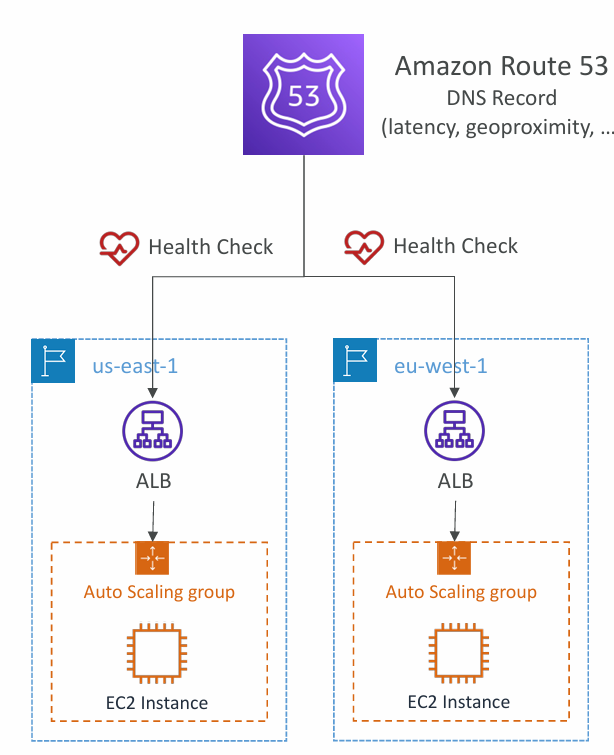
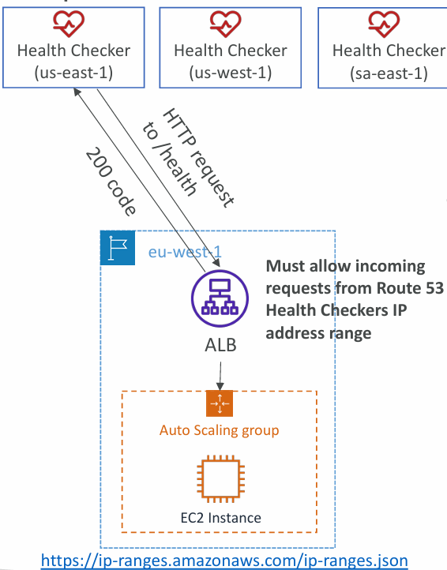
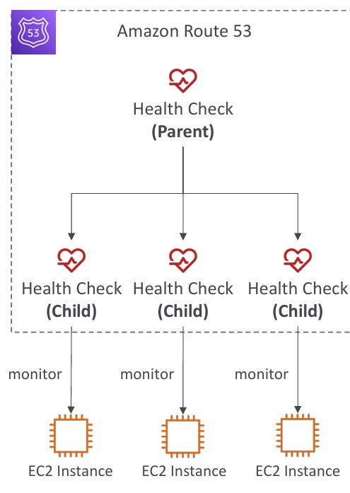
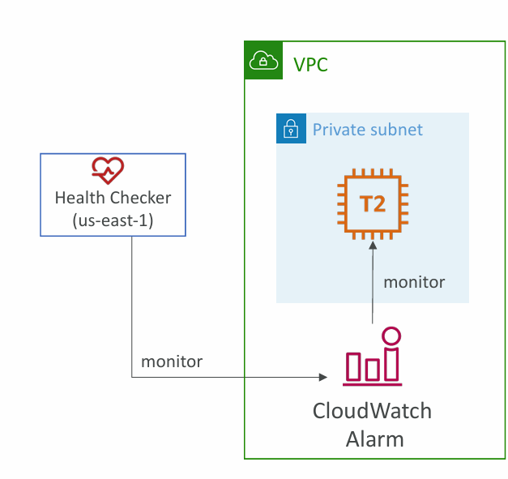

# 📌 Route 53 – Health Checks

## 1. What are Health Checks?
- **Health checks** in Route 53 allow **automated DNS failover** by monitoring the health of resources (endpoints, applications, servers, or AWS resources).  
- If a resource is marked **unhealthy**, Route 53 can stop returning it in DNS responses, automatically failing over to a healthy resource.  

⚠️ Note: HTTP/HTTPS health checks are available **only for public resources** (since Route 53 health checkers are outside AWS VPCs).  

---

## 2. Types of Health Checks
1. **Endpoint Monitoring**
   
   - Monitors the health of an endpoint (e.g., EC2 instance, ALB, S3 website, API).
   - Checks via **HTTP, HTTPS, or TCP** requests.  
   - Uses ~15 global health checkers around the world to test the endpoint.  
   - Endpoint is considered **healthy** if ==more than 18%== of checkers report success.  
   - Passes only when endpoint responds with **2xx or 3xx HTTP codes**.  
   - Can also validate specific response content (up to 5120 bytes).  

2. **Calculated Health Checks**

    

   - Combines results of multiple health checks into one parent health check.  
   - Can use **logical operators**: `AND`, `OR`, `NOT`.  
   - Supports up to **==256== child health checks**.  
   - Useful for complex scenarios:  
     - Example: Mark system healthy if **2 out of 3 endpoints** are up.  
     - Allows maintenance without marking the entire application down.  

3. **Health Checks Monitoring CloudWatch Alarms**
   
   - Instead of directly checking endpoints, it can monitor **CloudWatch Alarms**.  
   - Useful for **private resources** in a VPC (which Route 53 checkers can’t access).  
   - Example use cases:  
     - DynamoDB throttling  
     - RDS CPU alarms  
     - Custom CloudWatch metrics  
   - This allows **full control**, even for internal-only services.  

---

## 3. Key Features
- **Thresholds**: Default is 3 failed checks before marking unhealthy.  
- **Interval**: Default 30 sec (can reduce to 10 sec for faster detection, higher cost).  
- **Global Coverage**: Health checks are run from multiple AWS regions for reliability.  
- **Integration with CloudWatch Metrics**: You can view health check results and trigger alarms/actions.  
- **Firewall Configurations**: Must allow Route 53 health checker IP ranges (published at `https://ip-ranges.amazonaws.com/ip-ranges.json`).  

---

## 4. Special Considerations for Private Hosted Zones
- Since Route 53 health checkers are **outside the VPC**, they **cannot directly monitor private endpoints** (like internal VPC apps).  
- Workaround:  
  - Create a **CloudWatch Metric** inside the VPC.  
  - Attach it to a **CloudWatch Alarm**.  
  - Then create a Route 53 Health Check that monitors the **CloudWatch Alarm**.  

---

## 5. Example Scenarios
- **Failover between regions:**  
  - If `us-east-1` ALB fails health check, traffic is rerouted to `eu-west-1` ALB.  
- **Multi-endpoint application:**  
  - Use **calculated checks** so the parent stays healthy as long as a majority of child endpoints are up.  
- **Private application inside VPC:**  
  - Monitor **CloudWatch alarms** instead of direct HTTP checks.  

---

## ✅ Summary
- Route 53 health checks enable **DNS-based failover**.  
- Three modes: **Endpoint Monitoring**, **Calculated Health Checks**, and **CloudWatch Alarm Monitoring**.  
- Essential for building **resilient, highly available multi-region architectures**.  

---

# 🌍 Case Study: Multi-Region Application with Route 53 Health Checks

## **Background**

A global e-commerce company hosts its website in **two AWS regions**:

* **Primary Region:** `us-east-1` (Virginia)
* **Secondary Region:** `eu-west-1` (Ireland, used for disaster recovery / failover)

The website must be **always available** to customers worldwide, even if the primary region goes down.

---

## **Problem**

* If the primary region (`us-east-1`) experiences downtime (e.g., ALB failure, EC2 issues, or full region outage), users will get DNS records pointing to unhealthy servers.
* Without automation, DNS records would need **manual updates**, causing delays and downtime.

---

## **Solution: Route 53 Health Checks + Failover Policy**

1. **Setup DNS Failover with Route 53**

   * Create a DNS record: `www.shopglobal.com`.
   * Configure **Failover Routing Policy**:

     * **Primary record** → Alias to ALB in `us-east-1`.
     * **Secondary record** → Alias to ALB in `eu-west-1`.

2. **Health Check on Primary Region**

   * Route 53 health checker continuously monitors `us-east-1` ALB:

     * Protocol: HTTPS
     * Endpoint: `/health` (returns 200 OK when healthy)
     * Interval: every 30 sec (or 10 sec for faster detection).

3. **Automated Failover**

   * If **3 consecutive health checks fail**, Route 53 marks the `us-east-1` ALB **unhealthy**.
   * DNS automatically removes the primary record from responses.
   * Traffic is routed to the **secondary ALB** in `eu-west-1`.

4. **Recovery**

   * Once the health check succeeds again in `us-east-1`, Route 53 automatically restores it as the primary endpoint.

---

## **Broader Business Impact**

* ✅ **High Availability:** Users are always served by a healthy region.
* ✅ **Reduced Downtime:** Automatic failover, no manual DNS intervention.
* ✅ **Better User Experience:** Customers experience seamless continuity, even during outages.
* ✅ **Cost-Efficient:** No need for expensive global load balancers; DNS failover covers redundancy.

---

## **Architecture Flow**

1. User queries `www.shopglobal.com`.
2. Route 53 responds with the **primary ALB IP** (if healthy).
3. If primary ALB is unhealthy, Route 53 responds with **secondary ALB IP**.
4. Health checks ensure constant monitoring across global AWS checkers.

---

## **Extra Optimization**

* Use **Latency-based + Health Checks** for normal operations (users routed to the lowest latency region).
* Use **Failover Policy** as backup (if a region goes down).
* Combine with **Calculated Health Checks** to tolerate maintenance events (e.g., require at least 2 of 3 servers healthy).

---

✅ **In Practice:**
This design is used by **Netflix, Amazon retail, and global SaaS providers** for **multi-region resilience** without users ever noticing outages.

