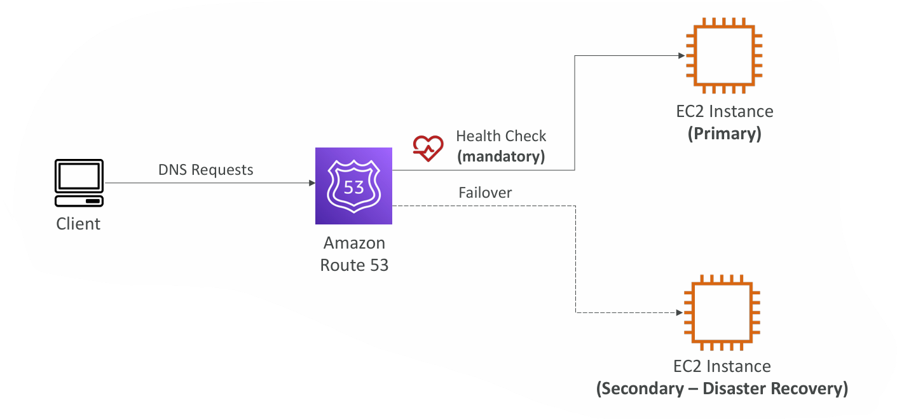
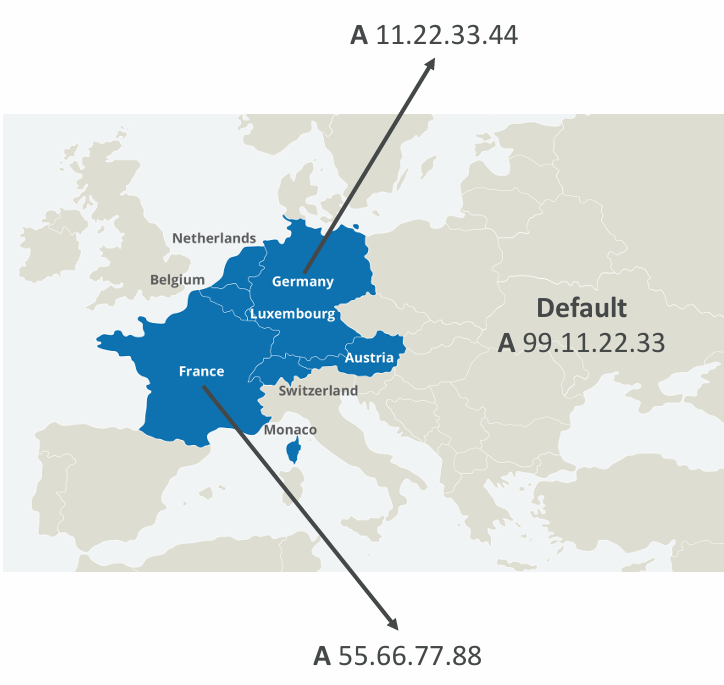
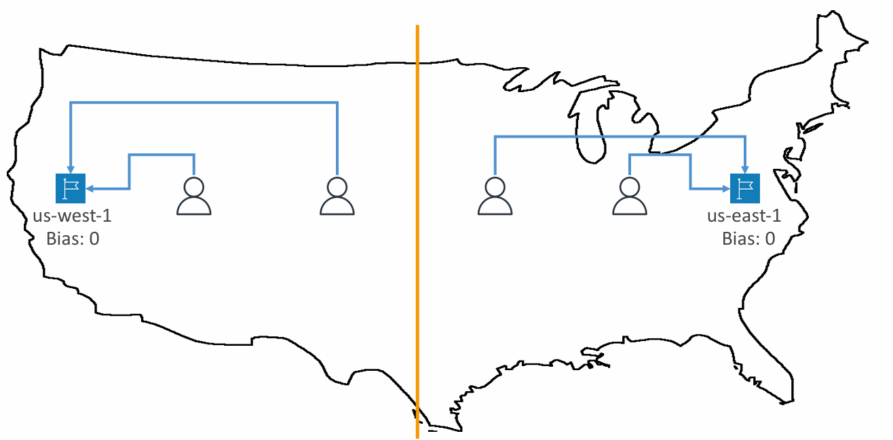
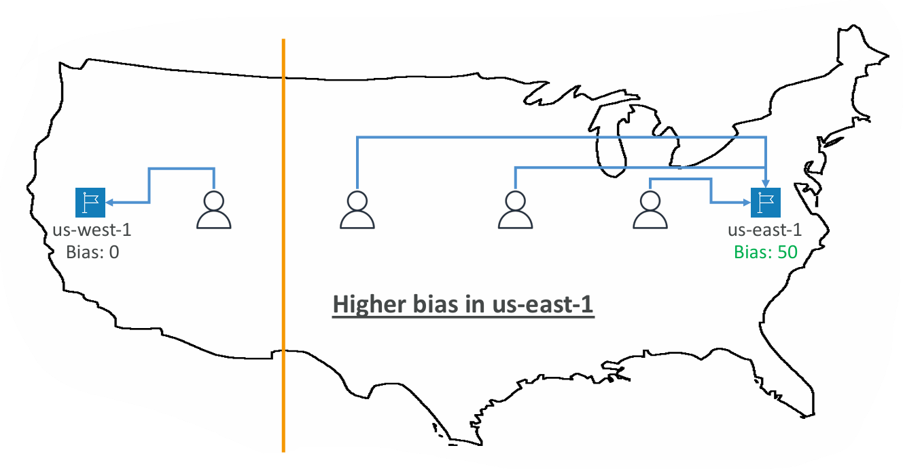

# 1) Failover routing (Active–Passive)




**What it does**

* Returns the **Primary** record *only while it’s healthy*; when it fails, Route 53 responds with the **Secondary** (DR) record.
* **Health checks are required for the Primary**. The Secondary is treated as healthy if you don’t attach a health check (recommended to attach one).

**How it chooses**

1. Primary healthy → answer Primary.
2. Primary unhealthy → answer Secondary (if healthy or no health check).
3. If *both* unhealthy → no answer (NXDOMAIN) unless you also keep a separate “always-on” record (rare).

**Great for**

* Regional DR (us-east-1 primary ↔ eu-west-1 secondary).
* Maintenance windows (fail traffic over, patch primary, fail back automatically).

**Key notes / pitfalls**

* **TTL matters**: shorter TTL (e.g., 30–60s) shortens user stickiness to the old answer during a failover.
* Alias targets (ALB/CloudFront/…): set **EvaluateTargetHealth: true** to let Route 53 consider the target’s own health if supported.
* Don’t confuse with ELB load-balancing: DNS only *answers records*; it doesn’t proxy.

**Quick JSON (change-resource-record-sets)**

```json
{
  "Comment": "Failover A-alias to ALBs",
  "Changes": [
    {
      "Action": "UPSERT",
      "ResourceRecordSet": {
        "Name": "www.example.com.",
        "Type": "A",
        "Failover": "PRIMARY",
        "SetIdentifier": "primary-us-east-1",
        "HealthCheckId": "HC_PRIMARY_ID",
        "AliasTarget": {
          "HostedZoneId": "Z35SXDOTRQ7X7K",
          "DNSName": "alb-primary-123.us-east-1.elb.amazonaws.com.",
          "EvaluateTargetHealth": true
        }
      }
    },
    {
      "Action": "UPSERT",
      "ResourceRecordSet": {
        "Name": "www.example.com.",
        "Type": "A",
        "Failover": "SECONDARY",
        "SetIdentifier": "secondary-eu-west-1",
        "HealthCheckId": "HC_SECONDARY_ID",
        "AliasTarget": {
          "HostedZoneId": "Z32O12XQLNTSW2",
          "DNSName": "alb-dr-456.eu-west-1.elb.amazonaws.com.",
          "EvaluateTargetHealth": true
        }
      }
    }
  ]
}
```

---

# 2) Geolocation routing



**What it does**

* Answers **based on the requester’s location**: Continent → Country → (US) State.
* **Most specific match wins** (US-CA beats US, which beats NA, which beats Default).

**Great for**

* Legal/compliance splits (serve EU from EU only).
* Regionalized content/pricing.
* Country-specific backends (IN users → Mumbai, US users → N. Virginia).

**Gotchas**

* Location is inferred from the **resolver’s IP**, not always the user’s exact IP (public DNS can skew location).
* Always create a **Default** record to avoid NXDOMAIN for unmapped locations.
* Can pair with **health checks** for resilience.

**Quick JSON examples**

```json
// Germany users
{
  "Name": "api.example.com.",
  "Type": "A",
  "SetIdentifier": "de",
  "GeoLocation": { "CountryCode": "DE" },
  "AliasTarget": { "...": "..." }
}
// Europe (fallback for other EU countries)
{
  "Name": "api.example.com.",
  "Type": "A",
  "SetIdentifier": "eu",
  "GeoLocation": { "ContinentCode": "EU" },
  "AliasTarget": { "...": "..." }
}
// Default (anywhere else)
{
  "Name": "api.example.com.",
  "Type": "A",
  "SetIdentifier": "default",
  "GeoLocation": { "CountryCode": "*" },
  "AliasTarget": { "...": "..." }
}
```

---

# 3) Geoproximity routing (Route 53 **Traffic Flow** feature)

**What it does**

* Routes by **proximity between users and resources** (AWS region *or* any latitude/longitude), and lets you **bias** distribution.
* **Bias** expands (+1 to +99) or shrinks (−1 to −99) the geographic influence of a resource—handy for **capacity steering**.

**Great for**

* Gently shifting load between regions without changing weights everywhere.
* Emergencies (e.g., decrease bias on a saturated region to bleed traffic elsewhere).
* Hybrid (AWS + non-AWS) multi-datacenter deployments.

**How it compares**

* **Geolocation** = “where the user is from” (policy buckets by country/region).
* **Geoproximity** = “which resource is nearest (with bias)” (distance math + tunable borders).
* **Latency-based** = “which region currently measures lowest latency” (telemetry-driven).

**Requirements / notes**

* Must use **Traffic Flow** (visual editor or Traffic Policy APIs).
* Can include **health checks**.
* Bias tuning is **additive** to distance (it does not replace distance).

**Typical steps (console Traffic Flow)**

1. Create a **Traffic Policy**.
2. Add **Geoproximity rules** for each resource (select AWS region *or* enter lat/long).
3. Optionally set **Bias** (e.g., +50 for us-east-1 during a promotion).
4. Attach the policy to your record name as a **Traffic Policy Instance**.



 
---

## Choosing among the three (fast rules)

* Want **DR with automatic failover** → **Failover** + health checks.
* Want **country/region-specific answers** (compliance/localization) → **Geolocation** (+ Default).
* Want **distance-based steering with a “knob” to push/pull traffic** → **Geoproximity (Traffic Flow)**.

---

## Operational tips & pitfalls

* **TTL tuning**

  * Failover/Geolocation/Geoproximity all benefit from **shorter TTLs** (30–120s) when you need quick change adoption.
  * After a cutover, consider raising TTL to reduce DNS query cost.

* **Health checks**

  * For Failover: **Primary health check is mandatory**; Secondary strongly recommended.
  * For private endpoints, use a **CloudWatch-alarm–based health check** (since Route 53 checkers are outside your VPC).

* **Testing**

  * Validate Geolocation/Geoproximity via **public resolvers in those regions** (e.g., online global DNS testers) rather than your local resolver.
  * For failover, simulate by **pausing health checks** or returning non-2xx from `/health`.

* **Combine smartly**

  * Many prod setups use **Latency-based** (normal), layered with **Failover** (backup), or **Geolocation** (compliance buckets) → all with health checks.
