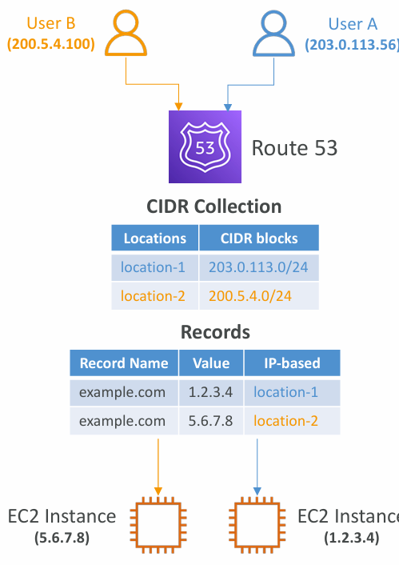
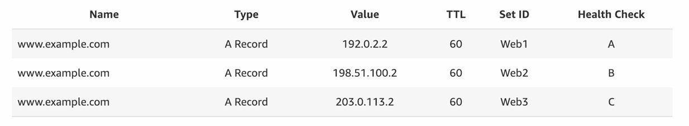

# 📘 AWS Route 53 Routing Policies

## 1. IP-based Routing Policy

**Concept:**

* Route 53 makes routing decisions based on the **client’s IP address**.
* You configure a **list of CIDR ranges** (Classless Inter-Domain Routing blocks) that map user IP ranges to specific endpoints.

**How it works:**

1. A user sends a DNS query.
2. Route 53 checks the IP address of the request.
3. If the IP belongs to a CIDR block you configured, Route 53 routes that request to the corresponding endpoint.

**Example:**

* **User A** (IP: 203.0.113.56) → falls in CIDR block `203.0.113.0/24` → routes to **location-1 → EC2 instance (1.2.3.4)**.
* **User B** (IP: 200.5.4.100) → falls in CIDR block `200.5.4.0/24` → routes to **location-2 → EC2 instance (5.6.7.8)**.

**Use Cases:**

* Optimize performance by routing users to the closest or most efficient endpoint.
* Reduce network/data transfer costs (e.g., route users to a cheaper ISP endpoint).
* Apply custom routing for enterprise clients based on their corporate IP ranges.

---

## 2. Multi-Value Routing Policy

**Concept:**

* Allows Route 53 to return **multiple IP addresses/resources** in response to a single DNS query.
* This provides **basic load distribution** and redundancy.

**Key Points:**

* Can be linked with **Health Checks**:

  * Only healthy endpoints are included in the DNS response.
* Up to **8 healthy records** are returned per query.
* Each DNS client may randomly select one of the IPs, distributing traffic across resources.

**Example:**

* A record for `www.example.com` may return 3 IPs:

  * 192.0.2.2 → Web1
  * 198.51.100.2 → Web2
  * 203.0.113.2 → Web3
* If Web2 fails health check, only Web1 and Web3 are returned.

**Important Limitation:**

* **Multi-Value Routing is *not* a substitute for an Elastic Load Balancer (ELB).**

  * DNS cannot do advanced load balancing or session stickiness.
  * It just distributes DNS responses.

**Use Cases:**

* Simple load distribution across multiple endpoints.
* Increase resiliency by providing fallback IPs.
* Cheap alternative when full ELB is not needed.

---

## 🔑 Key Differences: IP-based vs Multi-Value Routing

| Feature               | IP-based Routing                                         | Multi-Value Routing                      |
| --------------------- | -------------------------------------------------------- | ---------------------------------------- |
| **Decision Criteria** | Based on client’s IP (CIDR match)                        | Returns multiple IPs for the same record |
| **Use Case**          | Route specific users/ISPs to defined endpoints           | Distribute traffic & provide redundancy  |
| **Flexibility**       | Very specific (works only for defined IP ranges)         | General distribution for all users       |
| **Health Checks**     | Not mandatory but can be used indirectly                 | Directly integrates with health checks   |
| **Best For**          | Enterprise clients, cost optimization, ISP-based routing | Lightweight load balancing, redundancy   |

---

✅ **Summary:**

* **IP-based Routing** = control *who goes where* based on their IP address.
* **Multi-Value Routing** = give clients multiple options for redundancy and distribution.

---

# 🌍 Real-World Examples of Route 53 Routing Policies

## 1. **IP-based Routing**

**Background:**
This policy decides routing based on the **client’s IP address** mapped to a CIDR range.

**Examples:**

* **Corporate VPN / Enterprise Access**

  * A multinational company wants employees connecting from their **corporate IP ranges** to be routed to private endpoints (internal EC2 or VPN gateways).
  * Example: Employees from `203.0.113.0/24` (India branch) go to India-based servers, while `200.5.4.0/24` (US branch) employees go to US servers.

* **ISP Optimization**

  * A video-streaming company (like Netflix or Hotstar) can route users based on their ISP’s IP range.
  * Example: Airtel IP range → routed to Mumbai edge servers; Jio IP range → routed to Delhi edge servers. This reduces latency and ISP costs.

* **Country-Specific Regulations**

  * A bank may only allow logins from **domestic IP ranges** and block foreign IPs by routing them to a “restricted access” page.

---

## 2. **Multi-Value Routing**

**Background:**
This policy gives clients multiple IPs for the same domain, spreading traffic and providing redundancy.

**Examples:**

* **E-Commerce Websites (Flipkart, Amazon, Myntra)**

  * A domain like `www.flipkart.com` can return multiple IPs of web servers.
  * Clients automatically choose one server, balancing load across servers.
  * If one server fails health check, Route 53 removes it, keeping the site live.

* **Startups Without ELB**

  * A small startup may not want to pay for Elastic Load Balancer (ELB).
  * They can set up 3 EC2 servers in different Availability Zones and use Multi-Value Routing for basic distribution.

* **Gaming Servers**

  * Online gaming platforms can return multiple IPs for the same game server DNS.
  * Players get connected to one of the available healthy servers, reducing downtime.

---

# 🎯 Interview-Ready Mnemonics

* **IP-based = “Who are you?”** → routes traffic based on *who the client is* (IP/CIDR).
* **Multi-Value = “Here are options”** → returns *multiple healthy IPs*, like a menu of servers.

---

👉 These real-world use cases will not only help in **AWS Solutions Architect interviews** but also in **GATE-level questions** where they test whether you can apply concepts in practice.

