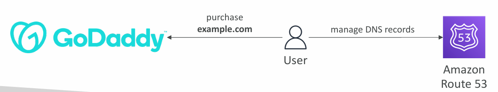
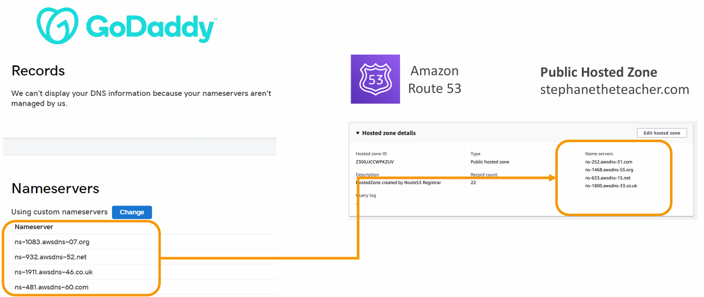

# 📘 Domain Registrar vs DNS Service

## 1. Domain Registrar
- A **Domain Registrar** is a company authorized to **sell domain names** (e.g., GoDaddy, Amazon Registrar Inc., Namecheap).  
- You **buy or register your domain** through them by paying annual fees.  
- Most registrars also provide a **basic DNS service** by default, allowing you to manage DNS records like A, CNAME, and MX.  

**Example:**  
- You purchase **example.com** from **GoDaddy**.  
- By default, GoDaddy allows you to configure DNS records (pointing to web servers, mail servers, etc.).  

---

## 2. DNS Service
- A **DNS Service** translates your domain name into IP addresses so users can reach your website or app.  
- AWS **Route 53** is a managed DNS service that provides:  
  - High availability and scalability.  
  - Advanced routing policies (Latency-based, Geo-location, IP-based, Multi-value).  
  - Health checks for failover.  

---

## 3. Key Difference
- **Domain Registrar ≠ DNS Service.**  
- Registrars just sell you the domain name.  
- DNS Services (like Route 53) manage how that domain resolves to your servers.  

---

## 4. Using Registrar + Route 53 (3rd Party Setup)
You don’t have to use your registrar’s DNS. You can:  
1. **Buy the domain** from GoDaddy (Registrar).  
2. **Create a Hosted Zone** in Route 53 (DNS service).  
3. **Update the Nameservers (NS Records)** in GoDaddy to point to Route 53’s nameservers.  

**Flow Example:**  
- Buy `example.com` on GoDaddy.  
- In Route 53, create a Hosted Zone for `example.com`.  
- Route 53 gives you nameservers like:  
  - `ns-1083.awsdns-07.org`  
  - `ns-932.awsdns-52.net`  
  - `ns-1911.awsdns-46.co.uk`  
  - `ns-481.awsdns-60.com`  
- Update these NS records in GoDaddy’s control panel.  
- Now, Route 53 becomes the **authoritative DNS** for `example.com`.  

---

## 5. Why Use Route 53 Instead of Registrar’s DNS?
- **Scalability:** Route 53 is highly scalable and globally distributed.  
- **Routing Policies:** Advanced features like Geolocation, Latency-based, Failover, and Weighted Routing.  
- **Integration with AWS:** Works seamlessly with EC2, S3, CloudFront, and ELB.  
- **Health Checks:** Can monitor endpoints and automatically failover.  

---

## 6. Real-World Example
- A company buys `myshop.com` from GoDaddy.  
- They want to use AWS infrastructure (EC2 + S3 + CloudFront).  
- They configure Route 53 as the DNS to route traffic intelligently (e.g., send users in Asia to Singapore servers and US users to Virginia servers).  
- GoDaddy remains only the registrar, but Route 53 manages DNS resolution.  

---

## 🔑 Summary
- **Domain Registrar** = Where you buy your domain name.  
- **DNS Service** = Who controls how your domain resolves to servers.  
- **Combination:** Buy from GoDaddy → Manage DNS in Route 53 by updating nameservers.  

---

👉 This separation is **very important** for AWS Solution Architect exam questions. Many people confuse Registrar with DNS.  

