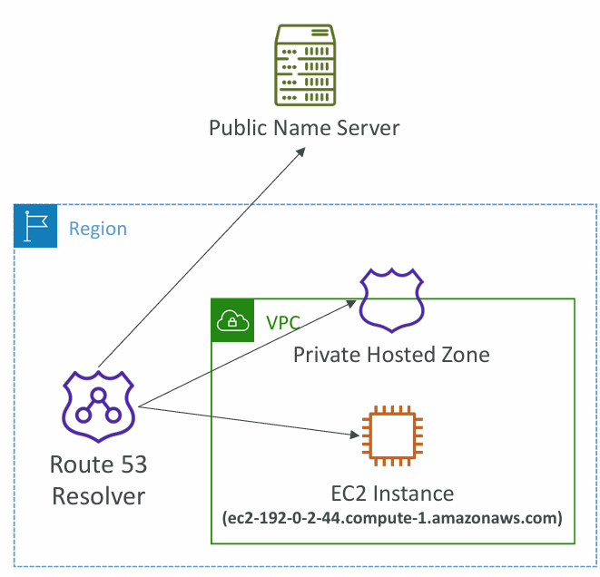
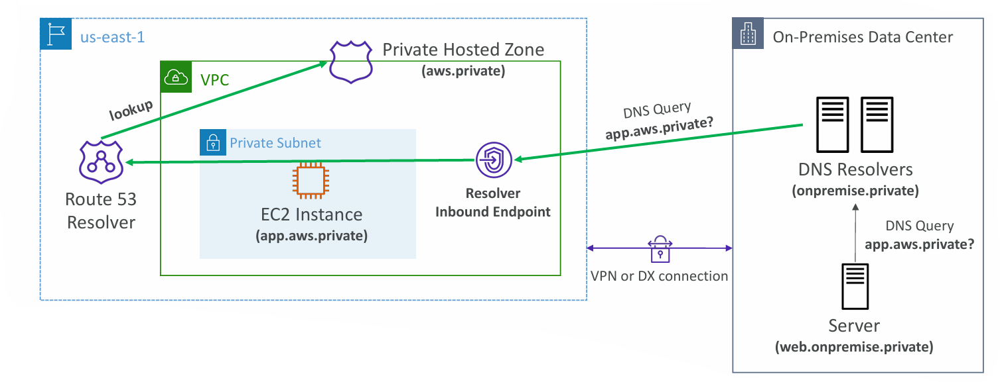
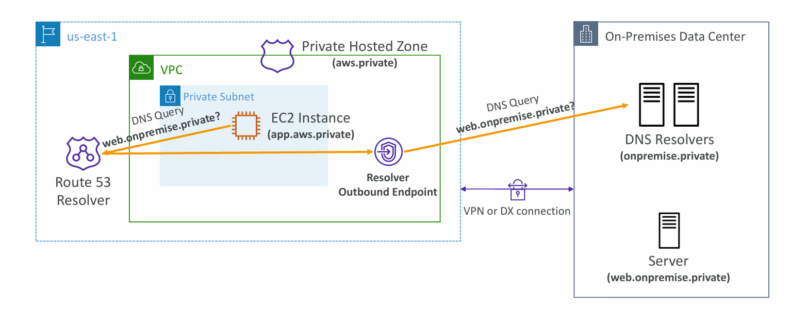

# 📘 Route 53 – Hybrid DNS & Resolver Endpoints

## 1. Route 53 Hybrid DNS

**Concept:**

* By default, **Route 53 Resolver** automatically answers DNS queries for:

  * Local domain names of **EC2 instances** (e.g., `ec2-192-0-2-44.compute-1.amazonaws.com`).
  * Records inside **Private Hosted Zones** (used within a VPC).
  * Records inside **Public DNS Zones** (internet-facing names).

**Hybrid DNS:**

* Extends DNS resolution **across cloud and on-premises networks**.
* It allows **bi-directional DNS queries** between:

  * AWS VPCs (via Route 53 Resolver).
  * On-premises/private networks (via other DNS resolvers).

**Networks involved:**

* VPC itself or **Peered VPCs**.
* **On-premises networks** via AWS Direct Connect (DX) or AWS VPN.

**Use Case Example:**

* A company has applications split between **on-prem data center** and **AWS VPC**.
* Hybrid DNS allows workloads in AWS to resolve **on-prem domain names** and vice versa.

---

## 2. Route 53 – Resolver Endpoints

### (a) **Inbound Endpoints**

* Allow **on-premises DNS resolvers** to resolve domain names hosted in AWS.
* Example:

  * On-premises server queries: `app.aws.private`.
  * The query travels via VPN/DX → Resolver Inbound Endpoint → Route 53 → Private Hosted Zone.
  * The correct EC2 IP (inside AWS VPC) is returned.

✅ **Use Case:**
An on-premises data center needs to access internal AWS applications (databases, EC2 apps) using private DNS names.

---

### (b) **Outbound Endpoints**

* Allow **AWS resources (inside VPC)** to resolve domain names hosted in **on-premises DNS servers**.
* Example:

  * EC2 inside VPC queries: `web.onpremise.private`.
  * Query goes to Resolver Outbound Endpoint → forwarded to on-prem DNS resolver.
  * On-prem server responds with the private IP.

✅ **Use Case:**
AWS-hosted apps (like EC2 microservices) need to call **on-prem services** (legacy apps, databases) by their private DNS names.

---

## 3. Putting It Together (Bi-Directional Flow)

* **Inbound Endpoint:** On-prem → AWS (resolve AWS private domains).
* **Outbound Endpoint:** AWS → On-prem (resolve on-prem private domains).

This setup provides a **seamless DNS resolution** experience across **hybrid cloud environments**.

---

## 4. Real-World Example

* A bank is migrating apps gradually from **on-prem to AWS**.
* Some services (core banking) still run on-prem, while new microservices run in AWS.
* Hybrid DNS + Resolver Endpoints allow both sides to resolve each other’s DNS records.
* This ensures apps continue communicating **without hardcoding IPs**.

---

## 5. Key AWS Exam Tips

* **Hybrid DNS** = bridging DNS between AWS and on-prem.
* **Inbound Endpoint** = On-prem → AWS.
* **Outbound Endpoint** = AWS → On-prem.
* Requires **VPN or Direct Connect** for connectivity.
* Commonly used in **hybrid cloud, multi-VPC, and migration scenarios**.

---

✅ **Summary:**

* Route 53 Resolver = DNS brain inside AWS.
* Hybrid DNS = allows VPC + on-prem DNS to work together.
* Inbound Endpoint = lets on-prem see AWS private records.
* Outbound Endpoint = lets AWS see on-prem private records.

---

# 🔑 Route 53 Resolver Endpoints – Quick Comparison

| Feature                   | **Inbound Endpoint**                                                                                 | **Outbound Endpoint**                                                 |
| ------------------------- | ---------------------------------------------------------------------------------------------------- | --------------------------------------------------------------------- |
| **Direction**             | On-premises → AWS                                                                                    | AWS → On-premises                                                     |
| **Purpose**               | Lets on-prem DNS resolvers resolve **AWS private domains** (e.g., EC2, Private Hosted Zone records). | Lets AWS resources (inside VPC) resolve **on-prem private domains**.  |
| **Example Query**         | On-prem server asks: `app.aws.private` → resolved to AWS EC2 IP.                                     | EC2 instance asks: `web.onpremise.private` → resolved by on-prem DNS. |
| **Connectivity Required** | VPN or Direct Connect                                                                                | VPN or Direct Connect                                                 |
| **Where it’s Deployed**   | Inside VPC (to receive queries from on-prem).                                                        | Inside VPC (to forward queries to on-prem).                           |
| **Use Case**              | On-premises applications accessing AWS-hosted workloads.                                             | AWS workloads accessing legacy on-premises systems.                   |

---

✅ **Easy Mnemonic:**

* **Inbound = In to AWS** (on-prem → AWS).
* **Outbound = Out to On-prem** (AWS → on-prem).

