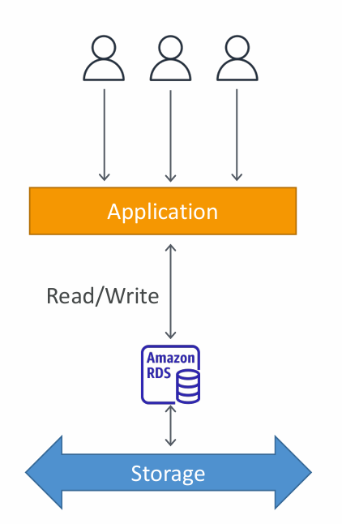

# 📘 Amazon RDS (Relational Database Service)

## 1. Amazon RDS Overview
- **RDS = Relational Database Service**, a **fully managed service** for relational databases in AWS.  
- Supports popular **SQL-based engines**, including:  
  - PostgreSQL  
  - MySQL  
  - MariaDB  
  - Oracle  
  - Microsoft SQL Server  
  - IBM DB2  
  - Amazon Aurora (AWS’s proprietary high-performance DB).  

**Key Idea:**  
Instead of manually installing and managing a database on EC2, RDS provides a **ready-to-use, managed database** ==where AWS handles operational overhead.==

---

## 2. Advantages of RDS vs Deploying DB on EC2

When you run a DB on **EC2**, you are responsible for:  
- OS patching, backups, replication, failover, scaling, etc.  

When you use **RDS**, AWS handles most of these.  

### Benefits of RDS:
1. **Automated Provisioning & OS Patching**  
   - No manual installation or patch management.  
   - AWS ensures DB engine + OS security patches are applied.  

2. **Continuous Backups & PITR (Point-In-Time Restore)**  
   - Automatic daily snapshots + transaction logs.  
   - You can restore DB to any point in the retention window.  

3. **Monitoring Dashboards**  
   - Integration with **Amazon CloudWatch** for metrics (CPU, IOPS, connections, storage).  

4. **Read Replicas**  
   - Scale read-heavy workloads by creating replicas across AZs/Regions.  

5. **Multi-AZ Deployment**  
   - Automatic failover for high availability (Disaster Recovery ready).  

6. **Maintenance Windows**  
   - Controlled schedule for upgrades (e.g., minor version updates).  

7. **Scaling Capability**  
   - **Vertical Scaling**: Change DB instance size (e.g., from db.t3.medium → db.m6g.large).  
   - **Horizontal Scaling**: Add read replicas.  

8. **Storage Backed by EBS**  
   - Uses fast, durable Elastic Block Store volumes.  

⚠️ **Limitation:**  
- You **cannot SSH into RDS instances**, unlike EC2. ==AWS hides OS-level access== to enforce “managed service” abstraction.  

---

## 3. RDS – Storage Auto Scaling

**Concept:**  
Automatically increases storage when your database is running out of space.  

### How it works:
- You set a **Maximum Storage Threshold** (upper storage limit).  
- RDS monitors usage and automatically expands storage if:  
  - Free storage < 10% of allocated size.  
  - Low storage has lasted at least **5 minutes**.  
  - Last modification was more than **6 hours ago**.  

### Benefits:
- Avoids downtime due to “out of storage” errors.  
- No manual intervention needed for scaling storage.  
- Useful for apps with **unpredictable workloads** (e.g., e-commerce traffic spikes, IoT data ingestion).  

### Supported Engines:
- Works with **all RDS database engines** (Postgres, MySQL, MariaDB, Oracle, SQL Server, Aurora).  

---

## 4. Real-World Example

- A fintech company runs a trading app on **RDS PostgreSQL**.  
- During market hours, millions of trades generate sudden spikes in storage requirements.  
- With **RDS Auto Scaling**, storage increases dynamically without downtime, ensuring smooth performance.  
- If they had run DB on EC2 → they would need a DBA to manually add storage volumes and restart DB, causing downtime.  

---

## 5. Key AWS Exam/Interview Takeaways
- **RDS vs EC2:** RDS = managed, EC2 = self-managed.  
- **High Availability:** Use **Multi-AZ**.  
- **Scaling Reads:** Use **Read Replicas**.  
- **Scaling Storage:** Use **Storage Auto Scaling**.  
- **Backups:** Automated + PITR.  
- **Security:** Integrated with IAM, VPC, Security Groups, and KMS for encryption.  
- **No OS Access:** You can’t SSH into RDS.  

> __Note__: Point-in-Time Recovery (PITR) in Amazon RDS is a feature that enables the restoration of a database instance to any specific second within a defined backup retention period. This is crucial for recovering from accidental data loss or corruption, as it allows you to roll back your database to a state before the incident occurred. 

---

✅ **Summary:**  
Amazon RDS provides a **managed relational database** solution with automated backups, high availability, scaling, and monitoring. Compared to self-hosting on EC2, RDS significantly reduces operational overhead, while features like **Auto Scaling** make it ideal for dynamic, unpredictable workloads.  

