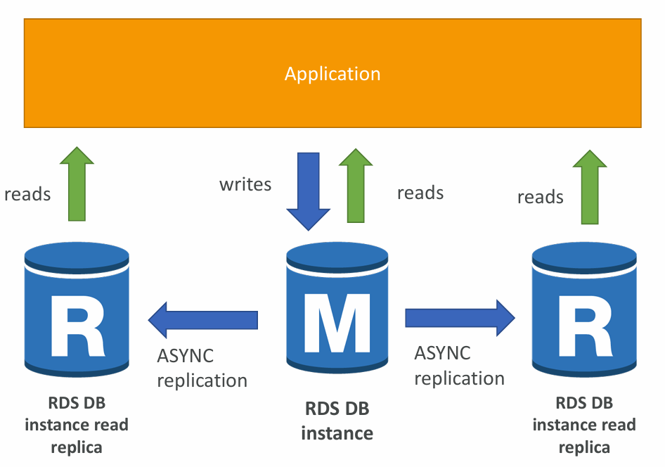
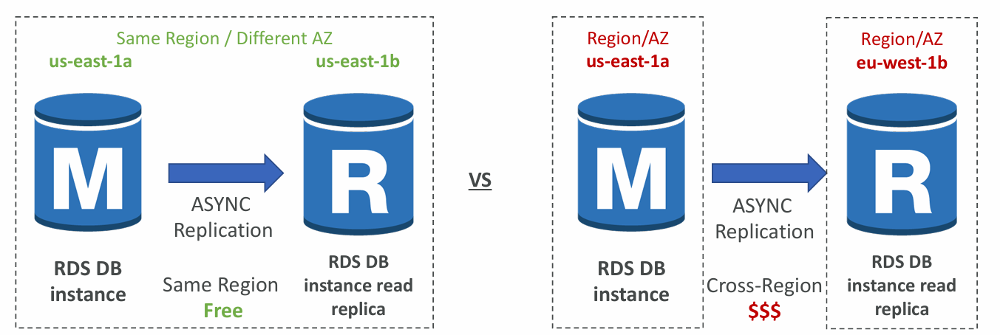

# 📘 Amazon RDS Read Replicas

## 1. What Are Read Replicas?
- **Read Replicas** allow you to scale read-heavy workloads by creating **copies of your RDS database**.  
- AWS RDS supports up to **15 Read Replicas per primary DB**.  
- Replication is **asynchronous (ASYNC)** → data is eventually consistent (not real-time).  
- Read Replicas can be created:  
  - Within the same **AZ** (Availability Zone).  
  - Across **different AZs** in the same Region.  
  - Across **different AWS Regions**.  

**Important:**  
- Applications must explicitly direct **read traffic** to replicas by changing the **connection string**.  
- ==If required, a Read Replica can be **promoted** to a standalone database== (useful for disaster recovery or migrations).  

---

## 2. How It Works
- **Master (Primary RDS DB Instance)** → Handles **all writes** (INSERT, UPDATE, DELETE) + can also handle reads.  
- **Read Replicas (R)** → Receive asynchronous updates from the master and handle **read queries (SELECT)**.  
- Application logic decides whether to send traffic to the Master or Replicas.  

From the above Diagram:
- `M` = Master DB instance.  
- `R` = Read Replica DB instance.  
- Writes → Master only.  
- Reads → Master + Replicas.  

---

## 3. Use Cases for Read Replicas

1. **Read Scalability**  
   - Offload **read-heavy traffic** (e.g., reporting, analytics, BI queries) to replicas.  
   - Production app continues unaffected.  

2. **Reporting Applications**  
   - Run long-running reporting queries on a replica without impacting the main production DB.  

3. **Disaster Recovery (DR)**  
   - ==In case of primary DB failure, promote a replica to standalone DB.==  

4. **Cross-Region Replication**  
   - Provide **low-latency reads** to users in different regions.  
   - Enable **cross-region DR strategy**.  

⚠️ **Limitation:**  
- Read Replicas are for **read-only** workloads (SELECT).  
- They **do not support writes** (INSERT, UPDATE, DELETE).  

---

## 4. Network Cost Considerations
AWS charges differently based on **where replicas are created**:  

1. **Same Region – Across AZs**  
   - **No extra data transfer costs** when using Read Replicas across AZs **in the same region**.  
   - Example: Master in `us-east-1a` → Replica in `us-east-1b`.  
   - Replication is **free**.  

2. **Cross-Region Read Replicas**  
   - **Replication traffic is billed** as cross-region data transfer.  
   - Example: Master in `us-east-1a` → Replica in `eu-west-1b`.  
   - This incurs additional cost ($$$).  

---

## 5. Real-World Example
- An e-commerce app hosted in **US East (Virginia)** uses MySQL RDS.  
- During peak traffic (Black Friday), the database faces heavy read queries for **product searches**.  
- Solution:  
  - Keep Master DB in `us-east-1a` for writes.  
  - Create 10 Read Replicas across `us-east-1b` and `us-east-1c` for reads.  
  - For European customers, create a Cross-Region Read Replica in `eu-west-1` to reduce latency.  

---

## 6. Key AWS Exam Tips
- **ASYNC Replication** = Read replicas are **eventually consistent**.  
- **Max 15 replicas** per DB.  
- **Promotion possible** (replica → standalone DB).  
- **Cross-Region = $$ cost**, Same Region (AZs) = Free.  
- Best for **read scalability** and **reporting use cases**, **not for writes**.  

---

✅ **Summary:**  
RDS Read Replicas help scale **read performance** by offloading queries from the master DB. They work asynchronously, can be deployed across AZs/Regions, and are cost-effective within a region but expensive cross-region. They are ideal for **scaling, reporting, and DR scenarios**.

