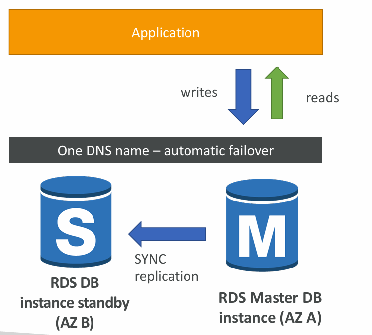
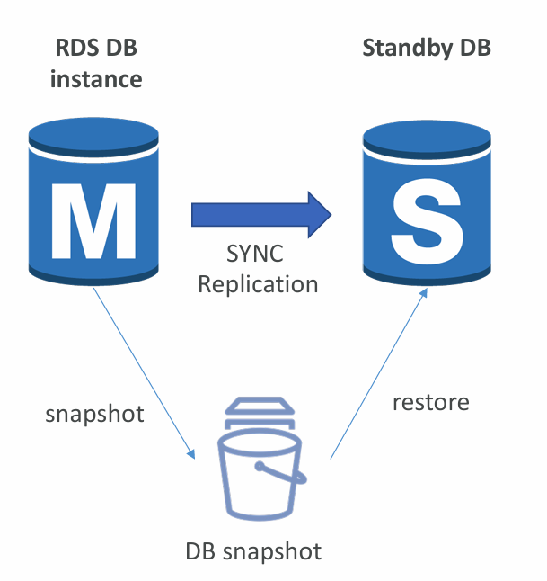
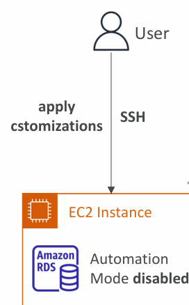

# 📘 Amazon RDS – Multi-AZ, Single-to-Multi AZ, and RDS Custom

---

## 1. RDS Multi-AZ (Disaster Recovery)

- **Definition**: Multi-AZ deployments are designed for **high availability (HA)** and **disaster recovery (DR)**.  
- **Replication type**: Uses **synchronous (SYNC) replication** between a **primary DB (AZ-A)** and a **standby DB (AZ-B)**.  
- **Automatic failover**:
  - If the primary AZ fails (e.g., network, storage, or instance failure), AWS automatically fails over to the standby DB.  
  - The application doesn’t need changes – AWS uses a **single DNS endpoint** that automatically points to the healthy instance.  

**Key Points**:
- **Not for scaling** → Read/write traffic does not split; standby is passive.  
- **Used for availability, not performance**.  
- **No manual intervention** is required – AWS handles failover automatically.  
- ✅ Best for **production workloads** where downtime is unacceptable.  

---

## 2. RDS – From Single-AZ to Multi-AZ

- You can convert an existing **Single-AZ RDS** instance to **Multi-AZ** with **zero downtime**.  
- Steps internally handled by AWS when you click **Modify → Multi-AZ**:
  1. AWS takes a **snapshot** of your DB.  
  2. A new standby DB is **restored in a different AZ** from the snapshot.  
  3. AWS establishes **synchronous replication** between the primary and standby.  

**Benefit**:
- You can upgrade to HA without service disruption.  
- Smooth transition for applications already running in Single-AZ.  

---

## 3. RDS Custom
- **What is RDS Custom?**  
  - A specialized RDS offering for **Oracle** and **Microsoft SQL Server** databases.  
  - Provides **full OS-level and DB-level customization**, unlike standard RDS where AWS fully manages the OS + DB.  

**Capabilities of RDS Custom**:
- Configure OS and database **settings**.  
- Install **custom patches** or **native DB features**.  
- Access underlying EC2 using **SSH** or **SSM Session Manager**.  

**Automation Mode**:
- In standard RDS, AWS automation handles backups, patching, scaling.  
- In **RDS Custom**, you can **disable automation mode** to apply custom changes, but best practice is to take a **DB snapshot first** (for rollback if needed).  

**Comparison (RDS vs RDS Custom)**:
- **RDS**:  
  - AWS manages the OS + DB fully.  
  - You have limited control.  
- **RDS Custom**:  
  - You get **full admin access** to OS + DB.  
  - Useful for enterprises with **legacy Oracle/MS SQL workloads** requiring fine-grained tuning.  

---

## 4. Exam/Interview Notes
- **Multi-AZ** = Synchronous replication → High availability + DR.  
- **Read Replicas** = Asynchronous replication → Read scaling, not DR.  
- **Single → Multi-AZ** = Seamless, zero downtime.  
- **RDS Custom** = For Oracle/SQL Server with **special compliance & customization needs**.  

---

✅ **Summary:**  
- Use **Multi-AZ** for **resilience and uptime** (not scaling).  
- Use **Read Replicas** for **scaling reads** (not DR).  
- Convert **Single-AZ to Multi-AZ** with no downtime.  
- Use **RDS Custom** when you need **control over OS/DB** (patching, tuning) while still leveraging AWS automation for backups and monitoring.  

---

# 📊 RDS – Read Replicas vs Multi-AZ vs RDS Custom

| Feature           | **RDS Read Replicas**                                             | **RDS Multi-AZ**                                          | **RDS Custom**                                                                              |
| ----------------- | ----------------------------------------------------------------- | --------------------------------------------------------- | ------------------------------------------------------------------------------------------- |
| **Purpose**       | Scale **read traffic**                                            | High availability (HA) & **Disaster Recovery**            | Full OS & DB customization (Oracle/SQL Server)                                              |
| **Replication**   | **Asynchronous**                                                  | **Synchronous**                                           | N/A (you manage DB + OS)                                                                    |
| **Consistency**   | Eventual consistency (lag possible)                               | Strong consistency (standby always up-to-date)            | Full control (depends on your config)                                                       |
| **Traffic**       | Used only for **reads (SELECT)**                                  | Primary handles **read/write**; standby only for failover | Full read/write, with custom patches/features                                               |
| **Failover**      | Not automatic                                                     | Automatic failover to standby using single DNS name       | Manual failover (since you manage customizations)                                           |
| **Scaling**       | ✅ Yes – up to 15 read replicas                                    | ❌ No – not used for scaling                               | ❌ Not for scaling                                                                           |
| **Use Cases**     | Analytics, reporting, read-heavy apps, global apps (cross-region) | Production DBs needing HA, DR, fault tolerance            | Enterprise workloads needing fine-grained control (Oracle/SQL Server with compliance needs) |
| **Conversion**    | Replicas can be **promoted** to standalone DBs                    | Can convert **Single-AZ → Multi-AZ** with zero downtime   | Managed EC2 + RDS – needs extra admin                                                       |
| **Network Cost**  | Cross-region replication → costs extra                            | Cross-AZ replication → included in price                  | Normal EC2/RDS networking charges                                                           |
| **Admin Control** | Limited (no OS access, no custom patches)                         | Limited (AWS manages everything)                          | Full control (SSH, SSM access to OS + DB)                                                   |
| **Best For**      | **Performance scaling**                                           | **Availability & DR**                                     | **Customization & compliance** (e.g., banking, healthcare)                                  |

---

✅ **Shortcut to remember**:

* **Read Replica → Scaling**
* **Multi-AZ → Resiliency (DR/HA)**
* **RDS Custom → Control (OS + DB customization)**

