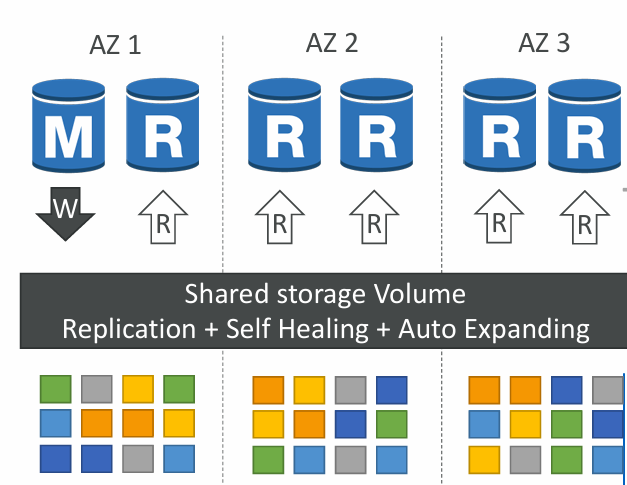
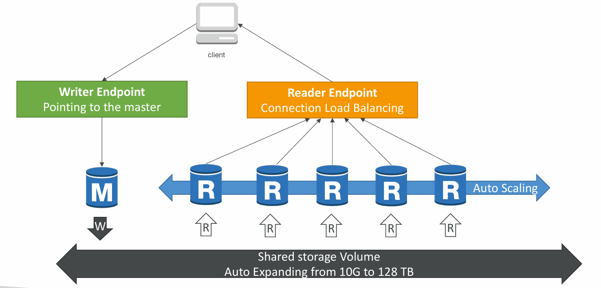

# 📘 Amazon Aurora – Detailed Notes

---

## 1. What is Aurora?

* **Aurora** is a **proprietary relational database** from AWS (not open source).
* Compatible with **MySQL** and **PostgreSQL** → you can use existing drivers, tools, and applications.
* Designed as an **AWS cloud-optimized database**, with:

  * **5x better performance** than MySQL on RDS.
  * **3x better performance** than PostgreSQL on RDS.
* **Storage**:

  * Auto-scales in increments of 10 GB.
  * Maximum size = **128 TB**.

**Cost:**

* ~20% more expensive than RDS, but **much more efficient**.

---

## 2. Aurora High Availability & Replication

* Aurora replicates data **6 times across 3 AZs**:

  * **4/6 copies required for writes**.
  * **3/6 copies required for reads**.
  * Peer-to-peer replication ensures **self-healing** of storage.
* **Shared storage volume** is distributed across **hundreds of disks** for durability and performance.

**High Availability:**

* Automated **failover in less than 30 seconds**.
* Native **HA (High Availability)** built into Aurora.

**Read Scaling:**

* Supports up to **15 Aurora Read Replicas**.
* Replication lag is very low (sub-10ms).
* Supports **cross-region replication** for global applications.

## Example 

Let’s break down **Aurora High Availability and Read Scaling** in a simple but detailed way, and then I’ll give you a **real-world example** so it sticks in memory.

# 📘 Aurora High Availability (HA) & Read Scaling

## 🔹 High Availability (HA)

* Aurora automatically **keeps 6 copies of your data** across **3 Availability Zones (AZs)**:

  * 2 copies per AZ.
* **Write Quorum** → Only **4 out of 6** copies are needed for a successful write.
* **Read Quorum** → Only **3 out of 6** copies are needed for a successful read.
* If one copy is lost or corrupted → Aurora uses **peer-to-peer replication** to repair it (self-healing).
* Failover (if the master DB fails) happens in **< 30 seconds** automatically.

✅ This makes Aurora much more durable than traditional RDS, where storage is tied to a single AZ.

---

## 🔹 Read Scaling

* Aurora separates **writes** (to the master) and **reads** (to replicas).
* You can add up to **15 Aurora Read Replicas**.
* Replication lag is **very low** (sub-10ms).
* Aurora supports **cross-region replication** (global apps).
* Clients connect through **endpoints**:

  * **Writer endpoint** → points to master DB (handles writes).
  * **Reader endpoint** → load balances across replicas (handles reads).

✅ This means your app can scale to handle **millions of read requests per second** while keeping a single master for consistency.

---

# 🌍 Example Scenario – E-commerce Website

Imagine you’re running **Amazon-style e-commerce**:

### 🔹 Setup

* **Aurora DB cluster**:

  * 1 **Master DB** (handles all product updates, orders, payments = writes).
  * 10 **Read Replicas** (handle product browsing, search queries = reads).
* **Data replicated across 3 AZs** for HA.

---

### 🔹 User Actions

1. **Customer Browsing Products**

   * Read-heavy workload.
   * Requests go to **Reader Endpoint**, which distributes them across 10 replicas.
   * Each replica serves thousands of queries in parallel.

2. **Customer Places Order**

   * Write-heavy operation (update inventory, order table).
   * Goes to the **Writer Endpoint** (master DB).
   * Aurora replicates the change across 6 storage copies instantly, and replicas catch up within ~10ms.

3. **AZ Failure Occurs**

   * Suppose the **master in AZ1** crashes.
   * Aurora automatically promotes a replica in **AZ2** to be the new master.
   * **Failover happens in <30 seconds** → app continues running without manual intervention.

---

### 🔹 Why This Is Powerful

* Reads are **scaled horizontally** (by adding replicas).
* Writes are **strongly consistent** (master only).
* Data is **highly available** (6 copies across 3 AZs).
* Failover is **fast and automatic** (<30s).

---

✅ **In Short:**
Aurora HA makes sure your database is **always available** (even if an AZ goes down).
Aurora Read Scaling lets you **handle massive read traffic** without overloading a single DB.

---

## 3. Aurora DB Cluster Design

Aurora operates as a **DB Cluster** with two types of endpoints:

1. **Writer Endpoint (Master)**

   * Only one master instance handles **all writes**.
   * Also handles reads if needed.

2. **Reader Endpoint**

   * Distributes **read traffic** across multiple replicas using **load balancing**.
   * Ideal for scaling read-heavy workloads.

**Auto-Scaling:**

* Replicas can scale up/down automatically based on workload.
* Shared storage ensures consistent performance across nodes.

---

## 4. Features of Aurora

1. **Automatic Failover** → less than 30 seconds.
    > __Note__: ==Failover== is a procedure by which a system automatically transfers control to a duplicate system when it detects a fault or failure.
2. **Backup and Recovery** → continuous backups to Amazon S3.
3. **Isolation & Security** → runs inside a VPC with IAM & KMS integration.
4. **Industry Compliance** → HIPAA, SOC, ISO, PCI DSS.
5. **Push-Button Scaling** → scale up/down compute resources.
6. **Zero-Downtime Patching** → managed patches without interruptions.
7. **Advanced Monitoring** → CloudWatch + Performance Insights.
8. **Routine Maintenance** → managed by AWS.
9. **Aurora Backtrack** → ==restore database to a point in time **without needing a backup restore** (unique Aurora feature).==

---

## 5. Why Choose Aurora Over RDS?

* **Performance** → Much faster due to cloud-native architecture.
* **Storage Scaling** → Auto-expands up to 128 TB vs fixed EBS for RDS.
* **HA/DR** → Built-in multi-AZ replication with fast failover.
* **Cost Efficiency** → Though ~20% costlier, fewer replicas + higher throughput = lower total cost.
* **Developer Friendly** → Same drivers/APIs as MySQL/PostgreSQL.

---

## 6. Real-World Use Case

* A **global e-commerce platform** needs:

  * Millions of reads per second for product searches.
  * Low write latency for orders and transactions.
  * High availability with **sub-30s failover**.
  * Cross-region replication for **US, EU, and APAC users**.

**Solution:**

* Aurora cluster with:

  * 1 writer (master).
  * 10 readers (read scaling).
  * Backtrack enabled for fast rollback in case of faulty deployment.
  * Cross-region replicas in Europe and Asia for local performance.

---

## 7. AWS Exam/Interview Key Points

* Aurora is **MySQL/Postgres compatible**.
* **Storage auto-scales** up to 128 TB.
* **6 copies across 3 AZs** → highly durable.
* **Replication lag < 10ms**.
* **15 replicas max**.
* **Failover < 30s**.
* Aurora **Backtrack** = unique feature.
* Aurora is **20% costlier** but more efficient.

---

✅ **Summary:**
Amazon Aurora is AWS’s **flagship relational database**, offering **enterprise-grade performance, scalability, and high availability**. With **cloud-native design**, it outperforms RDS and is well-suited for **mission-critical, global-scale applications**.

