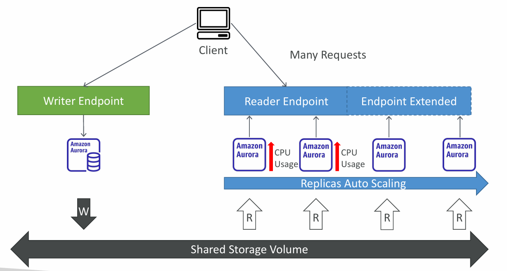
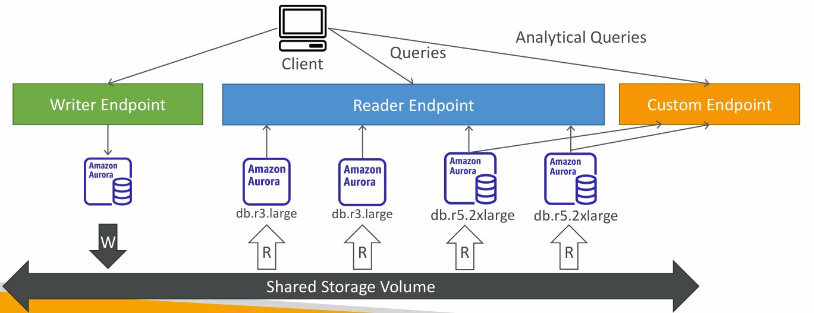
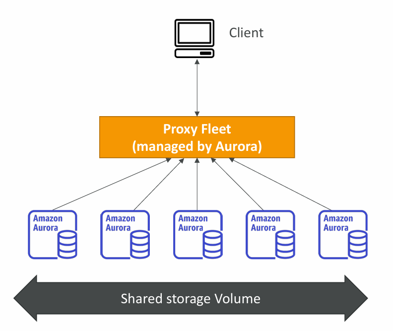
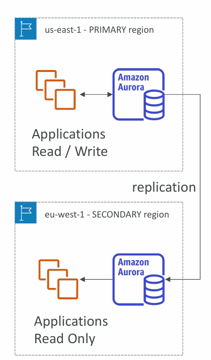

# 🌟 Amazon Aurora Advanced Features

## 1. **Aurora Replicas – Auto Scaling**

* Aurora automatically scales **read replicas** based on demand.
* When client applications send **many read requests**, Aurora adds more replicas behind the **Reader Endpoint**.
* **CPU Usage–based scaling:** As replica utilization increases, Aurora provisions additional replicas.
* **Extended Endpoint:** Used when replicas exceed a certain number, ensuring read load balancing.
* **Key Benefit:** Applications experience consistent performance without manual intervention.
  ✅ **Example:** An e-commerce app during a flash sale sees 10x more traffic. Aurora automatically adds replicas to handle read queries, preventing slowdowns.

---

## 2. **Aurora – Custom Endpoints**

* You can **define a subset of replicas** as a **custom endpoint**.
* Useful for **analytical workloads** that should not impact production queries.
* For example:

  * **Reader Endpoint** handles general read traffic.
  * **Custom Endpoint** is mapped only to specific large instances (e.g., `db.r5.2xlarge`) dedicated to analytics.
* **Benefit:** Ensures heavy queries don’t affect end-user experience.
  ✅ **Example:** A company runs **BI (Business Intelligence) reports** on a custom endpoint, while customers continue browsing products smoothly.

---

## 3. **Aurora Serverless**

* A **fully managed, on-demand autoscaling** database mode.
* No need for capacity planning; Aurora starts, stops, and scales based on usage.
* **Pay-per-second** billing, making it cost-effective for **intermittent** workloads.
* Good for apps with unpredictable traffic like dev/test environments or seasonal workloads.
  ✅ **Example:** A tax-filing app that gets high traffic in March-April but very low rest of the year uses Aurora Serverless to save costs.

---

## 4. **Global Aurora**

Two options for multi-region deployments:

### a) **Aurora Cross-Region Read Replicas**

* Simple setup, good for **disaster recovery (DR)**.
* Allows applications in another AWS region to **read from replicas**.

### b) **Aurora Global Database**

* Advanced option, designed for **low-latency global apps**.
* Features:

  * 1 **Primary Region** (read/write).
  * Up to 10 **Secondary Regions** (read-only).
  * Replication lag: **<1 second**.
  * Up to 16 replicas per secondary region.
  * Failover: promote a secondary region to primary in **<1 minute**.
    ✅ **Example:** A global **social media app** with users in the US, Europe, and Asia deploys Aurora Global Database so each region reads locally, reducing latency.

---

# 🔑 Key Takeaways

* **Auto Scaling Replicas** → Handles unexpected read traffic.
* **Custom Endpoints** → Separate analytical queries from production.
* **Aurora Serverless** → Best for variable or unpredictable workloads.
* **Global Aurora** → Enables low-latency, globally distributed apps with ==fast disaster recovery.==

---

⚡ This content is **highly exam-relevant** because AWS loves to test differences between:

* **Read Replicas vs Multi-AZ vs Global Aurora**
* **Aurora Serverless vs Aurora Provisioned**
* **Custom Endpoints vs Reader Endpoints**

