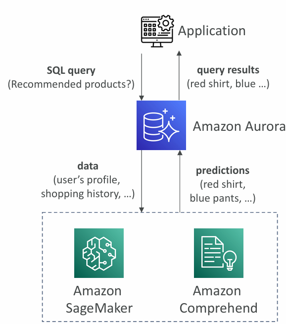
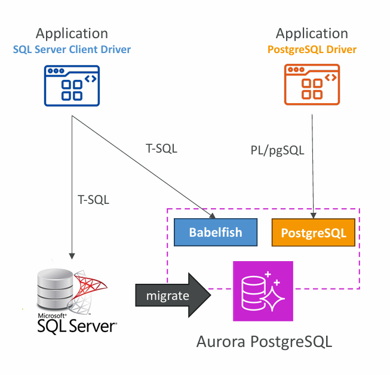

# 📘 Aurora Machine Learning

- **Integration of ML into Databases**  
  Aurora enables adding **ML predictions directly via SQL queries**.  
  Example: `SELECT predict_recommendations(user_id)` could return personalized product suggestions.

- **Supported Services**  
  - **Amazon SageMaker** → Train/deploy any ML model and call it from Aurora.  
  - **Amazon Comprehend** → Perform **sentiment analysis** (e.g., positive/negative/neutral) on text data stored in Aurora.

- **Key Points**  
  - Simple + secure integration → No need for deep ML expertise.  
  - SQL-based → Developers just use SQL queries; Aurora connects to ML services in background.  
  - Use cases: **fraud detection, product recommendations, ads targeting, sentiment analysis**.

---

# 📘 Babelfish for Aurora PostgreSQL

- **Purpose**  
  ==Allows **Aurora PostgreSQL** to understand **T-SQL (Microsoft SQL Server queries)**.==
  This means SQL Server–based applications can run on Aurora PostgreSQL **with minimal or no code changes**.

- **How it works**  
  - Applications using **MS SQL Server client drivers** can directly connect to Aurora PostgreSQL (via Babelfish).  
  - Aurora can parse and execute **T-SQL commands** alongside native PostgreSQL commands.  

- **Migration Benefit**  
  - Reduces migration effort from **SQL Server → Aurora PostgreSQL**.  
  - Can be combined with **AWS SCT (Schema Conversion Tool)** + **AWS DMS (Database Migration Service)**.

---

# 📘 RDS Backups

- **Automated Backups**  
  - Daily full backup.  
  - Transaction logs captured every **5 minutes**.  
  - Supports **Point-in-Time Restore (PITR)** (up to the last 5 minutes).  
  - Retention: **1–35 days** (configurable).  

- **Manual Snapshots**  
  - User-triggered.  
  - Can retain indefinitely.  

- **Note**: If RDS is **stopped**, you still pay for storage. For long-term suspension, better to **take a snapshot and delete the instance**.

---

# 📘 Aurora Backups

- **Automated Backups**  
  - Enabled by default.  
  - Retention: **1–35 days** (cannot be disabled).  
  - Supports **Point-in-Time Recovery (PITR)**.  

- **Manual Snapshots**  
  - Same as RDS → user-managed + indefinite retention.  

---

# 📘 Restore Options (RDS & Aurora)

- **General Rule**: Restoring a backup/snapshot **creates a new DB instance**.  

### 1. Restoring MySQL RDS from S3
- Create a backup of on-premises DB.  
- Upload backup to **Amazon S3**.  
- Restore backup into a **new RDS MySQL instance**.  

### 2. Restoring MySQL Aurora from S3
- Take a backup using **Percona XtraBackup** (a MySQL backup tool).  
- Store on **Amazon S3**.  
- Restore to a **new Aurora MySQL cluster**.  

---

✅ **Exam Tip**:  
- RDS PITR granularity = **5 minutes**.  
- Aurora backups = **always on, cannot disable**.  
- Babelfish = **MS SQL → Aurora PostgreSQL migration helper**.  
- Aurora ML = **SQL-driven ML inference with SageMaker + Comprehend**.  

