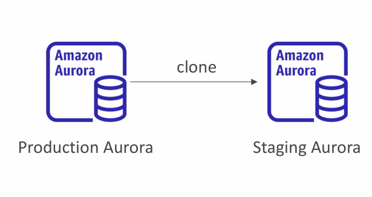
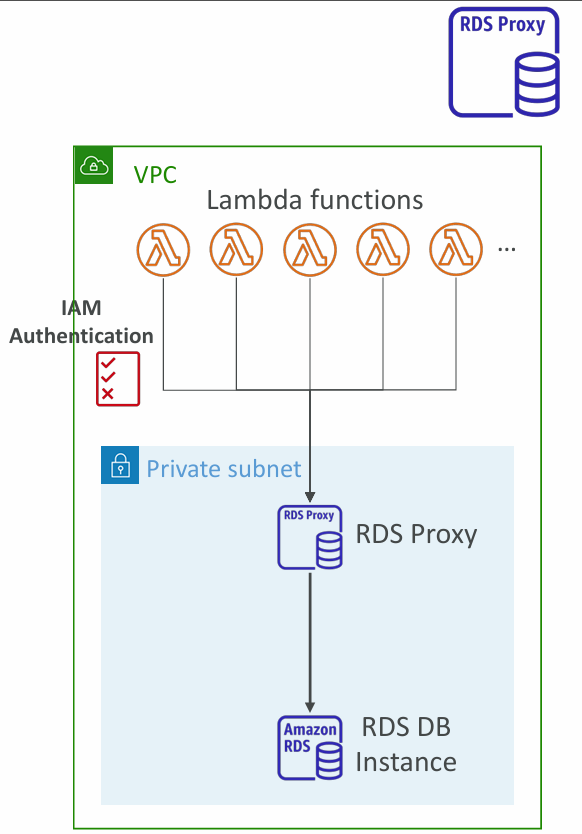

# **Aurora Database Cloning**

### Concept

Aurora Database Cloning allows you to create a **new Aurora DB cluster from an existing one** in a fast and cost-effective way. Instead of creating a full snapshot and restoring it, cloning is optimized using a **copy-on-write protocol**.

### How It Works

* **Copy-on-Write Protocol**

  * When you create a clone, initially it **shares the same underlying data volume** as the source DB cluster.
  * No data is copied immediately, which makes the process very fast.
  * As soon as changes are made in either the original DB or the clone, only the changed data blocks are copied to a new volume.
  * This keeps the cloned and original clusters isolated without duplicating the entire dataset.

### Benefits

* **Faster than snapshot + restore**: Because no initial copy is needed.
* **Cost-effective**: Storage costs only increase when changes are made, since only modified blocks need new space.
* **Use Cases**:

  * Creating **staging/test environments** from production without impacting performance.
  * Running **analytics or experiments** on cloned databases without touching production data.

---

# **RDS & Aurora Security**

### At-Rest Encryption

* Uses **AWS KMS (Key Management Service)**.
* Must be defined at DB launch.
* If the **master DB is unencrypted**, its **read replicas cannot be encrypted**.
* To encrypt an unencrypted DB, you must **snapshot → restore with encryption enabled**.

### In-Flight Encryption

* TLS-enabled by default.
* Use **AWS TLS root certificates** on the client side to ensure secure data transmission.

### IAM Authentication

* You can authenticate using **IAM roles** instead of usernames and passwords.
* This reduces reliance on static credentials and integrates with AWS security best practices.

### Security Groups

* Control **network-level access** to your RDS/Aurora DB.
* Acts as a firewall defining which IPs or resources can connect.

### Additional Security Notes

* **No SSH access**: Except for **RDS Custom** (where you manage OS-level access).
* **Audit Logs**: Can be enabled and stored in **CloudWatch Logs** for monitoring, auditing, and longer retention.

---

# **Amazon RDS Proxy**

### Concept

Amazon RDS Proxy is a **fully managed database proxy** for RDS and Aurora. It acts as an intermediary between applications and the database, allowing better connection management and security.

### Key Features

* **Connection Pooling**: Applications can pool and share DB connections.
> Note: 
__Pooling__ in a database, specifically database connection pooling, is a technique used to manage and reuse database connections efficiently. Instead of establishing a new connection for every database request, which incurs significant overhead in terms of time and resources, connection pooling maintains a cache (or "pool") of pre-established, open database connections.
* **Improves efficiency** by reducing stress on DB resources (CPU, RAM) and minimizing open/idle connections.
* **Serverless, autoscaling, multi-AZ**: Highly available and scales with workload.
* **Reduced failover time**: Improves RDS & Aurora failover by up to **66%**.
* **Multi-DB support**: Works with RDS MySQL, PostgreSQL, MariaDB, SQL Server, and Aurora (MySQL, PostgreSQL).

### Security

* **IAM Authentication** enforced for DB connections.
* Credentials securely stored in **AWS Secrets Manager**.
* **Not publicly accessible**: Must be accessed within a VPC.

### Benefits

* **No code changes required** for most applications.
* **Better scaling for Lambda functions** or serverless apps that create many short-lived connections.
* Prevents DB from being overwhelmed by connection storms.

---

✅ **In summary**:

* **Aurora Cloning** → quick staging DBs using copy-on-write, cost-efficient.
* **RDS & Aurora Security** → encryption at-rest/in-flight, IAM auth, no SSH, audit logging.
* **RDS Proxy** → connection pooling, efficiency, reduced failover, IAM integration, serverless-friendly.

