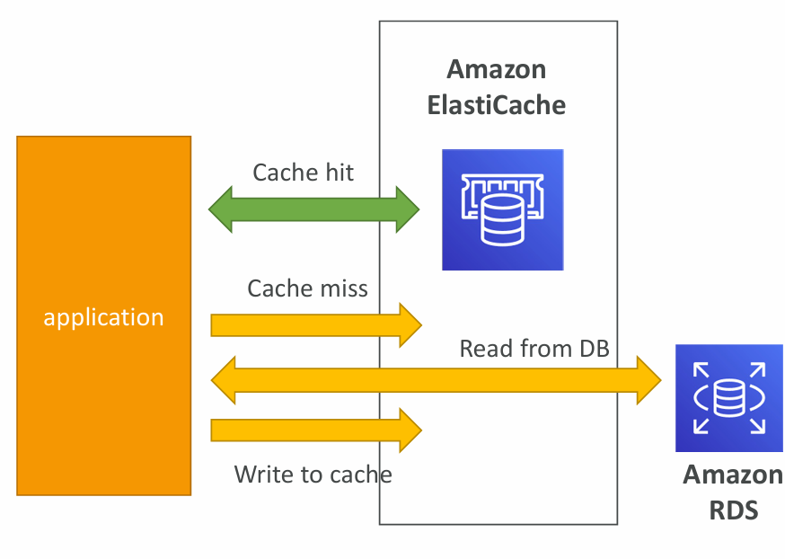
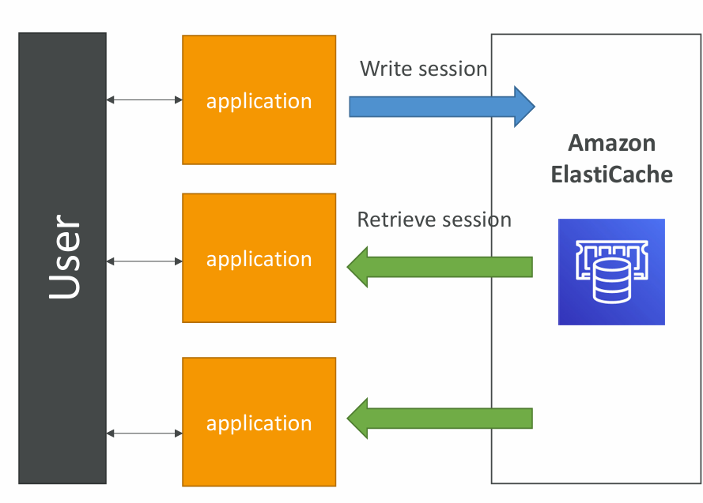

# **Amazon ElastiCache Overview**

### Concept
Amazon ElastiCache is a **fully managed in-memory caching service** provided by AWS. It supports **Redis** and **Memcached**, giving applications ultra-fast access to frequently used data with **low latency** and **high throughput**.

- **Analogy**: Just as RDS provides managed relational databases, ElastiCache provides managed caching (Redis/Memcached).  
- **Performance**: In-memory caches are much faster than traditional disk-based databases, making them ideal for read-heavy workloads.  

### Benefits
- **Offloads databases**: Reduces read load on databases (like RDS) by serving frequently accessed data from cache.  
- **Improves scalability**: Makes applications more responsive and able to handle higher throughput.  
- **Supports stateless architecture**: By moving session or frequently used data into cache, the application itself can remain stateless.  
- **AWS Management**: AWS takes care of patching, monitoring, failure recovery, backups, and cluster scaling.  

⚠️ **Note**: Using ElastiCache often requires **application code changes** (to implement cache logic such as storing, retrieving, and invalidating cached data).  

---

# **ElastiCache Solution Architecture – Database Cache**

### Workflow

1. **Application query**:  
   - Application first checks ElastiCache for data.  
   - If data exists → **Cache Hit** → returned directly from ElastiCache (fast).  
   - If data doesn’t exist → **Cache Miss** → retrieved from RDS, then stored in ElastiCache for future queries.  

2. **Read-heavy optimization**:  
   - Frequently requested queries are served from ElastiCache.  
   - This reduces load on RDS, making it more available for writes and less likely to bottleneck under heavy read traffic.  

3. **Cache invalidation**:  
   - Critical to ensure that data is **fresh**.  
   - Invalidation strategy is needed so stale/expired data doesn’t mislead applications. Common strategies:  
     - **Time-to-Live (TTL)** expiry.  
     - **Write-through** (update both DB and cache).  
     - **Lazy loading** (load into cache only on demand).  

### Benefits
- Great for applications with **frequent, repetitive queries** (e.g., product catalog, leaderboard, profile lookups).  
- Helps optimize **database performance and cost**.  

---

# **ElastiCache Solution Architecture – User Session Store**

### Workflow
1. **User logs in**:  
   - The application writes user session data into ElastiCache.  

2. **Application scaling**:  
   - If the user interacts with another instance of the application (e.g., behind a load balancer), that instance retrieves the session from ElastiCache.  
   - This ensures the user doesn’t need to re-login when moving between app servers.  

3. **Stateless design**:  
   - Application servers don’t need to store session information locally.  
   - All session data is centralized in ElastiCache.  

### Benefits
- **Scalability**: Multiple app servers can share user sessions seamlessly.  
- **Performance**: Fast retrieval of session data (since it’s in-memory).  
- **Reliability**: Even if one app server crashes, the session is still available to others.  

---

# **Summary**

- **ElastiCache Overview** → Provides managed Redis/Memcached for high-performance caching, reduces DB load, makes apps scalable, but requires app code changes.  
- **DB Cache Architecture** → Applications check ElastiCache first → Cache Hit (fast) or Cache Miss (fallback to RDS). Must implement invalidation strategy.  
- **User Session Store** → Session data stored in ElastiCache allows stateless applications and seamless multi-instance login management.  

