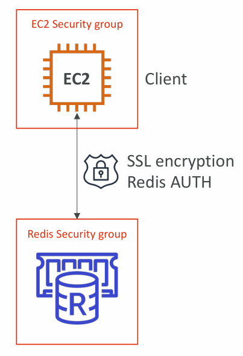
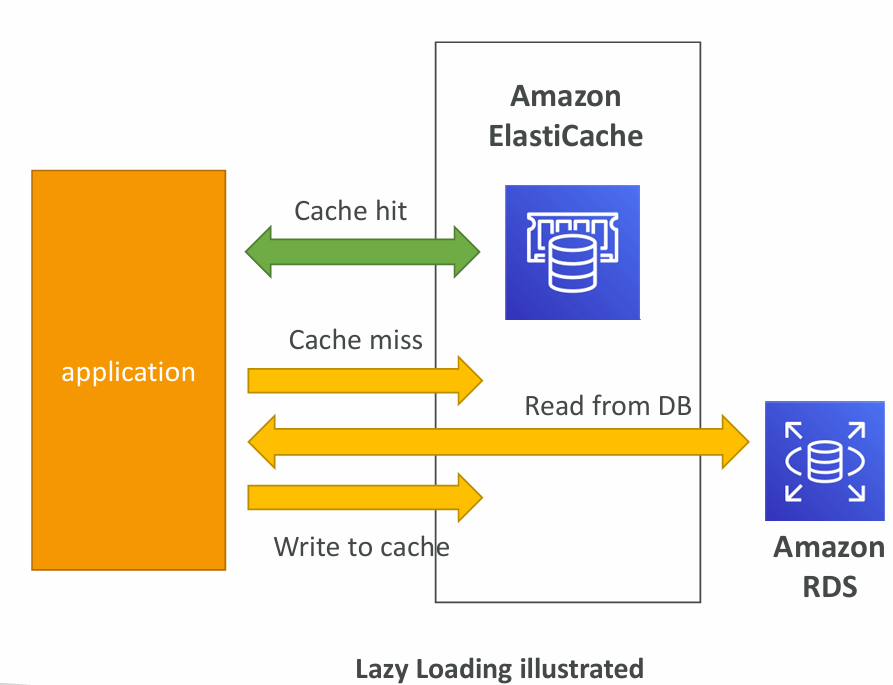
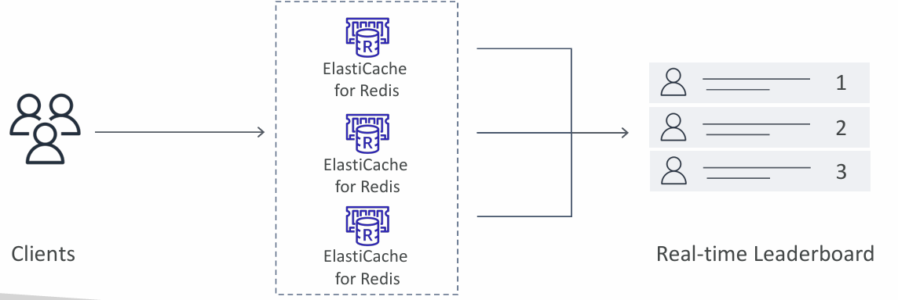

# **ElastiCache – Redis vs Memcached**

### Redis

* **High Availability & Durability**:

  * Supports **Multi-AZ with Auto-Failover** for resilience.
  * **Read Replicas** improve scalability and allow high availability.
  * **Persistence** supported with Append-Only File (AOF) for durability.
* **Backup & Restore**: Native support for backups to S3 and restoration.
* **Data Structures**: Advanced support for **Sets** and **Sorted Sets**, making it ideal for leaderboards, ranking, and other ordered data use cases.

### Memcached

* **Sharding**: Multi-node architecture where data is partitioned across nodes.
* **No High Availability**: No replication or automatic failover.
* **Non-Persistent**: Data stored only in memory; lost if node restarts.
* **No Native Backup/Restore** (serverless nature).
* **Multi-threaded**: Can utilize multiple CPU cores, making it lightweight and fast for simple caching.

👉 **Summary**:

* **Redis** → feature-rich, durable, reliable, high availability.
* **Memcached** → simpler, lightweight, high-performance, but lacks durability/HA.

---

# **ElastiCache – Cache Security**

### General Security

* **IAM Authentication**: Supported for **Redis**.
* **IAM policies** apply only at **AWS API level** (management actions, not data queries).

### Redis-Specific Security

* **Redis AUTH**: You can set a password/token when creating a cluster.
* Provides **extra security** on top of Security Groups.
* **SSL In-flight Encryption**: Protects data while moving between clients and cache.

### Memcached Security

* Supports **SASL-based authentication** for advanced use cases.

👉 Security best practices:

* Always use Security Groups to control **network-level access**.
* Use **Redis AUTH + SSL** for production-grade secure setups.

---

# **Patterns for ElastiCache**

### 1. **Lazy Loading**

* Data is cached only when requested for the first time.
* If data not in cache → retrieved from DB → written into cache.
* Drawback: Stale data can remain in cache until invalidated or expired.
* Good for read-heavy workloads.

### 2. **Write-Through**

* Data is written to both **DB and cache** simultaneously.
* Guarantees no stale data in cache.
* Can increase write latency (because every write updates cache + DB).

### 3. **Session Store**

* Cache used to store **temporary session data**.
* Uses **TTL (Time-to-Live)** to expire inactive sessions.
* Ideal for web apps with distributed, stateless servers where session persistence is required.

👉 Key Quote: *“There are only two hard things in Computer Science: cache invalidation and naming things.”*

* **Invalidation Strategy** is critical to avoid stale/incorrect data.

---

# **ElastiCache – Redis Use Case**

### Gaming Leaderboards

* Gaming leaderboards require frequent **ranking and ordering** of scores, which is computationally expensive in relational databases.

### Redis Sorted Sets

* **Guarantee uniqueness** (no duplicate scores for the same user).
* **Maintain order** automatically by score.
* New scores are inserted in real-time into the correct rank position.

### Benefits

* **Real-time Leaderboards**: Players instantly see updated rankings.
* **Scalability**: Can handle millions of updates per second with low latency.

👉 Other Redis Use Cases:

* Real-time analytics dashboards.
* Chat/messaging queues.
* Geo-spatial data (e.g., nearest drivers in ride-hailing apps).

---

# **Final Summary**

* **Redis** → feature-rich (HA, replication, persistence, backup, advanced data types).
* **Memcached** → simple, fast, sharded, but lacks durability and HA.
* **Security** → Redis supports IAM auth, Redis AUTH, SSL; Memcached uses SASL.
* **Patterns** → Lazy Loading (read-focused), Write-Through (write consistency), Session Store (stateless apps).
* **Redis Use Case** → Sorted Sets ideal for leaderboards, ranking, and real-time updates.

