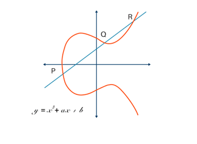

### 📌 **Elliptic Curve Cryptography (ECC)**

**Elliptic Curve Cryptography (ECC)** is a powerful public-key cryptographic system that provides **high levels of security** using **much smaller key sizes** compared to traditional systems like RSA. It is based on the **algebraic structure of elliptic curves over finite fields** and is widely used in modern cryptographic applications due to its **efficiency and strength**.

The diagram provided represents an **elliptic curve** defined by the general form:

$$
y^2 = x^3 + ax + b
$$

with a condition:

$$
4a^3 + 27b^2 \neq 0
$$

This condition ensures the curve has **no cusps or self-intersections**, making it suitable for cryptographic use.

---

## 🔍 **Key Features of ECC**

### 🔸 **Elliptic Curves**

* ECC uses curves of the form:

  $$
  y^2 = x^3 + ax + b \ (\text{mod } p)
  $$
* The curve forms a **set of points**, including a point at infinity, used for **cryptographic operations** such as point addition and scalar multiplication.

### 🔸 **Smaller Key Sizes**

* ECC achieves **equivalent security** with **shorter keys** than RSA.

  * **256-bit ECC ≈ 3072-bit RSA**
  * This results in **faster computations**, **less memory usage**, and **lower power consumption**.

### 🔸 **Efficiency**

* Ideal for **mobile devices**, **IoT**, and **embedded systems** due to minimal resource requirements.
* Faster encryption, signing, and key exchange compared to traditional public-key methods.

---

## 🔐 **ECC Operations**

### 1. **Key Generation**

* Choose an elliptic curve **E** over a finite field **Fp**.
* Select a **base point G** on the curve.
* Choose a **private key `d`** (a random integer).
* Compute the **public key `Q = dG`** (scalar multiplication).

### 2. **Encryption (Elliptic Curve ElGamal)**

* Given a message point **M**, sender:

  * Picks random integer **k**.
  * Computes **R = kG**.
  * Computes **S = M + kQ**.
* The ciphertext is the pair **(R, S)**.

### 3. **Decryption**

* Receiver knows private key `d` and ciphertext `(R, S)`:

  * Computes **M = S – dR**
  * Since **dR = kQ**, this operation reverses the encryption.

---

## 🔐 **Security of ECC**

* ECC is secure due to the **Elliptic Curve Discrete Logarithm Problem (ECDLP)**:

  * Given **Q = dG**, it is computationally hard to find `d`.
* **ECDLP is considered more difficult** than the integer factorization problem on which RSA relies, especially for smaller key sizes.

---

## 🌍 **Real-Life Applications**

ECC is becoming increasingly popular in real-world applications:

* **WhatsApp, Signal**: For end-to-end encryption
* **Bitcoin, Ethereum**: For digital signatures
* **SSL/TLS**: Used in HTTPS certificates for secure websites
* **Smart Cards, IoT Devices**: Where low power and storage are key

---

## 📈 **Diagram Explanation**

The diagram illustrates **point addition on an elliptic curve**, a fundamental operation in ECC:

* **P and Q** are two points on the curve.
* Draw a line through **P and Q**. It intersects the curve at a third point **R**.
* **R is reflected across the x-axis** to give the point **P + Q**.
* This geometric process is analogous to algebraic operations in the ECC key exchange.

---

## ✅ **Conclusion**

**Elliptic Curve Cryptography (ECC)** is a **modern, efficient, and highly secure** cryptographic technique. With its ability to provide **strong encryption using smaller keys**, ECC is well-suited for today's digital world—particularly in **mobile, IoT, and cloud-based environments**. Its adoption continues to grow as **security, speed, and efficiency** become increasingly important in communication and data protection.
