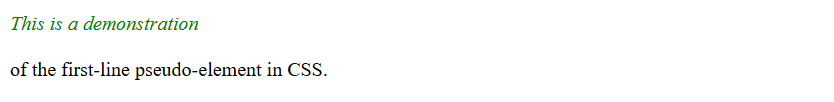
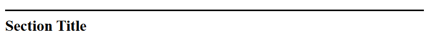
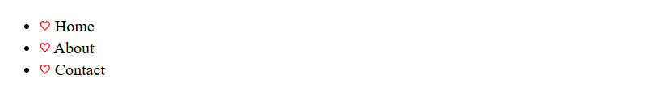

# Mastering CSS Pseudo-elements: A Comprehensive Guide  

CSS pseudo-elements are powerful tools that allow developers to style specific parts of elements, creating visually stunning designs without altering the HTML structure. This blog explores pseudo-elements in detail, their syntax, and practical applications with examples.  

---

## **What Are CSS Pseudo-elements?**  

Pseudo-elements enable you to style specific parts of an element. Unlike pseudo-classes, which target states of an element (e.g., hover or focus), pseudo-elements target a specific portion of the element, such as the first line or the first letter.  

---

## **Syntax of Pseudo-elements**  

Pseudo-elements are written with double colons (`::`), though single colons (`:`) are still valid in older CSS versions for certain pseudo-elements (e.g., `:before` and `:after`).  

```css
selector::pseudo-element {
  /* Styles */
}
```  

### **Commonly Used Pseudo-elements**
1. `::before`
2. `::after`
3. `::first-letter`
4. `::first-line`
5. `::placeholder`
6. `::selection`

---

## **1. `::before` Pseudo-element**  

The `::before` pseudo-element inserts content before the content of the selected element.  

### **Syntax**  
```css
selector::before {
  content: "text";
  /* Additional styles */
}
```  

### **Example**  
```html
<h1>Welcome</h1>
```  
```css
h1::before {
  content: "🎉 ";
  color: red;
}
```  

**Result:**  
The heading will appear as:  
🎉 Welcome  

---

## **2. `::after` Pseudo-element**  

The `::after` pseudo-element inserts content after the content of the selected element.  

### **Syntax**  
```css
selector::after {
  content: "text";
  /* Additional styles */
}
```  

### **Example**  
```html
<p>Read More</p>
```  
```css
p::after {
  content: " ➡️";
  font-size: larger;
}
```  

**Result:**  
The paragraph will appear as:  
Read More ➡️  

---

## **3. `::first-letter` Pseudo-element**  

The `::first-letter` pseudo-element styles the first letter of an element.  

### **Syntax**  
```css
selector::first-letter {
  /* Styles */
}
```  

### **Example**  
```html
<p>Welcome to the tutorial.</p>
```  
```css
p::first-letter {
  font-size: 2em;
  font-weight: bold;
  color: blue;
}
```  

**Result:**  
The paragraph will appear as:  
**W**elcome to the tutorial.  

---

## **4. `::first-line` Pseudo-element**  

The `::first-line` pseudo-element styles the first line of an element.  

### **Syntax**  
```css
selector::first-line {
  /* Styles */
}
```  

### **Example**  
```html
<p>This is a demonstration <br/> of the first-line pseudo-element in CSS.</p>
```  
```css
p::first-line {
  font-style: italic;
  color: green;
}
```  

**Result:**  
The first line of the paragraph will appear italic and green.  



---

## **5. `::placeholder` Pseudo-element**  

The `::placeholder` pseudo-element styles the placeholder text in form fields.  

### **Syntax**  
```css
input::placeholder {
  /* Styles */
}
```  

### **Example**  
```html
<input type="text" placeholder="Enter your name" />
```  
```css
input::placeholder {
  color: gray;
  font-style: italic;
}
```  

**Result:**  
The placeholder text appears gray and italicized.  


---

## **6. `::selection` Pseudo-element**  

The `::selection` pseudo-element styles the portion of text selected by the user.  

### **Syntax**  
```css
::selection {
  /* Styles */
}
```  

### **Example**  
```html
<p>Highlight this text to see the effect.</p>
```  
```css
::selection {
  background-color: yellow;
  color: black;
}
```  

**Result:**  
When the user selects text, it appears with a yellow background and black text color.  


---

## **Advanced Use Cases of Pseudo-elements**  

### **1. Creating Custom Quotes**  
Use `::before` and `::after` to add quotation marks around a block of text.  

```html
<blockquote>CSS is amazing!</blockquote>
```  
```css
blockquote::before {
  content: "“";
  font-size: 2em;
  color: gray;
}
blockquote::after {
  content: "”";
  font-size: 2em;
  color: gray;
}
```  

**Result:**  
“CSS is amazing!”  

---

### **2. Styling a Divider**  
Add a decorative line before or after an element using `::before` or `::after`.  

```html
<h2>Section Title</h2>
```  
```css
h2::before {
  content: "";
  display: block;
  height: 2px;
  background: black;
  margin-bottom: 10px;
}
```  

**Result:**  

A horizontal line appears before the section title.  




---

### **3. Adding Icons to Lists**  
Add icons to list items dynamically.  

```html
<ul>
  <li>Home</li>
  <li>About</li>
  <li>Contact</li>
</ul>
```  
```css
li::before {
  content: "♡ ";
  color: red;
}
```  

**Result:**  


---

## **Best Practices for Using Pseudo-elements**  

1. **Always Specify the `content` Property**  
For `::before` and `::after`, the `content` property is mandatory. Without it, the pseudo-element will not render.  

2. **Combine with Regular Selectors**  
Pseudo-elements are most effective when combined with regular selectors to target specific states or types.  

3. **Avoid Overuse**  
Overusing pseudo-elements can make your CSS difficult to maintain. Use them for enhancements rather than critical styling.  

---

## **Limitations of Pseudo-elements**  
- Limited to two pseudo-elements (`::before` and `::after`) per element.  
- Cannot dynamically manipulate content or fetch external data (use JavaScript for these cases).  

---

## **Conclusion**  

CSS pseudo-elements are essential for creating visually appealing and dynamic designs. By targeting specific parts of elements or enhancing content without altering the HTML, pseudo-elements offer a clean and efficient way to style your web pages.  

Experiment with these pseudo-elements in your next project to unlock the full potential of CSS!  