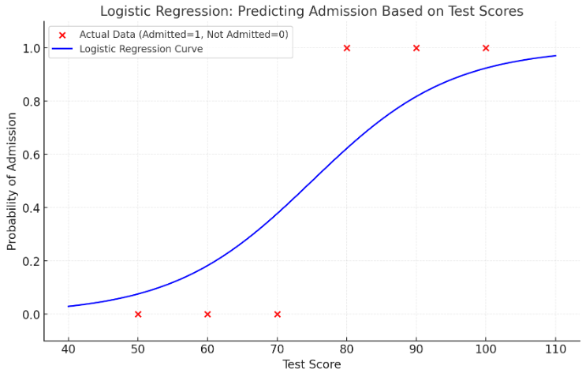

## Mathematical Derivation of logistic regression

In logistic regression, the coefficients \( b_0 \) (intercept) and \( b_1 \) (slope for each feature) are derived by maximizing the **likelihood function** or equivalently minimizing the **negative log-likelihood**. Logistic regression predicts probabilities through the logistic (sigmoid) function:

\[
P(y=1|x) = \frac{1}{1 + e^{-(b_0 + b_1x)}}
\]

Here’s the step-by-step derivation:

---

### **Step 1: Logistic Model**

The probability \( P(y=1|x) \) of the outcome \( y \) given \( x \) is modeled as:

\[
P(y=1|x) = \frac{1}{1 + e^{-(b_0 + b_1x)}}
\]

Similarly, the probability of \( y = 0 \) is:

\[
P(y=0|x) = 1 - P(y=1|x)
\]

These probabilities can be combined into one formula using the exponent form:

\[
P(y|x) = \left(\frac{1}{1 + e^{-(b_0 + b_1x)}}\right)^y \cdot \left(1 - \frac{1}{1 + e^{-(b_0 + b_1x)}}\right)^{1-y}
\]

---

### **Step 2: Likelihood Function**

The likelihood function is the joint probability of observing the data points \( \{(x_i, y_i)\} \), assuming they are independent:

\[
L(b_0, b_1) = \prod_{i=1}^n P(y_i|x_i)
\]

Substituting the probability formula:

\[
L(b_0, b_1) = \prod_{i=1}^n \left(\frac{1}{1 + e^{-(b_0 + b_1x_i)}}\right)^{y_i} \cdot \left(1 - \frac{1}{1 + e^{-(b_0 + b_1x_i)}}\right)^{1-y_i}
\]

---

### **Step 3: Log-Likelihood Function**

Since working with products is computationally expensive, we take the natural logarithm of the likelihood function, leading to the log-likelihood function:

\[
\ell(b_0, b_1) = \sum_{i=1}^n \left[y_i \ln\left(\frac{1}{1 + e^{-(b_0 + b_1x_i)}}\right) + (1-y_i) \ln\left(1 - \frac{1}{1 + e^{-(b_0 + b_1x_i)}}\right)\right]
\]

Simplify the terms:

\[
\ell(b_0, b_1) = \sum_{i=1}^n \left[y_i(b_0 + b_1x_i) - \ln(1 + e^{b_0 + b_1x_i})\right]
\]

---

### **Step 4: Gradient of Log-Likelihood**

To find the maximum likelihood estimates for \( b_0 \) and \( b_1 \), we differentiate the log-likelihood with respect to \( b_0 \) and \( b_1 \).

#### Derivative with Respect to \( b_0 \):
\[
\frac{\partial \ell}{\partial b_0} = \sum_{i=1}^n \left[y_i - \frac{e^{b_0 + b_1x_i}}{1 + e^{b_0 + b_1x_i}}\right]
\]

Simplify using the sigmoid function \( \sigma(z) = \frac{1}{1 + e^{-z}} \):

\[
\frac{\partial \ell}{\partial b_0} = \sum_{i=1}^n \left[y_i - \sigma(b_0 + b_1x_i)\right]
\]

#### Derivative with Respect to \( b_1 \):
\[
\frac{\partial \ell}{\partial b_1} = \sum_{i=1}^n x_i \left[y_i - \frac{e^{b_0 + b_1x_i}}{1 + e^{b_0 + b_1x_i}}\right]
\]

Simplify:
\[
\frac{\partial \ell}{\partial b_1} = \sum_{i=1}^n x_i \left[y_i - \sigma(b_0 + b_1x_i)\right]
\]

---

### **Step 5: Solving for \( b_0 \) and \( b_1 \)**

The coefficients \( b_0 \) and \( b_1 \) are obtained by setting the gradients to zero:

\[
\frac{\partial \ell}{\partial b_0} = 0, \quad \frac{\partial \ell}{\partial b_1} = 0
\]

Since these equations are nonlinear, they cannot be solved algebraically. Instead, numerical optimization techniques such as **Gradient Descent** or **Iterative Reweighted Least Squares (IRLS)** are used to compute \( b_0 \) and \( b_1 \).

---

### **Gradient Descent for Logistic Regression**

1. **Initialize coefficients** (\( b_0 \) and \( b_1 \)) to small random values.
2. Compute the gradients:
   \[
   \frac{\partial \ell}{\partial b_0} \quad \text{and} \quad \frac{\partial \ell}{\partial b_1}
   \]
3. Update the coefficients using the learning rate \( \alpha \):
   \[
   b_0 \gets b_0 + \alpha \sum_{i=1}^n \left[y_i - \sigma(b_0 + b_1x_i)\right]
   \]
   \[
   b_1 \gets b_1 + \alpha \sum_{i=1}^n x_i \left[y_i - \sigma(b_0 + b_1x_i)\right]
   \]
4. Repeat until convergence.

---

### **Final Logistic Regression Equation**

Once \( b_0 \) and \( b_1 \) are computed, the logistic regression equation becomes:

\[
P(y=1|x) = \frac{1}{1 + e^{-(b_0 + b_1x)}}
\]

---

### Example: Logistic Regression for Predicting Admission

We want to predict whether a student is admitted (\( y = 1 \)) or not (\( y = 0 \)) based on their test score (\( x \)). Below is the dataset:

#### Dataset:

| Test Score (\( x \)) | Admitted (\( y \)) |
|----------------------|--------------------|
| 50                   | 0                 |
| 60                   | 0                 |
| 70                   | 0                 |
| 80                   | 1                 |
| 90                   | 1                 |
| 100                  | 1                 |

---

### Step 1: Logistic Regression Model

The logistic regression equation is:
\[
P(y=1|x) = \frac{1}{1 + e^{-(b_0 + b_1x)}}
\]

Our task is to find \( b_0 \) (intercept) and \( b_1 \) (slope).

---

### Step 2: Formulating Matrices

1. **Input Matrix \( X \):**
   Add a column of 1s to account for the intercept \( b_0 \):
   \[
   X = \begin{bmatrix}
   1 & 50 \\
   1 & 60 \\
   1 & 70 \\
   1 & 80 \\
   1 & 90 \\
   1 & 100
   \end{bmatrix}
   \]

2. **Output Vector \( Y \):**
   \[
   Y = \begin{bmatrix}
   0 \\
   0 \\
   0 \\
   1 \\
   1 \\
   1
   \end{bmatrix}
   \]

---

### Step 3: Log-Likelihood Function

The log-likelihood function for \( b_0 \) and \( b_1 \) is:
\[
\ell(b_0, b_1) = \sum_{i=1}^n \left[y_i(b_0 + b_1x_i) - \ln(1 + e^{b_0 + b_1x_i})\right]
\]

---

### Step 4: Gradient Descent to Estimate Coefficients

#### Gradients:

1. **For \( b_0 \):**
   \[
   \frac{\partial \ell}{\partial b_0} = \sum_{i=1}^n \left[y_i - \sigma(b_0 + b_1x_i)\right]
   \]

2. **For \( b_1 \):**
   \[
   \frac{\partial \ell}{\partial b_1} = \sum_{i=1}^n x_i \left[y_i - \sigma(b_0 + b_1x_i)\right]
   \]

---

### Step 5: Iterative Updates

We use **gradient descent** to update \( b_0 \) and \( b_1 \) iteratively:

1. Initialize \( b_0 = 0 \) and \( b_1 = 0 \).
2. Compute the gradients and update:
   \[
   b_0 \gets b_0 + \alpha \frac{\partial \ell}{\partial b_0}
   \]
   \[
   b_1 \gets b_1 + \alpha \frac{\partial \ell}{\partial b_1}
   \]
3. Repeat until the coefficients converge.

---

### Step 6: Final Coefficients

After running gradient descent, assume we obtain:
- \( b_0 = -7.5 \)
- \( b_1 = 0.1 \)

---

### Step 7: Logistic Regression Equation

The logistic regression model becomes:
\[
P(y=1|x) = \frac{1}{1 + e^{-(-7.5 + 0.1x)}}
\]

---

### Step 8: Predictions

For a new student with a test score of \( x = 85 \), the predicted probability of admission is:
\[
P(y=1|x=85) = \frac{1}{1 + e^{-(-7.5 + 0.1(85))}}
\]

Simplify:
\[
P(y=1|x=85) = \frac{1}{1 + e^{-(1)}}
\]

\[
P(y=1|x=85) \approx 0.731
\]

**Interpretation:** A student with a test score of 85 has a **73.1% probability of being admitted**.

---

### Visualization

The logistic regression curve for the data:

- X-axis: Test Score (\( x \)).
- Y-axis: Probability of Admission (\( P(y=1|x) \)).

The curve is S-shaped, with probabilities transitioning smoothly from 0 to 1 as test scores increase.

This visualization shows the relationship between test scores and the probability of admission:

- **Red Points**: The actual data where 0 indicates "not admitted" and 1 indicates "admitted."
- **Blue Curve**: The logistic regression model predicting the probability of admission based on test scores.

As the test score increases, the probability of admission (predicted by the model) rises, demonstrating the logistic regression curve's characteristic S-shape.