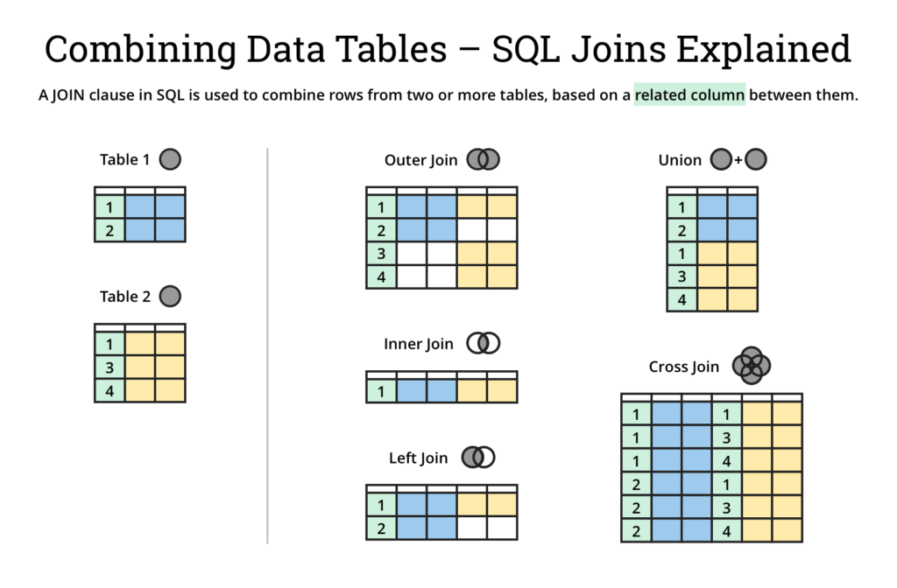

### **Joins in SQL Basics: Inner, Outer, Left, Right, and Cross Joins**

Joins are a fundamental feature in SQL that allow you to combine data from multiple tables. They are essential for working with relational databases, as they enable you to retrieve meaningful relationships between tables. In this blog, we will explore the most common types of SQL joins: **Inner Join, Outer Join, Left Join, Right Join**, and **Cross Join**, along with examples to illustrate their usage.

---

### **What Are Joins?**

Joins are operations in SQL that merge rows from two or more tables based on a related column. These columns typically represent logical relationships, such as a primary key in one table and a foreign key in another.




---

### **1. Inner Join**

An **Inner Join** retrieves only the rows that have matching values in both tables. If there is no match, the row is excluded from the result.

#### **Syntax:**
```sql
SELECT columns
FROM table1
INNER JOIN table2
ON table1.column = table2.column;
```

#### **Example:**
Consider two tables:

**Employees Table:**

| EmployeeID | Name      | DepartmentID |
|------------|-----------|--------------|
| 1          | Alice     | 101          |
| 2          | Bob       | 102          |
| 3          | Charlie   | NULL         |

**Departments Table:**

| DepartmentID | DepartmentName |
|--------------|----------------|
| 101          | HR             |
| 102          | IT             |
| 103          | Finance        |

**Query:** Retrieve the names of employees and their departments.
```sql
SELECT Employees.Name, Departments.DepartmentName
FROM Employees
INNER JOIN Departments
ON Employees.DepartmentID = Departments.DepartmentID;
```

**Result:**

| Name      | DepartmentName |
|-----------|----------------|
| Alice     | HR             |
| Bob       | IT             |

---

### **2. Left Join (Left Outer Join)**

A **Left Join** retrieves all rows from the left table, along with the matching rows from the right table. If there is no match, NULL values are included for the right table's columns.

#### **Syntax:**
```sql
SELECT columns
FROM table1
LEFT JOIN table2
ON table1.column = table2.column;
```

#### **Example:**
**Query:** Retrieve all employees and their departments, including those without a department.
```sql
SELECT Employees.Name, Departments.DepartmentName
FROM Employees
LEFT JOIN Departments
ON Employees.DepartmentID = Departments.DepartmentID;
```

**Result:**

| Name      | DepartmentName |
|-----------|----------------|
| Alice     | HR             |
| Bob       | IT             |
| Charlie   | NULL           |

---

### **3. Right Join (Right Outer Join)**

A **Right Join** retrieves all rows from the right table, along with the matching rows from the left table. If there is no match, NULL values are included for the left table's columns.

#### **Syntax:**
```sql
SELECT columns
FROM table1
RIGHT JOIN table2
ON table1.column = table2.column;
```

#### **Example:**
**Query:** Retrieve all departments and their employees, including departments without employees.
```sql
SELECT Employees.Name, Departments.DepartmentName
FROM Employees
RIGHT JOIN Departments
ON Employees.DepartmentID = Departments.DepartmentID;
```

**Result:**

| Name      | DepartmentName |
|-----------|----------------|
| Alice     | HR             |
| Bob       | IT             |
| NULL      | Finance        |

---

### **4. Full Outer Join**

A **Full Outer Join** retrieves all rows from both tables. If there is no match, NULL values are included for the missing columns.

#### **Syntax:**
```sql
SELECT columns
FROM table1
FULL OUTER JOIN table2
ON table1.column = table2.column;
```

#### **Example:**
**Query:** Retrieve all employees and all departments, regardless of whether they match.
```sql
SELECT Employees.Name, Departments.DepartmentName
FROM Employees
FULL OUTER JOIN Departments
ON Employees.DepartmentID = Departments.DepartmentID;
```

**Result:**

| Name      | DepartmentName |
|-----------|----------------|
| Alice     | HR             |
| Bob       | IT             |
| Charlie   | NULL           |
| NULL      | Finance        |

---

### **5. Cross Join**

A **Cross Join** produces the Cartesian product of two tables. Every row from the first table is combined with every row from the second table.

#### **Syntax:**
```sql
SELECT columns
FROM table1
CROSS JOIN table2;
```

#### **Example:**
**Query:** Combine employees with all departments.
```sql
SELECT Employees.Name, Departments.DepartmentName
FROM Employees
CROSS JOIN Departments;
```

**Result:**

| Name      | DepartmentName |
|-----------|----------------|
| Alice     | HR             |
| Alice     | IT             |
| Alice     | Finance        |
| Bob       | HR             |
| Bob       | IT             |
| Bob       | Finance        |
| Charlie   | HR             |
| Charlie   | IT             |
| Charlie   | Finance        |

A **Cross Join** is typically used for scenarios requiring all possible combinations, such as testing or when no logical relationship exists between the tables.

---

### **Comparison of Joins**

| Join Type       | Included Rows                                                                 |
|------------------|------------------------------------------------------------------------------|
| Inner Join       | Rows with matching values in both tables.                                   |
| Left Join        | All rows from the left table, with matches from the right table (NULLs if no match). |
| Right Join       | All rows from the right table, with matches from the left table (NULLs if no match). |
| Full Outer Join  | All rows from both tables, with NULLs for non-matching rows.                |
| Cross Join       | All combinations of rows from both tables.                                 |

---

### **Best Practices for Using Joins**

1. **Understand Relationships:** Know the relationships between your tables (e.g., primary and foreign keys) before writing join queries.
2. **Optimize Performance:** Use indexed columns in join conditions to improve query performance.
3. **Avoid Ambiguity:** When selecting columns, use table aliases to avoid ambiguity if columns have the same name in both tables.
4. **Test with Sample Data:** Test your queries on smaller datasets to verify the results before running them on production data.

---

### **Conclusion**

Joins are essential for combining and analyzing data in relational databases. By understanding the differences between Inner, Left, Right, Full Outer, and Cross Joins, you can write efficient queries to retrieve meaningful insights from your data. Practice these joins with real-world datasets to build a solid foundation in SQL!