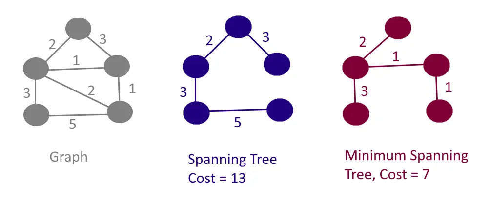

# Minimum Spanning Tree (MST) 

A Minimum Spanning Tree (MST) is a subgraph of a weighted, connected, and undirected graph that connects all the vertices with the minimum total edge weight. It is a fundamental concept in graph theory and has applications in network design, clustering, and optimization problems.




---

## Key Features of MST

1. **Connected Subgraph**: MST includes all the vertices of the original graph.
2. **No Cycles**: MST forms a tree, which means it has no cycles.
3. **Minimum Weight**: Among all possible spanning trees, the MST has the smallest sum of edge weights.

### Applications:
- **Network Design**: Laying out cables or pipelines with minimal cost.
- **Clustering**: Grouping data points in machine learning.
- **Approximation Algorithms**: Solving NP-hard problems like the Traveling Salesman Problem.

---

## Approaches to Find MST

### 1. Kruskal's Algorithm
- A greedy algorithm that sorts all edges by weight and adds them to the MST while ensuring no cycles are formed.

#### Steps:
1. Sort all edges in non-decreasing order of weight.
2. Initialize an empty MST.
3. For each edge, check if adding it to the MST forms a cycle (using a Union-Find/Disjoint Set).
4. If no cycle is formed, add the edge to the MST.
5. Repeat until the MST has \(V - 1\) edges, where \(V\) is the number of vertices.

#### Implementation:
```java
import java.util.*;

class Edge implements Comparable<Edge> {
    int source, destination, weight;

    public Edge(int source, int destination, int weight) {
        this.source = source;
        this.destination = destination;
        this.weight = weight;
    }

    public int compareTo(Edge other) {
        return this.weight - other.weight;
    }
}

public class Kruskal {
    class UnionFind {
        private int[] parent, rank;

        public UnionFind(int size) {
            parent = new int[size];
            rank = new int[size];
            for (int i = 0; i < size; i++) {
                parent[i] = i;
                rank[i] = 0;
            }
        }

        public int find(int u) {
            if (parent[u] != u) {
                parent[u] = find(parent[u]);
            }
            return parent[u];
        }

        public boolean union(int u, int v) {
            int rootU = find(u);
            int rootV = find(v);
            if (rootU == rootV) return false;

            if (rank[rootU] > rank[rootV]) {
                parent[rootV] = rootU;
            } else if (rank[rootU] < rank[rootV]) {
                parent[rootU] = rootV;
            } else {
                parent[rootV] = rootU;
                rank[rootU]++;
            }
            return true;
        }
    }

    public List<Edge> kruskalMST(List<Edge> edges, int vertices) {
        Collections.sort(edges);
        UnionFind uf = new UnionFind(vertices);
        List<Edge> mst = new ArrayList<>();

        for (Edge edge : edges) {
            if (uf.union(edge.source, edge.destination)) {
                mst.add(edge);
            }
        }
        return mst;
    }

    public static void main(String[] args) {
        List<Edge> edges = new ArrayList<>();
        edges.add(new Edge(0, 1, 10));
        edges.add(new Edge(0, 2, 6));
        edges.add(new Edge(0, 3, 5));
        edges.add(new Edge(1, 3, 15));
        edges.add(new Edge(2, 3, 4));

        Kruskal k = new Kruskal();
        List<Edge> mst = k.kruskalMST(edges, 4);

        for (Edge edge : mst) {
            System.out.println("Edge: " + edge.source + " - " + edge.destination + ", Weight: " + edge.weight);
        }
    }
}
```

---

### 2. Prim's Algorithm
- A greedy algorithm that starts with a single vertex and grows the MST by adding the smallest edge that connects a visited vertex to an unvisited vertex.

#### Steps:
1. Start with an arbitrary vertex.
2. Maintain a priority queue of edges connected to the visited vertices.
3. Extract the smallest edge, and add it to the MST if it connects to an unvisited vertex.
4. Add all edges of the newly visited vertex to the priority queue.
5. Repeat until all vertices are included in the MST.

#### Implementation:
```java
import java.util.*;

class Prim {
    public void primMST(int[][] graph, int vertices) {
        boolean[] visited = new boolean[vertices];
        int[] parent = new int[vertices];
        int[] key = new int[vertices];
        PriorityQueue<int[]> pq = new PriorityQueue<>(Comparator.comparingInt(a -> a[1]));

        Arrays.fill(key, Integer.MAX_VALUE);
        key[0] = 0;
        parent[0] = -1;
        pq.offer(new int[]{0, 0});

        while (!pq.isEmpty()) {
            int u = pq.poll()[0];
            visited[u] = true;

            for (int v = 0; v < vertices; v++) {
                if (graph[u][v] != 0 && !visited[v] && graph[u][v] < key[v]) {
                    key[v] = graph[u][v];
                    parent[v] = u;
                    pq.offer(new int[]{v, key[v]});
                }
            }
        }

        printMST(parent, graph);
    }

    private void printMST(int[] parent, int[][] graph) {
        System.out.println("Edge 	Weight");
        for (int i = 1; i < graph.length; i++) {
            System.out.println(parent[i] + " - " + i + "	" + graph[i][parent[i]]);
        }
    }

    public static void main(String[] args) {
        int[][] graph = {
            {0, 2, 0, 6, 0},
            {2, 0, 3, 8, 5},
            {0, 3, 0, 0, 7},
            {6, 8, 0, 0, 9},
            {0, 5, 7, 9, 0}
        };

        Prim p = new Prim();
        p.primMST(graph, 5);
    }
}
```

---

## Time and Space Complexity

### Kruskal's Algorithm:
- **Time Complexity**: \(O(E \log E + E \alpha(V))\), where \(\alpha\) is the inverse Ackermann function.
- **Space Complexity**: \(O(E + V)\).

### Prim's Algorithm:
- **Time Complexity**: \(O(V^2)\) for adjacency matrix or \(O(E \log V)\) for adjacency list with a priority queue.
- **Space Complexity**: \(O(V^2)\) for adjacency matrix or \(O(E + V)\) for adjacency list.

---

## Example Execution

### Graph:
```
   0 --(10)-- 1
   | \       |
  (6) (5)   (15)
   |     \   |
   2 --(4)-- 3
```

### Kruskal Output:
```
Edge: 2 - 3, Weight: 4
Edge: 0 - 3, Weight: 5
Edge: 0 - 1, Weight: 10
```

### Prim Output:
```
Edge    Weight
0 - 1     10
0 - 2     6
0 - 3     5
2 - 3     4
```

---

## Conclusion

Minimum Spanning Trees provide an efficient way to connect all vertices in a graph with the minimum possible edge weight. Understanding and implementing Kruskal's and Prim's algorithms is crucial for solving optimization problems in various domains, from network design to clustering and beyond. By practicing these algorithms, you can enhance your problem-solving and programming skills effectively.

