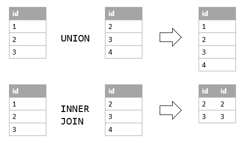

### **Joins and Unions in SQL: Understanding Inner, Outer, Left, Right, Cross Joins, and UNION**

SQL offers powerful features like **joins** and **unions** to combine and retrieve data from multiple tables or queries. While **joins** merge rows based on relationships between tables, **UNION** combines the results of two or more queries into a single dataset.

In this blog, we will explore the most common types of **joins** (Inner, Outer, Left, Right, Cross) and the **UNION** operator with practical examples.




---

### **1. What Are Joins?**

Joins allow you to merge rows from two or more tables based on a common column or logical relationship, such as primary and foreign keys.

---

### **Types of Joins**

#### **Inner Join**
Retrieves only the rows with matching values in both tables.

#### **Left Join**
Returns all rows from the left table, with matching rows from the right table (or NULL if no match).

#### **Right Join**
Returns all rows from the right table, with matching rows from the left table (or NULL if no match).

#### **Full Outer Join**
Returns all rows from both tables, with NULLs for non-matching rows.

#### **Cross Join**
Returns the Cartesian product of two tables (all combinations of rows).

---

### **2. UNION: Combining Results from Multiple Queries**

The **UNION** operator is used to combine the results of two or more `SELECT` queries. Unlike joins, UNION does not require a relationship between the tables.

#### **Key Points About UNION:**
- The columns in the `SELECT` queries must have the same number and compatible data types.
- By default, UNION removes duplicate rows. Use `UNION ALL` to include duplicates.
- The `ORDER BY` clause can be applied only to the final result set.

---

### **Syntax of UNION**
```sql
SELECT column1, column2 FROM table1
UNION
SELECT column1, column2 FROM table2;
```

---

### **Example: UNION**

#### **Tables:**

**Table A** (Employees in Office 1):

| Name      | Department  |
|-----------|-------------|
| Alice     | HR          |
| Bob       | IT          |
| Charlie   | Finance     |

**Table B** (Employees in Office 2):

| Name      | Department  |
|-----------|-------------|
| Diana     | IT          |
| Bob       | IT          |
| Eve       | Marketing   |

---

#### **Query: Combine Employee Lists**

```sql
SELECT Name, Department FROM TableA
UNION
SELECT Name, Department FROM TableB;
```

**Result:**

| Name      | Department  |
|-----------|-------------|
| Alice     | HR          |
| Bob       | IT          |
| Charlie   | Finance     |
| Diana     | IT          |
| Eve       | Marketing   |

---

#### **Query: Include Duplicate Rows**

```sql
SELECT Name, Department FROM TableA
UNION ALL
SELECT Name, Department FROM TableB;
```

**Result:**

| Name      | Department  |
|-----------|-------------|
| Alice     | HR          |
| Bob       | IT          |
| Charlie   | Finance     |
| Diana     | IT          |
| Bob       | IT          |
| Eve       | Marketing   |

---

### **Difference Between JOIN and UNION**

| Feature                | JOIN                                      | UNION                                   |
|------------------------|-------------------------------------------|-----------------------------------------|
| **Purpose**            | Combines rows based on relationships.    | Combines results of two queries.        |
| **Output Structure**   | Columns from both tables.                | Columns from each query (same structure). |
| **Condition Required** | Yes (ON condition).                      | No condition required.                  |
| **Duplicates**         | Duplicates are not removed automatically.| UNION removes duplicates unless UNION ALL is used. |

---

### **Practical Example: Combining Joins and UNION**

#### **Tables:**

**Employees Table**:

| EmployeeID | Name      | DepartmentID |
|------------|-----------|--------------|
| 1          | Alice     | 101          |
| 2          | Bob       | 102          |
| 3          | Charlie   | NULL         |

**Departments Table**:

| DepartmentID | DepartmentName |
|--------------|----------------|
| 101          | HR             |
| 102          | IT             |
| 103          | Finance        |

---

#### **Query: Combine Employees with Departments and Add External Employee List**

1. **Step 1: Join Employees with Departments**
   ```sql
   SELECT Employees.Name, Departments.DepartmentName
   FROM Employees
   LEFT JOIN Departments
   ON Employees.DepartmentID = Departments.DepartmentID;
   ```

   **Result:**

   | Name      | DepartmentName |
   |-----------|----------------|
   | Alice     | HR             |
   | Bob       | IT             |
   | Charlie   | NULL           |

2. **Step 2: Add External Employees Using UNION**
   ```sql
   SELECT Employees.Name, Departments.DepartmentName
   FROM Employees
   LEFT JOIN Departments
   ON Employees.DepartmentID = Departments.DepartmentID
   UNION
   SELECT 'Eve' AS Name, 'Marketing' AS DepartmentName;
   ```

   **Final Result:**

   | Name      | DepartmentName |
   |-----------|----------------|
   | Alice     | HR             |
   | Bob       | IT             |
   | Charlie   | NULL           |
   | Eve       | Marketing      |

---

### **Best Practices for Joins and UNION**

1. **Ensure Column Compatibility for UNION**: Always check that the columns in the queries have the same number and compatible data types.
2. **Optimize JOIN Conditions**: Use indexes and proper ON conditions to improve performance.
3. **Test with Small Datasets**: Test your queries on smaller datasets before running them on large tables.
4. **Use UNION ALL for Large Datasets**: If duplicates are acceptable, `UNION ALL` is faster as it skips duplicate elimination.

---

### **Conclusion**

SQL joins and the UNION operator provide powerful tools for merging and combining data. Joins are essential for working with related tables, while UNION is perfect for combining query results. By mastering these operations, you can handle complex data retrieval tasks efficiently.

