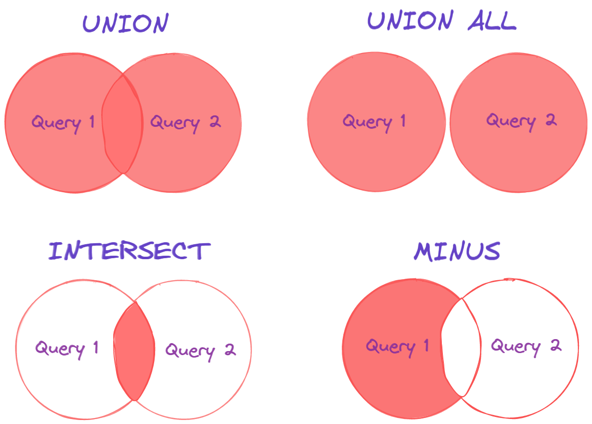

### **Mastering Set Operations in SQL: UNION, INTERSECT, and EXCEPT**

SQL **set operations** allow you to combine the results of two or more queries into a single result set. These operations are modeled after mathematical set theory and provide an elegant way to perform comparisons, unions, and exclusions between datasets.

In this blog, we’ll cover the three main set operations in SQL:
1. **UNION** – Combines results from multiple queries.
2. **INTERSECT** – Returns rows common to all queries.
3. **EXCEPT** (or MINUS in some databases) – Returns rows in the first query but not in the second.




---

### **Key Requirements for Set Operations**

1. **Same Number of Columns**: The queries must return the same number of columns.
2. **Compatible Data Types**: The corresponding columns in each query must have compatible data types.
3. **Order of Columns**: The order of columns matters; column data types must match in the same order.
4. **Duplicates Handling**: By default, set operations remove duplicate rows, but duplicates can be retained using variations like `UNION ALL`.

---

### **1. UNION**

The **UNION** operator combines the results of two or more queries into a single result set, eliminating duplicate rows by default.

#### **Syntax**
```sql
SELECT column1, column2 FROM table1
UNION
SELECT column1, column2 FROM table2;
```

#### **Variants**
- **UNION**: Removes duplicate rows.
- **UNION ALL**: Retains duplicate rows.

---

#### **Example: UNION**

**Employees_Office1 Table**:

| Name   | Department |
|--------|------------|
| Alice  | HR         |
| Bob    | IT         |

**Employees_Office2 Table**:

| Name   | Department |
|--------|------------|
| Charlie| Finance    |
| Bob    | IT         |

**Query**:
```sql
SELECT Name, Department FROM Employees_Office1
UNION
SELECT Name, Department FROM Employees_Office2;
```

**Result**:

| Name     | Department |
|----------|------------|
| Alice    | HR         |
| Bob      | IT         |
| Charlie  | Finance    |

**Query with UNION ALL**:
```sql
SELECT Name, Department FROM Employees_Office1
UNION ALL
SELECT Name, Department FROM Employees_Office2;
```

**Result with UNION ALL**:

| Name     | Department |
|----------|------------|
| Alice    | HR         |
| Bob      | IT         |
| Charlie  | Finance    |
| Bob      | IT         |

---

### **2. INTERSECT**

The **INTERSECT** operator returns rows that are common to both queries.

#### **Syntax**
```sql
SELECT column1, column2 FROM table1
INTERSECT
SELECT column1, column2 FROM table2;
```

---

#### **Example: INTERSECT**

**Employees_Office1 Table**:

| Name   | Department |
|--------|------------|
| Alice  | HR         |
| Bob    | IT         |

**Employees_Office2 Table**:

| Name   | Department |
|--------|------------|
| Charlie| Finance    |
| Bob    | IT         |

**Query**:
```sql
SELECT Name, Department FROM Employees_Office1
INTERSECT
SELECT Name, Department FROM Employees_Office2;
```

**Result**:

| Name   | Department |
|--------|------------|
| Bob    | IT         |

---

### **3. EXCEPT (or MINUS)**

The **EXCEPT** operator (called **MINUS** in some databases like Oracle) returns rows from the first query that are not present in the second query.

#### **Syntax**
```sql
SELECT column1, column2 FROM table1
EXCEPT
SELECT column1, column2 FROM table2;
```

---

#### **Example: EXCEPT**

**Employees_Office1 Table**:

| Name   | Department |
|--------|------------|
| Alice  | HR         |
| Bob    | IT         |

**Employees_Office2 Table**:

| Name   | Department |
|--------|------------|
| Charlie| Finance    |
| Bob    | IT         |

**Query**:
```sql
SELECT Name, Department FROM Employees_Office1
EXCEPT
SELECT Name, Department FROM Employees_Office2;
```

**Result**:

| Name   | Department |
|--------|------------|
| Alice  | HR         |

---

### **Comparison of UNION, INTERSECT, and EXCEPT**

| Operator   | Purpose                                      | Duplicate Rows | Result Contains |
|------------|----------------------------------------------|----------------|-----------------|
| **UNION**  | Combines results from multiple queries.      | Removes by default, can retain with `UNION ALL`. | Rows from all queries. |
| **INTERSECT** | Returns rows common to all queries.       | Removes duplicates. | Common rows.       |
| **EXCEPT** | Returns rows from the first query not in the second query. | Removes duplicates. | Rows unique to the first query. |

---

### **Practical Use Cases**

1. **UNION**:
   - Combine customer data from multiple regional databases.
   - Merge transaction data from different years into a single view.

2. **INTERSECT**:
   - Identify customers who purchased products from both Store A and Store B.
   - Find employees who work in multiple departments.

3. **EXCEPT**:
   - List customers who made a purchase last year but not this year.
   - Identify products in the catalog that are not currently in stock.

---

### **Best Practices for Set Operations**

1. **Ensure Data Type Consistency**:
   - Use explicit type casting if necessary to avoid errors.

2. **Optimize with Indexing**:
   - Index columns involved in set operations for better performance, especially with large datasets.

3. **UNION ALL for Large Datasets**:
   - Use `UNION ALL` instead of `UNION` when duplicates are acceptable, as it avoids the overhead of duplicate removal.

4. **Avoid Unnecessary Columns**:
   - Include only the columns required for comparison to simplify queries and improve performance.

5. **Test with Subqueries**:
   - Use subqueries to validate intermediate results for complex queries.

---

### **Conclusion**

Set operations like **UNION**, **INTERSECT**, and **EXCEPT** are essential tools for comparing and combining datasets in SQL. By understanding their syntax, functionality, and use cases, you can write efficient queries to handle complex data manipulations. Practice the examples provided to build a strong foundation in SQL set operations and apply them effectively in real-world scenarios.