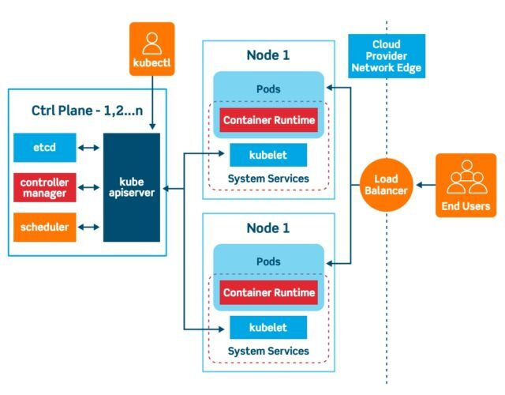

### **Introduction to Kubernetes**

In the era of cloud computing and containerization, managing application deployment and scaling across distributed systems has become a challenge. **Kubernetes**, often referred to as **K8s**, is an open-source container orchestration platform that automates the deployment, scaling, and management of containerized applications.

This blog provides an in-depth introduction to Kubernetes, its architecture, features, and why it has become a cornerstone of modern software development.

---

### **What is Kubernetes?**

Kubernetes is a portable, extensible platform for managing containerized workloads and services. Originally developed by Google, it was open-sourced in 2014 and is now maintained by the **Cloud Native Computing Foundation (CNCF)**.

Kubernetes simplifies operations by:
1. Automating deployment and scaling.
2. Managing resource allocation efficiently.
3. Providing high availability and fault tolerance.

---

### **Why Kubernetes?**

With the rise of container technologies like Docker, deploying applications in isolated environments became easier. However, managing containers in production at scale introduced complexities like:
- **Scaling Applications**: Dynamically adjusting the number of containers.
- **Networking**: Enabling communication between containers and external services.
- **Load Balancing**: Distributing traffic across containers.
- **Fault Tolerance**: Recovering from container failures automatically.

Kubernetes addresses these challenges by orchestrating containers and providing a unified platform to manage them.

---

### **Key Features of Kubernetes**

1. **Automated Scheduling**:
   - Efficiently schedules containers across nodes based on resource requirements and constraints.

2. **Self-Healing**:
   - Automatically restarts failed containers.
   - Reschedules containers when nodes fail.
   - Replaces and reschedules containers when they become unresponsive.

3. **Horizontal Scaling**:
   - Automatically scales applications up or down based on demand.

4. **Load Balancing**:
   - Distributes traffic across multiple containers to ensure reliability.

5. **Service Discovery**:
   - Provides built-in DNS and service discovery mechanisms for container communication.

6. **Storage Orchestration**:
   - Automatically mounts storage systems, including local storage, public clouds, and network storage.

7. **Rolling Updates and Rollbacks**:
   - Gradually updates applications with zero downtime and rolls back changes in case of failure.

8. **Resource Optimization**:
   - Ensures optimal use of computing resources through resource allocation and monitoring.

---

### **Kubernetes Architecture**

Kubernetes follows a **master-worker architecture**, consisting of the following components:





#### **1. Master Node**
The control plane of Kubernetes that manages the cluster.

- **API Server**:
  - Acts as the frontend for the Kubernetes control plane.
  - Handles REST requests from users and tools.

- **Scheduler**:
  - Assigns workloads to nodes based on resource availability and policies.

- **Controller Manager**:
  - Manages controllers that handle tasks like node management, replication, and endpoint monitoring.

- **etcd**:
  - A distributed key-value store used for storing cluster state and configuration.

#### **2. Worker Nodes**
Nodes that run the application workloads.

- **Kubelet**:
  - Agent running on each node that ensures containers are running as expected.

- **Kube-Proxy**:
  - Manages networking rules and facilitates communication between containers.

- **Container Runtime**:
  - Software responsible for running containers (e.g., Docker, CRI-O, or containerd).

---

### **Kubernetes Objects**

Kubernetes uses objects to represent the state of your cluster. Some key objects include:

1. **Pod**:
   - The smallest deployable unit in Kubernetes.
   - A pod can contain one or more tightly coupled containers.

2. **Service**:
   - Exposes a set of pods as a network service, allowing communication between pods or external access.

3. **Deployment**:
   - Manages the deployment and scaling of pods.
   - Ensures a specified number of replicas are running.

4. **ConfigMap and Secret**:
   - Used for managing configuration data and sensitive information like passwords or API keys.

5. **Persistent Volume (PV) and Persistent Volume Claim (PVC)**:
   - Handle persistent storage for containers.

---

### **How Kubernetes Works**

1. **Deploying an Application**:
   - Define your application’s desired state using YAML or JSON configuration files (e.g., number of replicas, resource limits).
   - Submit the configuration to the Kubernetes API server.

2. **Scheduling and Running**:
   - The scheduler places the pods on available nodes based on resource requirements.
   - Kubelet ensures the pods are running.

3. **Networking and Scaling**:
   - Kubernetes provides networking between pods and scales applications based on traffic or resource usage.

4. **Monitoring and Self-Healing**:
   - Monitors container health and replaces failed pods automatically.

---

### **Kubernetes Workflow Example**

#### **Deploying a Simple Web Application**

Here’s a basic example of deploying a web server using Kubernetes.

1. **Step 1: Create a Deployment**

```yaml
apiVersion: apps/v1
kind: Deployment
metadata:
  name: nginx-deployment
spec:
  replicas: 3
  selector:
    matchLabels:
      app: nginx
  template:
    metadata:
      labels:
        app: nginx
    spec:
      containers:
      - name: nginx
        image: nginx:1.21
        ports:
        - containerPort: 80
```

Save the file as `nginx-deployment.yaml` and apply it using:

```bash
kubectl apply -f nginx-deployment.yaml
```

2. **Step 2: Create a Service**

Expose the deployment using a service:

```yaml
apiVersion: v1
kind: Service
metadata:
  name: nginx-service
spec:
  selector:
    app: nginx
  ports:
  - protocol: TCP
    port: 80
    targetPort: 80
  type: LoadBalancer
```

Save the file as `nginx-service.yaml` and apply it:

```bash
kubectl apply -f nginx-service.yaml
```

3. **Step 3: Access the Application**

Retrieve the external IP of the service using:

```bash
kubectl get services
```

Access the web application in your browser using the provided IP.

---

### **Advantages of Kubernetes**

1. **Portability**:
   - Runs on public clouds, private data centers, and hybrid environments.

2. **Scalability**:
   - Dynamically scales applications to meet demand.

3. **High Availability**:
   - Ensures application reliability with self-healing and rolling updates.

4. **Ecosystem**:
   - Integrates seamlessly with CI/CD tools, monitoring systems, and service meshes.

---

### **When Not to Use Kubernetes**

1. **Small Applications**:
   - For simple projects, Kubernetes might introduce unnecessary complexity.

2. **Resource Constraints**:
   - Requires significant resources to set up and manage effectively.

3. **Learning Curve**:
   - Kubernetes has a steep learning curve, which might be challenging for small teams.

---

### **Conclusion**

Kubernetes is a powerful platform for managing containerized applications, offering scalability, reliability, and flexibility. While it introduces complexity, its benefits in managing distributed systems at scale make it an essential tool for modern software development.

Start exploring Kubernetes by deploying simple applications and gradually experiment with advanced features like scaling, storage, and networking. With its growing ecosystem and community, Kubernetes is poised to remain a dominant force in cloud-native development. 🚀
