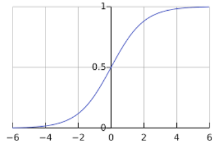
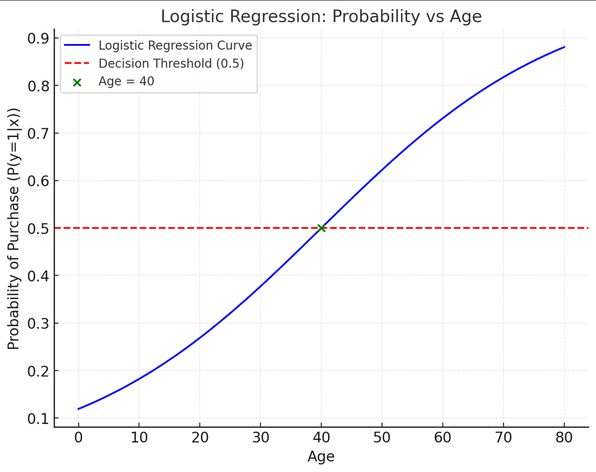

### Introduction
Logistic regression is a statistical method used for **binary classification** problems, where the target variable has two possible outcomes, such as "yes/no," "success/failure," or "0/1." Despite its name, logistic regression is a classification algorithm rather than a regression algorithm.

It models the probability that an input belongs to a specific category using a sigmoid function to ensure that predictions remain between 0 and 1.

---

### Key Concepts

#### 1. **Sigmoid Function**




Logistic regression uses the sigmoid function to map any real-valued number to the range `[0, 1]`. The sigmoid function is defined as:

\[
h(x) = \frac{1}{1 + e^{-z}}
\]

Here:
- \( z \) is the linear combination of the input features: \( z = w_1x_1 + w_2x_2 + \dots + w_nx_n + b \), where \( w \) are weights, \( x \) are features, and \( b \) is the bias.

The sigmoid function ensures that \( h(x) \) represents the probability of the positive class (e.g., \( P(y = 1 | x) \)).

#### 2. **Decision Boundary**
The decision boundary is a threshold value (usually 0.5). If the probability \( h(x) \) is greater than 0.5, the model predicts the positive class (\( y = 1 \)); otherwise, it predicts the negative class (\( y = 0 \)).

---

### Logistic Regression Equation

The logistic regression model predicts the probability of the positive class as:

\[
P(y = 1 | x) = h(x) = \frac{1}{1 + e^{-(w \cdot x + b)}}
\]

Where:
- \( w \) is the vector of weights for features.
- \( x \) is the vector of input features.
- \( b \) is the bias term.

The output \( P(y = 1 | x) \) is interpreted as the likelihood that the input belongs to the positive class.

---

### Steps in Logistic Regression

#### 1. **Data Preparation**
- Ensure the dataset has a binary target variable.
- Normalize or standardize the input features to improve model performance.

#### 2. **Model Training**
- Optimize the weights \( w \) and bias \( b \) using a loss function called the **log-loss** (or binary cross-entropy loss):
  
$$
\text{Log Loss} = - \frac{1}{m} \sum_{i=1}^m \left[ y_i \log(h(x_i)) + (1 - y_i) \log(1 - h(x_i)) \right]
$$

Here:
- \( y_i \) is the true label for the \( i \)-th sample.
- \( h(x_i) \) is the predicted probability for the \( i \)-th sample.
- \( m \) is the number of samples.

#### 3. **Prediction**
- Compute the probabilities using the sigmoid function.
- Classify samples based on the decision boundary.

#### 4. **Evaluation**
- Use metrics such as accuracy, precision, recall, F1-score, and ROC-AUC to evaluate the model.

---

### Example: Logistic Regression with Python

#### Dataset
We will use the **Iris dataset**, focusing on a binary classification problem: classifying whether a flower is **Iris-setosa** or **not** based on sepal length and sepal width.

#### Code Implementation

```python
import numpy as np
import pandas as pd
from sklearn.model_selection import train_test_split
from sklearn.linear_model import LogisticRegression
from sklearn.metrics import accuracy_score, confusion_matrix, classification_report, roc_auc_score

# Load dataset
from sklearn.datasets import load_iris
iris = load_iris()
data = pd.DataFrame(iris.data, columns=iris.feature_names)
data['target'] = (iris.target == 0).astype(int)  # 1 if Iris-setosa, 0 otherwise

# Select features and target
X = data[['sepal length (cm)', 'sepal width (cm)']]
y = data['target']

# Split data into training and testing sets
X_train, X_test, y_train, y_test = train_test_split(X, y, test_size=0.3, random_state=42)

# Create and train the logistic regression model
model = LogisticRegression()
model.fit(X_train, y_train)

# Make predictions
y_pred = model.predict(X_test)
y_pred_prob = model.predict_proba(X_test)[:, 1]

# Evaluate the model
accuracy = accuracy_score(y_test, y_pred)
conf_matrix = confusion_matrix(y_test, y_pred)
classification_rep = classification_report(y_test, y_pred)
roc_auc = roc_auc_score(y_test, y_pred_prob)

print("Accuracy:", accuracy)
print("\nConfusion Matrix:\n", conf_matrix)
print("\nClassification Report:\n", classification_rep)
print("ROC-AUC Score:", roc_auc)
```

---

### Explanation of Results

1. **Confusion Matrix**
   - Displays the counts of true positives, true negatives, false positives, and false negatives.

2. **Classification Report**
   - Shows precision, recall, F1-score, and support for each class.

3. **ROC-AUC Score**
   - Indicates the model's ability to distinguish between the two classes. A value closer to 1 indicates excellent performance.

---

### Advantages of Logistic Regression

1. **Simple and Interpretable**:
   - Easy to implement and interpret as it outputs probabilities.

2. **Efficient**:
   - Works well for small to medium-sized datasets.

3. **Feature Importance**:
   - Coefficients can indicate the importance of features.

---

### Limitations of Logistic Regression

1. **Linearity Assumption**:
   - Assumes a linear relationship between input features and the log-odds of the target.

2. **Not Suitable for Complex Relationships**:
   - Struggles with highly non-linear data unless features are transformed.

3. **Binary Classification**:
   - Primarily used for binary outcomes. Extensions like multinomial logistic regression are required for multi-class problems.

---

### Extensions of Logistic Regression

1. **Multinomial Logistic Regression**:
   - For problems with more than two classes.

2. **Regularized Logistic Regression**:
   - Uses L1 (Lasso) or L2 (Ridge) regularization to prevent overfitting.

---

### Real-World Applications

1. **Healthcare**:
   - Predicting whether a patient has a disease (e.g., diabetes or heart disease).

2. **Finance**:
   - Credit scoring and fraud detection.

3. **Marketing**:
   - Customer churn prediction or click-through rate (CTR) estimation.

---
### Numerical Problem: Logistic Regression for Exam Practice

#### Problem Statement:

A logistic regression model is used to predict whether a customer will buy a product (1: "Yes", 0: "No") based on their age (\( x \)). The model equation is given as:

\[
P(y = 1|x) = \frac{1}{1 + e^{-(w \cdot x + b)}}
\]

Where:
- \( w = 0.05 \) (weight)
- \( b = -2 \) (bias)

**Question 1**: If the customer's age is \( x = 40 \), calculate the probability that the customer will buy the product (\( P(y = 1|x) \)).

**Question 2**: Based on a decision threshold of 0.5, will the model predict that the customer will buy the product?

---

### Solution:

#### Question 1: Calculating \( P(y = 1|x) \)

The logistic regression model predicts the probability as:
\[
P(y = 1|x) = \frac{1}{1 + e^{-(w \cdot x + b)}}
\]

Substitute the given values:
- \( w = 0.05 \)
- \( b = -2 \)
- \( x = 40 \)

\[
P(y = 1|x) = \frac{1}{1 + e^{-(0.05 \cdot 40 - 2)}}
\]

Simplify:
\[
P(y = 1|x) = \frac{1}{1 + e^{-(2 - 2)}} = \frac{1}{1 + e^0} = \frac{1}{1 + 1}
\]

\[
P(y = 1|x) = \frac{1}{2} = 0.5
\]

---

#### Question 2: Prediction Based on Decision Threshold

The decision threshold is 0.5:
- If \( P(y = 1|x) \geq 0.5 \), the prediction is \( y = 1 \) ("Yes").
- If \( P(y = 1|x) < 0.5 \), the prediction is \( y = 0 \) ("No").

Here, \( P(y = 1|x) = 0.5 \), which is equal to the threshold. Therefore, the model predicts:
\[
y = 1 \, (\text{"Yes"})
\]

---

### Final Answer:

1. The probability that the customer will buy the product is **0.5**. 
2. The model predicts that the customer **will buy the product**.

> **Note**: In this example, the customer will buy when Probability of purchase >= 5 else the customer won't buy. 


Here is the graph for the logistic regression model:

 

- The **blue curve** represents the logistic regression equation \( P(y=1|x) \), showing the probability of purchase as a function of age.
- The **red dashed line** indicates the decision threshold (0.5). If the probability is greater than or equal to 0.5, the model predicts \( y = 1 \) ("Yes").
- The **green point** marks the probability for \( x = 40 \) (age = 40), which aligns with the threshold at \( P(y=1|x) = 0.5 \).

This visualization illustrates how logistic regression models the relationship between the independent variable (age) and the dependent variable (purchase probability).


---

### Additional Practice:

1. If \( w = 0.03 \), \( b = -1.5 \), and \( x = 50 \), calculate \( P(y = 1|x) \) and determine the prediction with a threshold of 0.6.
2. Modify the threshold to 0.7 for the above problem. How does the prediction change?

---

### Conclusion

Logistic regression is a powerful and interpretable classification algorithm that works well for binary problems. Its simplicity, efficiency, and probabilistic output make it a popular choice in various domains. However, its limitations in handling non-linear relationships mean it is often complemented by more advanced algorithms like decision trees or neural networks for complex tasks.

