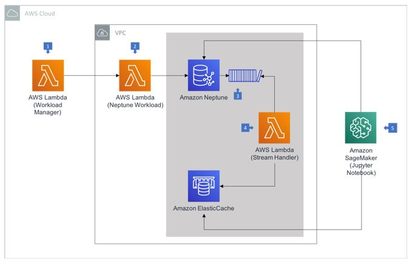

# **Amazon Neptune and Amazon Neptune Streams: A Deep Dive**

## **Introduction to Amazon Neptune**
Amazon Neptune is a fully managed graph database service provided by AWS that is optimized for storing and querying highly connected datasets. It supports both **property graphs (Gremlin)** and **RDF graphs (SPARQL)**, making it a powerful solution for applications requiring complex relationships between data points.

### **Key Features of Amazon Neptune**
1. **Graph Database Model:**  
   - Unlike traditional relational databases, Neptune is optimized for working with relationships, making it ideal for social networks, recommendation systems, fraud detection, and knowledge graphs.

2. **Supports Multiple Graph Models:**  
   - **Gremlin (Apache TinkerPop framework)** for property graphs.  
   - **SPARQL (RDF Query Language)** for semantic and linked data.

3. **Highly Available & Scalable:**  
   - Neptune automatically replicates data across three Availability Zones (AZs) for fault tolerance.  
   - It supports up to **15 read replicas**, allowing applications to scale read-heavy workloads efficiently.

4. **Optimized Query Performance:**  
   - Graph queries are optimized for performance, providing **millisecond latency** for complex relationships.

5. **Security and Compliance:**  
   - **IAM-based authentication** and fine-grained access control.  
   - **Encryption using AWS KMS (Key Management Service).**  
   - **Network security with VPC and Security Groups.**  

6. **Automated Backups and Snapshots:**  
   - Continuous backups with **point-in-time recovery (PITR)** for up to 35 days.  
   - Manual snapshots for long-term data retention.

7. **Use Cases for Amazon Neptune:**  
   - **Social Networks:** Tracking friendships, likes, and interactions.  
   - **Fraud Detection:** Identifying fraudulent transactions based on relationships.  
   - **Recommendation Systems:** Suggesting products or connections based on past behaviors.  
   - **Knowledge Graphs:** Storing structured data like Wikipedia relationships.

---

## **Amazon Neptune Streams**
Amazon Neptune Streams provides a real-time, ordered sequence of **every change** made to graph data. This feature allows applications to track modifications efficiently and respond accordingly.

---

This **AWS architecture diagram** represents a **graph processing workflow** using **Amazon Neptune, AWS Lambda, Amazon ElastiCache, and Amazon SageMaker**. Here’s a breakdown of how each component interacts:

### **1️⃣ AWS Lambda (Workload Manager)**
- Acts as the **entry point** for processing.
- Triggers the workflow based on **events** (e.g., user request, data update).
- Sends the request to the **next Lambda function** responsible for Neptune operations.

### **2️⃣ AWS Lambda (Neptune Workload)**
- Connects to **Amazon Neptune** (AWS’s managed graph database).
- Executes **graph-related queries** (e.g., adding relationships, retrieving graph data).
- Stores and retrieves data for further processing.

### **3️⃣ Amazon Neptune**
- The **core graph database** in this architecture.
- Stores **graph relationships** and executes complex graph queries.
- Generates **change streams**, which track updates in the graph.

### **4️⃣ AWS Lambda (Stream Handler)**
- Listens to **Neptune Streams** (real-time change events).
- Processes updates and sends frequently accessed data to **Amazon ElastiCache** for fast retrieval.
- Ensures **optimized query performance** by reducing direct Neptune queries.

### **5️⃣ Amazon SageMaker (Jupyter Notebook)**
- Connects to **processed data** stored in Neptune and ElastiCache.
- Runs **machine learning models** for analytics, recommendation engines, or graph-based predictions.
- Could be used for fraud detection, social network analysis, etc.

### **Additional Insights:**
✅ **Neptune Streams** track **real-time changes** in graph data.  
✅ **ElastiCache** serves as a **caching layer** for frequently accessed data, reducing Neptune load.  
✅ **SageMaker** enables **AI/ML model training** based on the graph data.

This architecture is ideal for applications like **fraud detection, recommendation systems, knowledge graphs, and social network analysis**. 🚀

---

### **Key Features of Neptune Streams**
1. **Real-time Data Updates:**  
   - Captures and logs changes in the graph structure.  
   - Changes are available immediately after writing.

2. **Strictly Ordered, No Duplicates:**  
   - Ensures that events are **logged in the order they occurred**, making it easy to track graph modifications without inconsistencies.

3. **Accessible via HTTP REST API:**  
   - Applications can **retrieve change data** via a REST API, making integration straightforward.

4. **Data Synchronization & Replication:**  
   - Neptune Streams can synchronize graph changes **to external data stores**, such as **Amazon S3, OpenSearch, or ElastiCache**.

### **Use Cases for Neptune Streams**
- **Triggering Notifications:**  
  - Example: Sending a notification when a new friend request is accepted in a social media app.
  
- **Maintaining Graph Consistency Across Multiple Data Stores:**  
  - Example: Keeping a **graph database** and **a search index (OpenSearch)** in sync.
  
- **Cross-Region Replication:**  
  - Example: Replicating graph changes across AWS **regions** for disaster recovery.

---

## **Amazon Neptune vs Traditional Databases**
| Feature | Amazon Neptune | Traditional Relational DB |
|---------|---------------|---------------------------|
| Data Model | Graph-based | Table-based (rows & columns) |
| Query Language | Gremlin / SPARQL | SQL |
| Performance | Optimized for **relationship queries** | Optimized for **structured tabular data** |
| Scalability | Multi-AZ, **15 read replicas** | Limited scalability |
| Use Cases | Social networks, recommendations, fraud detection | E-commerce, financial transactions |

---

## **Conclusion**
Amazon Neptune is a powerful graph database that enables **fast and scalable** querying of highly connected datasets. With **Neptune Streams**, it becomes even more powerful by enabling **real-time event tracking, data synchronization, and replication**. Whether you're working with **social networks, fraud detection, or knowledge graphs**, Neptune offers the flexibility, security, and performance needed for modern applications.

### **When to Use Amazon Neptune?**
- If you need **fast relationship queries** with **low latency**.
- If you're working with **complex connected data** (e.g., social networks, fraud detection).
- If you need **real-time event tracking** with Neptune Streams.
- If your application requires **multi-region replication** for **disaster recovery**.

With **Amazon Neptune**, AWS provides a fully managed, secure, and highly available **graph database solution**, making it an excellent choice for modern, connected applications. 🚀