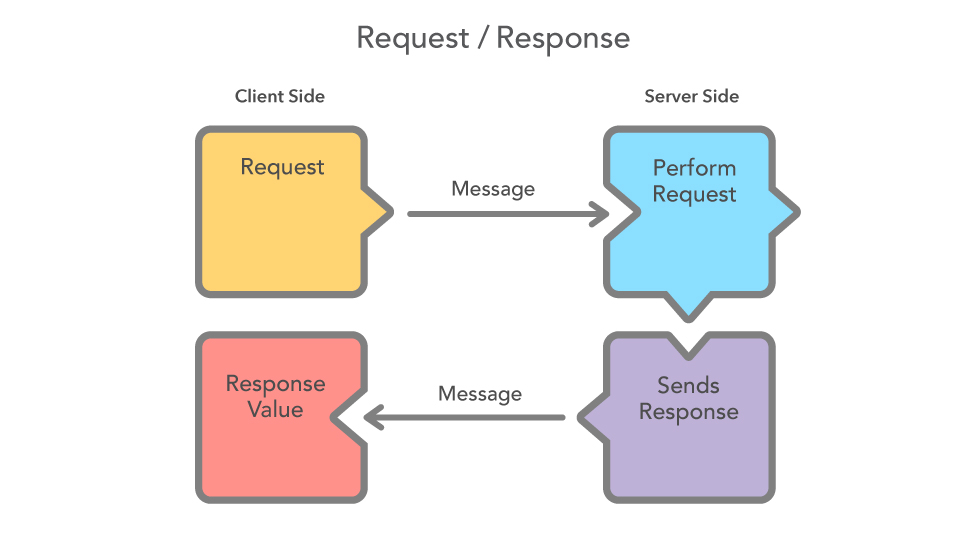
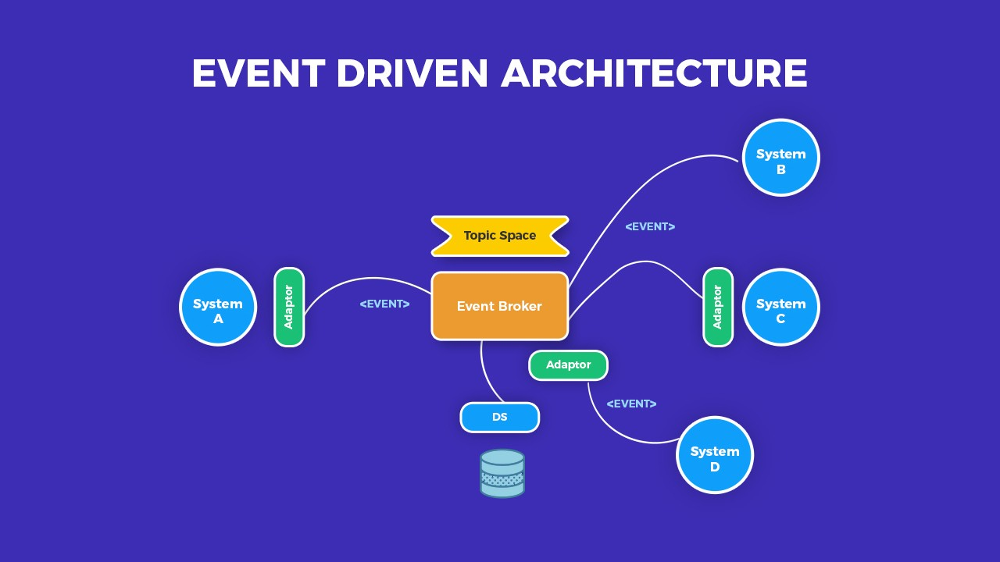
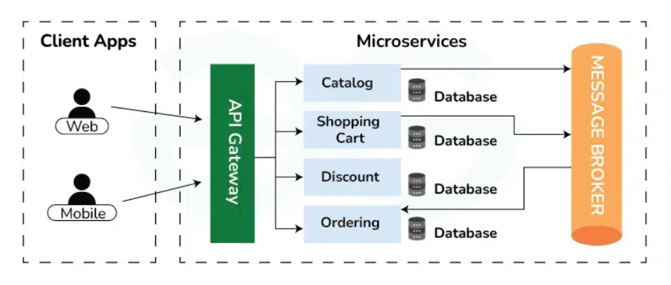
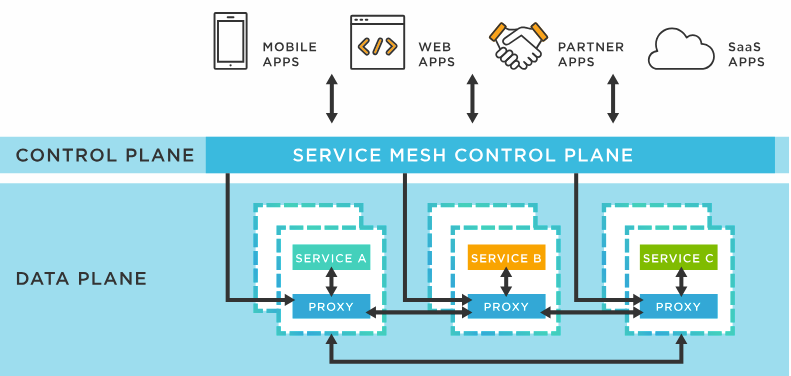

# **Communication Between Microservices: An Overview**

Microservices architecture has revolutionized the way we design and deploy applications, allowing for greater scalability, flexibility, and maintainability. However, one of the most critical aspects of microservices is **inter-service communication**. Properly handling communication between microservices ensures efficient data flow, performance optimization, and system reliability.

This blog will explore the various communication mechanisms, patterns, and best practices for effective microservices communication.

---

## **1. Types of Microservices Communication**

Microservices can communicate in two main ways:

1. **Synchronous Communication (Blocking)**
2. **Asynchronous Communication (Non-blocking)**

### **1.1 Synchronous Communication**
In synchronous communication, the caller waits for the response before proceeding. This approach is commonly used when one microservice needs immediate data from another.

#### **Common Synchronous Communication Protocols**
- **RESTful APIs (HTTP)**
- **gRPC**
- **GraphQL**
- **SOAP**

#### **Pros:**
- Simple to implement.
- Well-supported across multiple technologies.
- Easier debugging with direct responses.

#### **Cons:**
- Introduces latency due to waiting for responses.
- Tightly couples microservices.
- Can lead to cascading failures if one service is down.

#### **Example: REST API Communication**
```java
@RestController
@RequestMapping("/orders")
public class OrderController {

    private final RestTemplate restTemplate;

    @Autowired
    public OrderController(RestTemplate restTemplate) {
        this.restTemplate = restTemplate;
    }

    @GetMapping("/{orderId}")
    public ResponseEntity<OrderDetails> getOrder(@PathVariable String orderId) {
        String customerServiceUrl = "http://customer-service/customers/" + orderId;
        CustomerDetails customerDetails = restTemplate.getForObject(customerServiceUrl, CustomerDetails.class);
        return ResponseEntity.ok(new OrderDetails(orderId, customerDetails));
    }
}
```
> **Note:** Here, the `OrderService` is calling `CustomerService` synchronously.

---

### **1.2 Asynchronous Communication**
In asynchronous communication, the sender does not wait for a response but instead sends the message and continues its process.

#### **Common Asynchronous Communication Protocols**
- **Message Brokers (Kafka, RabbitMQ, ActiveMQ)**
- **Event-Driven Architecture (Event Streaming)**
- **WebSockets**
- **Server-Sent Events (SSE)**

#### **Pros:**
- Decouples microservices, improving resilience.
- Handles high loads effectively.
- More scalable for event-driven applications.

#### **Cons:**
- Complex to implement and debug.
- Requires additional infrastructure like message brokers.
- Message delivery reliability depends on broker configurations.

#### **Example: Kafka Event-Driven Communication**
```java
@Service
public class OrderService {

    private final KafkaTemplate<String, OrderEvent> kafkaTemplate;

    @Autowired
    public OrderService(KafkaTemplate<String, OrderEvent> kafkaTemplate) {
        this.kafkaTemplate = kafkaTemplate;
    }

    public void placeOrder(Order order) {
        kafkaTemplate.send("order-events", new OrderEvent(order.getId(), "Order Placed"));
    }
}
```
> **Note:** Here, an `OrderService` publishes an event to Kafka, and a `PaymentService` can subscribe to process the order asynchronously.

---

## **2. Communication Patterns in Microservices**

### **2.1 Request-Response Pattern**



- Used in synchronous REST API calls.
- The client sends a request, and the service responds immediately.
- Commonly used for retrieving data or triggering actions.

### **2.2 Event-Driven Pattern**



- Services communicate by publishing and subscribing to events.
- Enhances scalability and fault tolerance.
- Ideal for real-time applications like e-commerce and financial transactions.

### **2.3 API Gateway Pattern**



- Acts as an intermediary between clients and microservices.
- Centralizes authentication, logging, and rate limiting.
- Reduces direct dependency between microservices.

### **2.4 Service Mesh Pattern**



- Handles communication, security, and observability.
- Examples: Istio, Linkerd, Consul.
- Adds extra networking layers to manage inter-service communication efficiently.

---

## **3. Choosing the Right Communication Mechanism**
| **Factor**           | **Synchronous (HTTP/gRPC)** | **Asynchronous (Kafka/RabbitMQ)** |
|----------------------|--------------------------|----------------------------------|
| **Latency**         | Higher                    | Lower (No waiting)               |
| **Scalability**     | Moderate                  | High                             |
| **Coupling**        | High                      | Low                              |
| **Fault Tolerance** | Low                        | High                             |
| **Use Case**        | Real-time API calls       | Event-driven processing         |

---

## **4. Best Practices for Microservices Communication**
1. **Use Asynchronous Communication When Possible:** Reduces tight coupling and improves system resilience.
2. **Implement Circuit Breakers:** Prevents cascading failures by stopping calls to failing services.
3. **Adopt API Gateway:** Simplifies inter-service communication by providing a single entry point.
4. **Use a Service Discovery Mechanism:** Ensures that microservices can dynamically locate each other (e.g., Eureka, Consul).
5. **Enable Distributed Tracing:** Helps in debugging and monitoring using tools like Zipkin or Jaeger.
6. **Implement Idempotency:** Ensures duplicate messages don’t affect business logic.
7. **Use Retry and Timeout Mechanisms:** Prevents infinite blocking in case of failures.

---

## **Conclusion**
Microservices communication is a crucial aspect of designing scalable and efficient systems. Choosing the right communication method—**synchronous (HTTP, gRPC)** or **asynchronous (Kafka, RabbitMQ)**—depends on your application’s requirements. By implementing best practices such as API gateways, service discovery, and event-driven messaging, you can build a robust microservices architecture.
