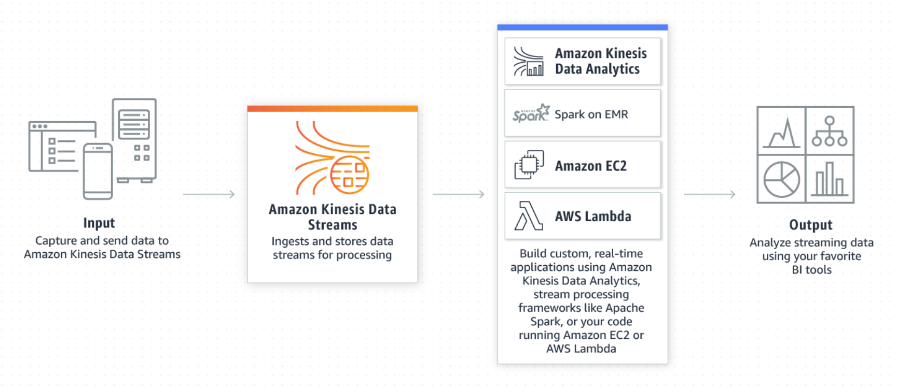
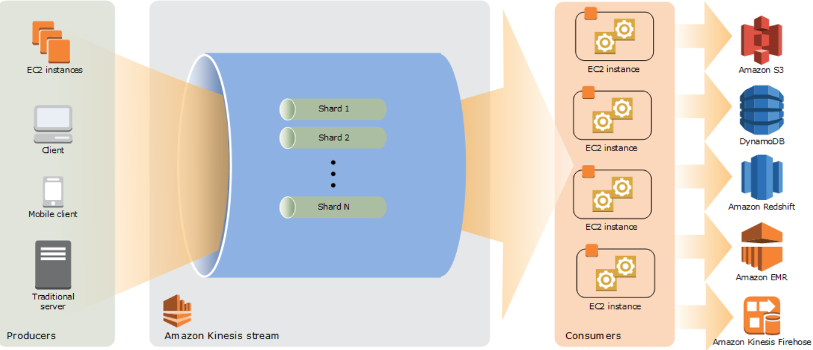

# 🔄 Real-Time Streaming with Amazon Kinesis Data Streams

## 📌 Introduction

In today’s data-driven world, capturing and processing data in **real-time** is crucial for modern applications—from monitoring IoT devices to tracking user activity on websites. **Amazon Kinesis Data Streams (KDS)** is a powerful AWS service that allows you to **ingest, buffer, and process real-time streaming data at scale**.

Let’s explore how Kinesis works, its architecture, features, and hands-on implementation.

---

## 🧩 What is Amazon Kinesis Data Streams?

**Amazon Kinesis Data Streams** is a real-time data streaming service that allows you to:
- **Collect**, process, and **store data streams** at scale
- Feed multiple **real-time consumers** simultaneously
- Enable analytics and alerting based on live data




Use cases include:
- Clickstream analytics
- IoT device telemetry
- Server logs and metrics
- Application performance monitoring

> **Note** : Clickstream analytics is the process of tracking, analyzing, and reporting data on user interactions (clicks, page views, etc.) on websites or apps to understand user behavior and improve user experience and business outcomes. 

> **Note** : Telemetry is the process of gathering data from remote locations and sending it to receiving equipment for monitoring. The word comes from the Greek words tele, meaning "far off", and metron, meaning "measure". 

---

## 🧠 Kinesis Architecture



Kinesis works with three main components:

### 1. **Producers**  
Sources that send data to Kinesis:
- Web apps (click streams)
- IoT devices
- Log shippers (e.g., Kinesis Agent)

### 2. **Amazon Kinesis Data Streams (KDS)**  
The core managed streaming service that:
- Buffers real-time data
- Organizes it by **shards** for scalability
- Retains data for up to 365 days

### 3. **Consumers**  
Services that process the streaming data:
- Custom **applications**
- AWS **Lambda** functions
- **Kinesis Data Firehose** (for delivery to S3, Redshift, etc.)
- **Apache Flink** (real-time analytics)

---

## 🧾 Key Features of Kinesis Data Streams

### ✅ Data Retention
- Keep data from **24 hours up to 365 days**
- Reprocess historical data anytime (e.g., bug fixes or re-analytics)

### ✅ Replay Capability
- Consumers can **replay events** (great for debugging or reprocessing)

### ✅ Durability
- Data can’t be deleted manually—remains until it **expires**

### ✅ Record Size
- Supports data records up to **1MB** in size

### ✅ Data Ordering
- Maintains order within the same **Partition Key**

### ✅ Encryption
- **In-flight encryption** via HTTPS
- **At-rest encryption** using AWS KMS

### ✅ Developer Tools
- **KPL (Kinesis Producer Library)** – for high-performance producers
- **KCL (Kinesis Client Library)** – for optimized consumers

---

## ⚙️ Capacity Modes in Kinesis Data Streams

You can choose between **Provisioned** or **On-Demand** modes:

---

### 🔹 Provisioned Mode
- Choose number of **shards**
- Each shard:
  - Ingests **1 MB/sec or 1000 records/sec**
  - Delivers **2 MB/sec**
- You scale manually
- Pay per shard/hour

Great for **predictable workloads** with consistent traffic.

---

### 🔹 On-Demand Mode
- No need to configure shards manually
- Auto-scales based on usage
- Default: 4 MB/sec in or 4000 records/sec
- Pay per usage (per GB and per hour)

Perfect for **unpredictable traffic spikes** or variable load apps.

---

## 🧪 Example Use Case

Let’s say you run an **e-commerce site**. You want to:
1. Capture **click events**
2. Store them in S3
3. Trigger analytics in real time

### Here’s how it looks:
```
Browser (clicks)
   |
   v
Kinesis Agent / SDK
   |
   v
Amazon Kinesis Data Streams
   |
   v
Amazon Kinesis Data Firehose --> Amazon S3
        |
        --> Lambda --> Analytics
```

With this setup:
- You monitor user behavior live.
- You build real-time dashboards.
- You react to anomalies instantly.

---

## 🔐 Security & Compliance

- **IAM Policies**: Control who can write/read to the stream
- **KMS Encryption**: Protects data at rest
- **Private VPC Endpoints**: Keep data traffic within your network

---

## 💡 Best Practices

- Use **partition keys** wisely to balance load across shards.
- Monitor with **CloudWatch** for metrics like `IncomingBytes`, `ReadProvisionedThroughputExceeded`.
- Combine with **SNS/SQS** for triggering downstream systems.
- Leverage **Firehose** if you just need delivery without custom code.

---

## 🧾 Summary Table

| Feature                 | Description                                       |
|-------------------------|---------------------------------------------------|
| Data Retention          | Up to 365 days                                    |
| Replay                  | Yes, consumers can reprocess                      |
| Throughput Modes        | Provisioned & On-Demand                           |
| Encryption              | At-rest with KMS, in-transit with HTTPS           |
| Scalability             | Manual (Provisioned) or Auto (On-Demand)          |
| Libraries               | KPL for writing, KCL for reading                  |
| Use Case Examples       | Logs, metrics, IoT, clickstreams, real-time ML    |

---

## ✅ Conclusion

Amazon Kinesis Data Streams is a **core building block** for building **real-time applications** on AWS. Whether you're streaming data from sensors, tracking user activity, or building dynamic dashboards, Kinesis helps you build scalable and reactive systems.

By combining Kinesis with Lambda, Firehose, and Flink—you can process and analyze data in milliseconds.

