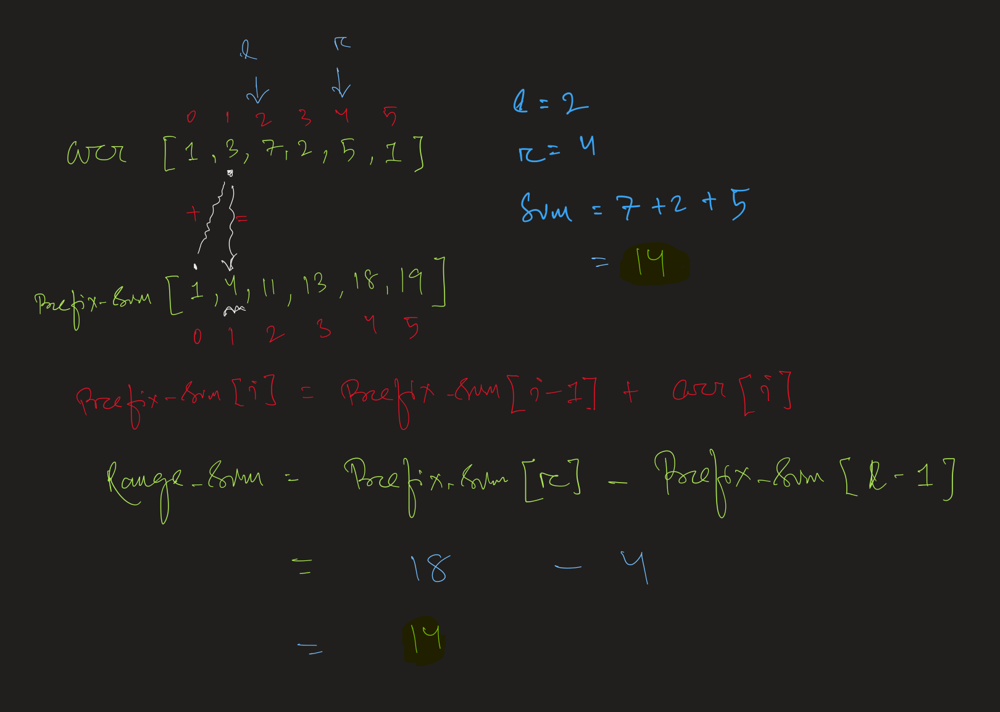

## 🟡 **Prefix Sum – Range Queries (No Updates)**

### 📌 **Use Case**  
When you need to **answer multiple range sum queries** on a static array (i.e., no updates).

---

### 📊 **Core Idea**  
Precompute a prefix sum array `prefix[i] = arr[0] + arr[1] + ... + arr[i]`.

Then, the **sum from index `l` to `r`** is:  
```java
sum = prefix[r] - prefix[l - 1];
```

If `l == 0`, just return `prefix[r]`.

---

### 💡 **Why It Works**
It transforms an O(n) query into **O(1)** after **O(n)** preprocessing.

---

### ✅ **Steps**
1. Create a prefix array of same size.
2. Loop once to fill: `prefix[i] = prefix[i-1] + arr[i]`
3. Use formula to get range sums instantly.




---

### 📘 **Example (Java)**

```java
int[] arr = {2, 4, 6, 8, 10};
int[] prefix = new int[arr.length];
prefix[0] = arr[0];
for (int i = 1; i < arr.length; i++) {
    prefix[i] = prefix[i - 1] + arr[i];
}

// Query: sum of arr[1..3]
int l = 1, r = 3;
int sum = l == 0 ? prefix[r] : prefix[r] - prefix[l - 1];
System.out.println(sum); // Output: 18 (4 + 6 + 8)
```

---

### 🚀 **Common Problems**
- Range Sum Query (LC 303)
- Number of Subarrays with Given Sum
- Equilibrium Index

---

### 🔐 Time & Space
- Preprocessing: **O(n)**
- Query: **O(1)**
- Space: **O(n)**
