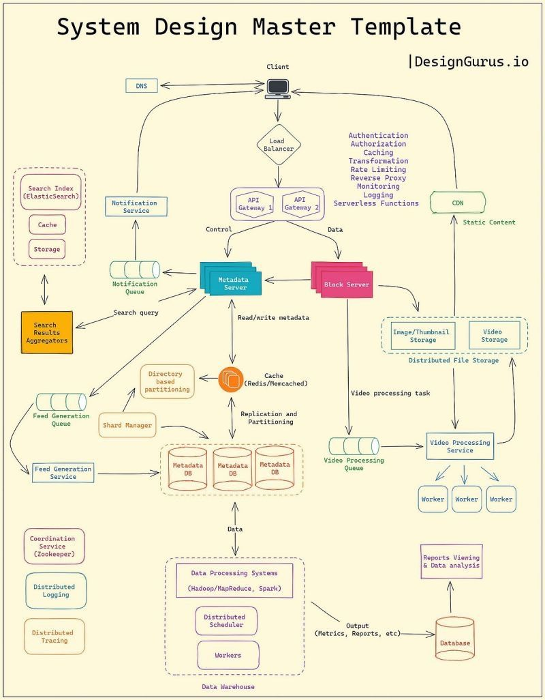

# System Design Concepts Every Developer Should Know

In modern software development, understanding key system design concepts is critical for building scalable, reliable, and high-performance applications. Here are 25 core ideas every developer should be familiar with:

---

### 1. Latency vs Throughput
- **Latency**: Time delay to complete one request.
- **Throughput**: Number of requests handled per unit of time.

### 2. Load Balancer
- Distributes incoming traffic across multiple servers to ensure no server gets overwhelmed.

### 3. Caching
- Stores frequently accessed data closer to users or services to reduce latency and database load.

### 4. Database Indexing
- Organizes database columns to make queries faster and avoid full table scans.

### 5. Sharding
- Splits data across multiple databases or servers to achieve horizontal scalability.

### 6. Replication
- Duplicates data across multiple database nodes for high availability and fault tolerance.

### 7. CAP Theorem
- In a distributed system, you can only achieve two out of three: Consistency, Availability, and Partition Tolerance.

### 8. Consistency Models
- Defines how and when updates become visible across distributed systems (e.g., eventual consistency, strong consistency).

### 9. Rate Limiting
- Restricts how often users or services can perform actions to protect the system from abuse.

### 10. Backpressure
- Mechanism to slow down data producers when consumers can't keep up, preventing system overload.

### 11. Message Queues
- Enable asynchronous communication by decoupling producers from consumers.

### 12. Idempotency
- Ensures that repeating the same operation yields the same result, essential for safe retries.

### 13. Service Discovery
- Automatically identifies and connects services within dynamic distributed environments.

### 14. Health Checks
- Periodically verify if a service is healthy and responsive.

### 15. Circuit Breaker
- Protects systems by stopping calls to a failing service to prevent cascading failures.

### 16. Retry Logic with Exponential Backoff
- Retries failed requests after gradually increasing delays to reduce pressure on services.

### 17. Data Partitioning
- Divides large datasets into smaller parts to optimize performance and manageability.

### 18. Eventual Consistency
- Guarantees that, given enough time, all nodes will converge to the same data state.

### 19. Distributed Transactions
- Complex mechanism for coordinating commits across multiple systems; typically avoided when possible due to complexity.

### 20. Horizontal vs Vertical Scaling
- **Horizontal**: Add more machines.
- **Vertical**: Upgrade the existing machine's resources.

### 21. Sticky Sessions
- Ensures that a user's session is consistently routed to the same server.

### 22. Content Delivery Network (CDN)
- Distributes static resources geographically closer to users to reduce latency.

### 23. Write Amplification
- Refers to writing more data than initially requested, often occurring in databases and SSDs.

### 24. Cold Start Problem
- Delay that occurs when a resource, like a serverless function, spins up on-demand.

### 25. Observability vs Monitoring
- **Monitoring**: Tells you something is wrong.
- **Observability**: Helps you understand *why* it went wrong.

Mastering these concepts will empower developers to build highly scalable, resilient, and efficient systems that stand the test of real-world production demands.

---

### Classic View:

System Design Concepts Every Developer Should Know

1. Latency vs Throughput: Latency is the delay per request, while throughput refers to how many requests can be handled per second.
2. Load Balancer: Distributes incoming traffic across multiple servers to prevent overload.
3. Caching: Stores frequently accessed data to reduce latency and database hits.
4. Database Indexing: Speeds up queries by avoiding full table scans.
5. Sharding: Splits data across multiple databases to scale horizontally.
6. Replication: Copies data across DB nodes for availability and read scaling.
7. CAP Theorem: In distributed systems, you can only guarantee two out of three—Consistency, Availability, and Partition Tolerance.
8. Consistency Models: Define when and how changes become visible across systems (e.g., eventual, strong).
9. Rate Limiting: Controls how frequently users or services can make requests.
10.	Backpressure: Prevents a system from being overwhelmed by slowing down producers.
11.	Message Queues: Decouple producers and consumers for asynchronous, reliable communication.
12.	Idempotency: Ensures repeated operations have the same effect—critical for APIs.
13.	Service Discovery: Lets services find each other dynamically in distributed environments.
14.	Health Checks: Automated checks to verify if a service is up and running.
15.	Circuit Breaker: Temporarily disables calls to a failing service to prevent cascading failures.
16.	Retry Logic with Exponential Backoff: Retries failed operations with increasing delay to reduce load.
17.	Data Partitioning: Splits large datasets across storage units for performance and scale.
18.	Eventual Consistency: Guarantees data will sync across nodes eventually.
19.	Distributed Transactions: Coordinated commits across multiple systems—usually avoided due to complexity.
20.	Horizontal vs Vertical Scaling: Add more machines (horizontal) vs. more powerful machines (vertical).
21.	Sticky Sessions: Route users to the same server to maintain session state.
22.	Content Delivery Network (CDN): Distributes static content closer to users for faster delivery.
23.	Write Amplification: Cost of writing more data than needed—common in databases and SSDs.
24.	Cold Start Problem: Initial delay when a resource (e.g., serverless function) is spun up on demand.
25.	Observability vs Monitoring: Observability helps explain why something broke, not just what broke.

