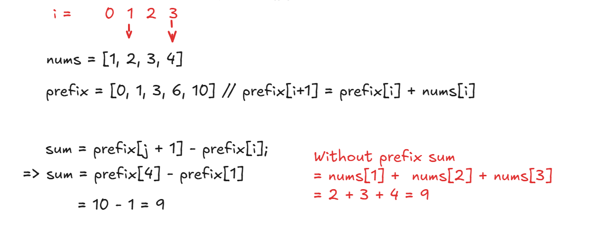

# ➕ **Prefix Sum (Cumulative Sum)**

## → Fast Subarray Sum, Range Sum, and Count Queries

---

## 🧠 What is Prefix Sum?

A **prefix sum array** is a new array where each element at index `i` stores the sum of all elements from index `0` to `i` in the original array.

### 🔧 Definition:

```java
prefix[i] = nums[0] + nums[1] + ... + nums[i]
```

---

## 🛠 Why Use It?

Prefix sum helps you:

* Compute **range sums in O(1)** after **O(n)** preprocessing
* Solve **subarray sum**, **range frequency**, and **counting problems** efficiently

---

## ✅ How to Build It

### Java Example:

```java
int[] prefix = new int[nums.length + 1];
for (int i = 0; i < nums.length; i++) {
    prefix[i + 1] = prefix[i] + nums[i];
}
```

### 🔍 To get sum from index `i` to `j`:

```java
sum = prefix[j + 1] - prefix[i];
```




---

## 🔄 Prefix Sum Variants

| Variant                          | Description                    |
| -------------------------------- | ------------------------------ |
| Basic Prefix Sum                 | Running total                  |
| Prefix Sum + HashMap             | Track sums and counts          |
| 2D Prefix Sum                    | Matrix sum queries             |
| Binary Prefix Sum (Fenwick Tree) | For fast dynamic range updates |

---

## 🧩 Typical Use Cases

* **Subarray sum problems**
* **Range queries (sum, count)**
* **Detect equal sums, count zero-sum subarrays**
* **Sliding windows with sum constraints**

> Range queries in computer science involve efficiently answering questions about a contiguous range of elements within a data structure, like an array or a set. These queries can be used to find the sum, minimum, maximum, or frequency of values within a specified range, or even to find which elements from a set are within a given range

---

## 📘 Classic LeetCode Problems using Prefix Sum

| Problem # | Name                                     | Technique                    |
| --------- | ---------------------------------------- | ---------------------------- |
| 560       | Subarray Sum Equals K                    | Prefix Sum + HashMap         |
| 303       | Range Sum Query - Immutable              | Basic Prefix Sum             |
| 523       | Continuous Subarray Sum (divisible by k) | Prefix Sum + Modulo HashMap  |
| 724       | Find Pivot Index                         | Prefix Sum Comparison        |
| 2381      | Shifting Letters II                      | Prefix Sum on Difference Arr |
| 304       | Range Sum Query 2D                       | 2D Prefix Sum                |
| 1248      | Count Number of Nice Subarrays           | Prefix Sum + Sliding Window  |
| 1744      | Can You Eat Your Favorite Candy on Day   | Prefix Sum Comparison        |

---

## ⚠️ Pitfalls to Avoid

* Be careful with **off-by-one** indexing (`prefix[i+1]`)
* Initialize `prefix[0] = 0` for clean math
* For **count-based prefix sum**, use maps to track frequency of sums


Let’s explain each of those points clearly:

---

## 🔹 **1. Be careful with off-by-one indexing (`prefix[i + 1]`)**

### ✅ What it means:

When building a prefix sum array of size `n + 1`, we often store:

```java
prefix[i + 1] = prefix[i] + nums[i];
```

* `prefix[0]` is initialized to `0`
* `prefix[1] = nums[0]`
* `prefix[2] = nums[0] + nums[1]`
* ... and so on

### ⚠️ Off-by-one trap:

If you accidentally use `prefix[i] = prefix[i - 1] + nums[i]`, it might:

* Access `prefix[-1]` on `i = 0` (index error)
* Misalign your range sum logic

**Always ensure array bounds are correct.**

---

## 🔹 **2. Initialize `prefix[0] = 0` for clean math**

### ✅ Why?

By setting `prefix[0] = 0`, the sum of `nums[i...j]` can be calculated as:

```java
prefix[j + 1] - prefix[i]
```

This makes:

* Sum from `0 to j` → `prefix[j + 1]`
* Sum from `i to j` → `prefix[j + 1] - prefix[i]`

Without `prefix[0] = 0`, you'd need special cases when `i = 0`.

---

## 🔹 **3. For count-based prefix sum, use `Map<Integer, Integer>`**

### ✅ When?

In problems like:

* Count subarrays with sum `K` (e.g., LeetCode 560)

We track **how often each prefix sum has occurred**.

### 🔁 Why a map?

We want to know:

* “How many previous prefix sums equal `currentSum - K`?”

### 💡 Example:

```java
Map<Integer, Integer> map = new HashMap<>();
map.put(0, 1); // base case

int sum = 0, count = 0;
for (int num : nums) {
    sum += num;
    count += map.getOrDefault(sum - k, 0); // check for matching past prefix
    map.put(sum, map.getOrDefault(sum, 0) + 1);
}
```

---

## 🔚 Summary:

| Rule                      | Why it matters                                          |
| ------------------------- | ------------------------------------------------------- |
| `prefix[i+1]` indexing    | Avoids out-of-bound and aligns sums with `[i, j]` logic |
| `prefix[0] = 0`           | Enables uniform formula: `prefix[j+1] - prefix[i]`      |
| Map for prefix sum counts | Needed to **count** subarrays with a target sum `k`     |


---

## 🔚 Summary Table

| Goal                       | Use                  |
| -------------------------- | -------------------- |
| Fast sum of subarrays      | Prefix Sum           |
| Count subarrays with sum K | Prefix Sum + HashMap |
| Sum in 2D grid             | 2D Prefix Sum        |
| Track running balance      | Prefix with HashMap  |


