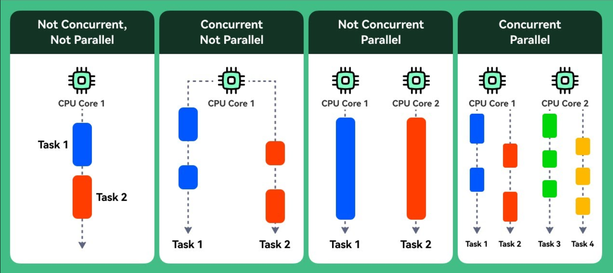

# 📬 Async Task Queues in Node.js with BullMQ — Concurrency and Scalability Guide

In scalable Node.js applications, it’s often essential to **offload long-running, CPU-intensive, or delayed tasks** to a **background queue**. That’s where **task queues** come in — and **BullMQ** is one of the most powerful and production-ready tools for it.

> BullMQ is a distributed Task Scheduler (Not a DAG (Directed Acyclic Graph)  based)

In this post, we’ll cover:

* What are async task queues?
* Why and when you need them
* BullMQ architecture
* Example: using BullMQ with Redis
* Features, best practices, and scaling strategies

---

## ⏳ What Is an Async Task Queue?

An **async task queue** is a system that:

1. Accepts tasks (jobs) from your app
2. Queues them for background execution
3. Processes them using **workers**
4. Optionally retries, delays, or schedules jobs

---

## 🧠 Why Use a Task Queue?

| Scenario               | Why BullMQ Helps                   |
| ---------------------- | ---------------------------------- |
| Sending emails         | Avoid blocking the main request    |
| Generating reports     | Offload heavy computation          |
| Processing payments    | Ensure retry/failure handling      |
| Video/image processing | Push to a background service       |
| Rate-limited API calls | Control job concurrency and timing |

> 🛑 Without queues, your server becomes bloated and unresponsive under load.

---

## 🚀 Meet BullMQ

**BullMQ** is the modern, TypeScript-first rewrite of the popular **Bull** queue library.

Built on **Redis**, it provides:

✅ Atomic job handling
✅ Delayed jobs
✅ Repeatable tasks
✅ Concurrency controls
✅ Prioritization and rate-limiting
✅ UI dashboard (via [Arena](https://github.com/bee-queue/arena) or [bull-board](https://github.com/felixmosh/bull-board))

---

## 🏗️ BullMQ Architecture

```
  ┌──────────────┐       addJob()        ┌─────────────┐
  │   Producer   │ ────────────────────▶ │   Redis DB  │
  │ (Node App)   │                      └─────────────┘
  └──────────────┘                            ▲
                                              │
                                   ┌──────────┴─────────┐
                                   │     Worker         │
                                   │ (Node.js Consumer) │
                                   └──────────┬─────────┘
                                              │
                                    Processed / Failed
```

---

## 📦 Installing BullMQ

```bash
npm install bullmq ioredis
```

> You also need a running **Redis server**.

---

## 🧪 Simple Example

### `queue.js` (Producer)

```js
const { Queue } = require('bullmq');
const { Redis } = require('ioredis');

const queue = new Queue('emailQueue', {
  connection: new Redis()
});

queue.add('sendEmail', {
  to: 'user@example.com',
  subject: 'Welcome!',
  body: 'Thanks for joining us.'
});
```

---

### `worker.js` (Consumer)

```js
const { Worker } = require('bullmq');
const { Redis } = require('ioredis');

const worker = new Worker('emailQueue', async job => {
  console.log(`📧 Sending email to ${job.data.to}`);
  // simulate work
  await new Promise(resolve => setTimeout(resolve, 2000));
  console.log('✅ Email sent!');
}, {
  connection: new Redis()
});
```

---

## ⏱️ Scheduling, Delay & Retry

```js
queue.add('reportJob', { userId: 42 }, {
  delay: 5000, // start 5s later
  attempts: 3, // retry if fails
  backoff: { type: 'exponential', delay: 2000 }
});
```

## Example 

### Timeline for BullMQ Retry with Exponential Backoff

Given this config:

```js
queue.add('job', {}, {
  delay: 5000, // initial delay before first execution
  attempts: 5,
  backoff: {
    type: 'exponential',
    delay: 2000 // base delay
  }
});
```

---

### 🧠 Execution Timeline Breakdown (assuming all attempts fail)

| Attempt # | Time from `t`                           | Delay Explanation                      |
| --------- | --------------------------------------- | -------------------------------------- |
| 1         | `t + 5000ms`                            | Initial `delay` before first execution |
| 2         | `t + 5000 + 2000`                       | backoff(2⁰ × 2000) = 2s after fail     |
| 3         | `t + 5000 + 2000 + 4000`                | backoff(2¹ × 2000) = 4s                |
| 4         | `t + 5000 + 2000 + 4000 + 8000`         | backoff(2² × 2000) = 8s                |
| 5         | `t + 5000 + 2000 + 4000 + 8000 + 16000` | backoff(2³ × 2000) = 16s               |

---

### 🔁 Actual Retry Delay Formula:

For retry **n** (starting from 1), the delay after the previous attempt is:

```
delay_n = baseDelay * 2^(n - 1)
```

So it's:

* Retry 1: 2⁰ × 2000 = 2s
* Retry 2: 2¹ × 2000 = 4s
* Retry 3: 2² × 2000 = 8s
* Retry 4: 2³ × 2000 = 16s
* ...

---

### ✅ Final Timeline (Total elapsed since t):

```
Attempt 1:  t + 5s
Attempt 2:  t + 7s   (5s + 2s)
Attempt 3:  t + 11s  (5s + 2s + 4s)
Attempt 4:  t + 19s  (5s + 2s + 4s + 8s)
Attempt 5:  t + 35s  (5s + 2s + 4s + 8s + 16s)
```

---

So to correct your original understanding:

> ❌ No, retries don’t all happen at `t + 5000ms`.
> ✅ First execution is at `t + delay`. Retries then happen with **exponential backoff from the previous failure time**, not from the original `t`.


---

## ⚙️ Concurrency Control

```js
new Worker('videoJobs', async job => {
  // process video...
}, {
  concurrency: 5,
  connection: new Redis()
});
```

* Processes 5 jobs in parallel
* Avoids CPU/memory overload





>  The core purpose of concurrency is to maximize CPU utilization by efficiently handling multiple tasks — even if not all of them are CPU-bound.

---

## 📊 Monitoring Jobs (bull-board UI)

```bash
npm install @bull-board/api @bull-board/express
```

```js
const { ExpressAdapter } = require('@bull-board/express');
const { createBullBoard } = require('@bull-board/api');
const express = require('express');

const app = express();
const serverAdapter = new ExpressAdapter();
serverAdapter.setBasePath('/admin/queues');

createBullBoard({
  queues: [new BullAdapter(queue)],
  serverAdapter
});

app.use('/admin/queues', serverAdapter.getRouter());
app.listen(3001);
```

* View status of jobs: waiting, active, failed, completed

---

## 🧰 Best Practices

| Tip                                     | Why                                  |
| --------------------------------------- | ------------------------------------ |
| Use Redis persistence                   | Keeps jobs safe after restarts       |
| Set job `attempts` + `backoff`          | Handles failures gracefully          |
| Use `removeOnComplete` & `removeOnFail` | Prevent Redis memory bloat           |
| Separate producers & workers            | Decouples APIs from background tasks |
| Use named queues per domain             | Helps scale and isolate logic        |

---

## 📦 Scaling Strategies

* Run multiple **workers** on different machines
* Partition logic by **queue names**
* Use Redis Cluster for horizontal scaling
* Apply rate limiting and concurrency caps for API jobs

---

## 🧠 When Not to Use BullMQ

* For real-time messaging (use socket or pub/sub)
* For transactional DB jobs (consider DB-native queues)
* For simple one-off async code (use `setTimeout` or Promises)

---

## ✅ Conclusion

BullMQ enables **resilient, scalable, and fault-tolerant task processing** in Node.js. Whether you're sending millions of emails, generating invoices, or processing videos — moving heavy tasks off the main thread via queues is a **key pattern for concurrency and scalability**.

> 🎯 Async task queues help your app stay fast, stable, and production-ready — even under pressure.

---
