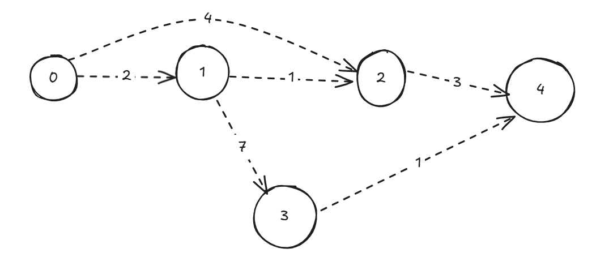

# 🛣️ Dijkstra’s Algorithm – Find Shortest Path in Weighted Graphs (No Negative Weights)

Dijkstra’s Algorithm is one of the most important **Greedy algorithms** used to find the **shortest path** from a **source node** to all other nodes in a **weighted, non-negative graph**.

---

## 🧠 Core Intuition

Dijkstra’s algorithm is like throwing a stone in a lake — it **spreads out** from the source node, always expanding to the **closest unvisited node**. By doing this, it guarantees the shortest path because once a node is visited, there’s **no shorter way to reach it**.

---

## 🚦 When to Use Dijkstra

* You have a **weighted graph**.
* All **edge weights are non-negative**.
* You want to find **shortest paths from a single source** to all other nodes.
* Common in **routing algorithms**, **GPS navigation**, **network routing**.

---

## 📊 Time & Space Complexity

| Implementation | Time Complexity  | Data Structures Used                  |
| -------------- | ---------------- | ------------------------------------- |
| Naive          | O(V²)            | Adjacency Matrix + Linear Search      |
| Using Min-Heap | O((V + E) log V) | Adjacency List + PriorityQueue (Heap) |

* `V`: number of vertices
* `E`: number of edges

👉 For **sparse graphs**, use **min-heap** version with **Adjacency List** (standard in interviews).

---

## 🛠️ Data Structures You Need

* **Priority Queue / Min Heap** (Java: `PriorityQueue`)
* **Adjacency List** to store graph
* **Distance Array** to track minimum distances

---

## 🧱 Step-by-Step Explanation

1. Initialize `dist[]` array with `Infinity`, and set `dist[src] = 0`.
2. Use a **priority queue** (min-heap) to always pick the node with the shortest known distance.
3. For the current node, explore all its neighbors:

   * If going through the current node gives a shorter path, **update the distance** and **add neighbor to the queue**.
4. Repeat until the priority queue is empty.

---

## 💻 Java Implementation

```java
import java.util.*;

class Dijkstra {
    static class Pair {
        int node, dist;
        Pair(int d, int n) {
            dist = d;
            node = n;
        }
    }

    public static int[] dijkstra(int V, List<List<int[]>> adj, int src) {
        int[] dist = new int[V];
        Arrays.fill(dist, Integer.MAX_VALUE);
        dist[src] = 0;

        PriorityQueue<Pair> pq = new PriorityQueue<>(Comparator.comparingInt(a -> a.dist));
        pq.offer(new Pair(0, src));

        while (!pq.isEmpty()) {
            Pair curr = pq.poll();
            int u = curr.node;

            for (int[] edge : adj.get(u)) {
                int v = edge[0];
                int weight = edge[1];

                if (dist[u] + weight < dist[v]) {
                    dist[v] = dist[u] + weight;
                    pq.offer(new Pair(dist[v], v));
                }
            }
        }
        return dist;
    }

    // Sample usage
    public static void main(String[] args) {
        int V = 5;
        List<List<int[]>> adj = new ArrayList<>();
        for (int i = 0; i < V; i++) adj.add(new ArrayList<>());

        // Add edges: from -> to, weight
        adj.get(0).add(new int[]{1, 2});
        adj.get(0).add(new int[]{2, 4});
        adj.get(1).add(new int[]{2, 1});
        adj.get(1).add(new int[]{3, 7});
        adj.get(2).add(new int[]{4, 3});
        adj.get(3).add(new int[]{4, 1});

        int[] shortest = dijkstra(V, adj, 0);

        System.out.println("Shortest distances from source 0:");
        for (int i = 0; i < V; i++) {
            System.out.println("Node " + i + " : " + shortest[i]);
        }
    }
}
```

---

## 🧪 Dry Run Example

Let’s say you have a graph:


* Start from node `0`
* Shortest path to `2`: 0 → 1 → 2 (cost 3), not 0 → 2 directly (cost 4)

Dijkstra always expands **cheapest edge first**, so it gets optimal paths.

---

## 🚫 Common Mistakes

* ❌ **Using Dijkstra with negative weights** → it gives wrong results.
* ❌ **Updating nodes multiple times without checking if they already had a better distance**.
* ❌ **Forgetting to use min-heap** – leads to higher time complexity.

---

## 🔍 Real-World Applications

* GPS & Map Routing (Google Maps, Uber)
* Network Routing (OSPF Protocol)
* Flight Booking Systems
* Game AI Pathfinding

---

## 🧠 Dijkstra vs Bellman-Ford

| Feature              | Dijkstra       | Bellman-Ford    |
| -------------------- | -------------- | --------------- |
| Edge Weights         | Non-negative   | Can be negative |
| Time Complexity      | O((V+E) log V) | O(V × E)        |
| Negative Cycle Check | ❌ Not possible | ✅ Supported     |
| Practical Usage      | More common    | Less frequent   |

---

## 📚 LeetCode Problems to Practice

1. 🔗 [743. Network Delay Time](https://leetcode.com/problems/network-delay-time/)
2. 🔗 [787. Cheapest Flights Within K Stops](https://leetcode.com/problems/cheapest-flights-within-k-stops/) (modified Dijkstra)
3. 🔗 [1631. Path With Minimum Effort](https://leetcode.com/problems/path-with-minimum-effort/)
4. 🔗 [1514. Path with Maximum Probability](https://leetcode.com/problems/path-with-maximum-probability/)

---

## ✅ Final Tips

* Always track the current distance and neighbor’s updated distance.
* Use a priority queue for best performance.
* Stick to Dijkstra **only if** there are **no negative weights**.

> 🎯 “Dijkstra’s is the first tool you reach for when solving single-source shortest path problems in real-world applications.”

---

> Note : Dijkstra’s Algorithm is same like BFS but instead of queue in bfs it uses priority queue with order based on distance.


### 🔁 Dijkstra’s Algorithm vs. BFS

| Feature           | **BFS**                       | **Dijkstra**                                       |
| ----------------- | ----------------------------- | -------------------------------------------------- |
| Graph type        | Unweighted                    | Weighted (non-negative)                            |
| Data structure    | Queue (`FIFO`)                | Priority Queue (min-heap based on distance)        |
| Distance tracking | Level-based (1 step = 1 unit) | Minimum total cost from source                     |
| Update condition  | If not visited                | If new path is shorter                             |
| Time complexity   | O(V + E)                      | O((V + E) log V) with priority queue (binary heap) |

---

### 🧠 Intuition:

> Dijkstra is like BFS, but it chooses the **closest unvisited node** next using a **priority queue** based on current `distance`.

---

### 🔧 Dijkstra uses:

```java
PriorityQueue<Pair> pq = new PriorityQueue<>(Comparator.comparingInt(p -> p.distance));
```

Where `Pair` holds: `node` and `distance`.
