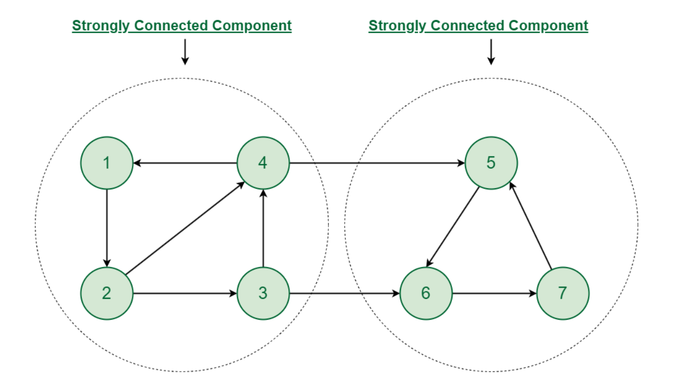

# 🔄 Strongly Connected Components (SCCs) in Graphs – Explained for Interviews

## 📌 What Are Strongly Connected Components?

In a **directed graph**, a **Strongly Connected Component (SCC)** is a **maximal subgraph** where:

> Every node is reachable from every other node in the same component.

That is, for any pair of nodes `u` and `v` in the component:

* There is a path from `u → v`
* And a path from `v → u`



---

## 🧠 Why Are SCCs Important?

* Used in **compilers** for dependency resolution.
* Used in **distributed systems** to detect strongly coupled services/modules.
* Helps in **optimizing call graphs**, **circuit analysis**, **deadlock detection**, and **Kosaraju’s algorithm** is often asked in coding interviews.

---

## 🧭 How to Find SCCs?

There are **two major algorithms**:

---

### ✅ 1. **Kosaraju’s Algorithm** (Two-Pass DFS)

#### Steps:

1. **Do a DFS and record the finish time** of each node (postorder) in a stack.
2. **Reverse the graph** (reverse all edges).
3. **Do DFS in the order of decreasing finish time** (pop from the stack).

   * Each DFS call now gives **one SCC**.

#### Code (Java):

```java
void dfs1(int u, boolean[] visited, Stack<Integer> stack, List<List<Integer>> graph) {
    visited[u] = true;
    for (int v : graph.get(u)) {
        if (!visited[v]) dfs1(v, visited, stack, graph);
    }
    stack.push(u);
}

void dfs2(int u, boolean[] visited, List<Integer> component, List<List<Integer>> revGraph) {
    visited[u] = true;
    component.add(u);
    for (int v : revGraph.get(u)) {
        if (!visited[v]) dfs2(v, visited, component, revGraph);
    }
}

List<List<Integer>> findSCCs(int n, List<List<Integer>> graph) {
    Stack<Integer> stack = new Stack<>();
    boolean[] visited = new boolean[n];

    // Step 1: Original DFS
    for (int i = 0; i < n; i++)
        if (!visited[i]) dfs1(i, visited, stack, graph);

    // Step 2: Reverse the graph
    List<List<Integer>> revGraph = new ArrayList<>();
    for (int i = 0; i < n; i++) revGraph.add(new ArrayList<>());
    for (int u = 0; u < n; u++) {
        for (int v : graph.get(u)) {
            revGraph.get(v).add(u);
        }
    }

    // Step 3: DFS on reversed graph
    Arrays.fill(visited, false);
    List<List<Integer>> result = new ArrayList<>();
    while (!stack.isEmpty()) {
        int u = stack.pop();
        if (!visited[u]) {
            List<Integer> component = new ArrayList<>();
            dfs2(u, visited, component, revGraph);
            result.add(component);
        }
    }
    return result;
}
```

#### ⏱️ Time Complexity:

* `O(V + E)` (2 DFS + 1 graph reversal)

---

### ✅ 2. **Tarjan’s Algorithm** (Single-Pass DFS with Low-Link Values)

* Uses **discovery time** and **low-link values**.
* Keeps track of a stack to know the current DFS path.
* Pops nodes from the stack when an SCC is found.

Useful when you want to:

* Find all SCCs in a **single DFS pass**.
* Use **constant time stack maintenance**.

> Slightly more complex to implement but more elegant.

---

## 🔍 Real-World Examples

| Application                                        | Why SCC?                                               |
| -------------------------------------------------- | ------------------------------------------------------ |
| Dependency resolution in software (e.g., NPM, pip) | Detect circular dependencies                           |
| Social Networks                                    | Detect tight-knit communities (e.g., mutual followers) |
| Call Graphs                                        | Optimize inlining in compilers                         |
| Deadlock detection                                 | Identify cycles in wait-for graphs                     |
| Circuit design                                     | SCCs indicate feedback loops                           |

---

## 🧩 Common LeetCode / CP Problems

| Problem                                            | Link                                                                         |
| -------------------------------------------------- | ---------------------------------------------------------------------------- |
| Critical Connections in a Network (Tarjan variant) | [LC 1192](https://leetcode.com/problems/critical-connections-in-a-network)   |
| Strongly Connected Components (SPOJ)               | [SCC](https://www.spoj.com/problems/SCC/)                                    |
| Kosaraju’s Algorithm                               | [GFG Practice](https://www.geeksforgeeks.org/strongly-connected-components/) |

---

## 🧠 Intuition Summary

| Feature            | Kosaraju             | Tarjan                            |
| ------------------ | -------------------- | --------------------------------- |
| Passes             | 2 DFS                | 1 DFS                             |
| Stack use          | For ordering         | For tracking recursion            |
| Complexity         | `O(V + E)`           | `O(V + E)`                        |
| Easy to implement? | Yes                  | Slightly complex                  |
| Best for           | Quick implementation | Optimized DFS-based SCC detection |

---

## ✅ Final Tip for Interviews

* Start with **Kosaraju** for clarity and speed.
* Mention **Tarjan** if asked about **efficient/optimized** versions.
* Explain the difference clearly — especially during system design or competitive rounds.


