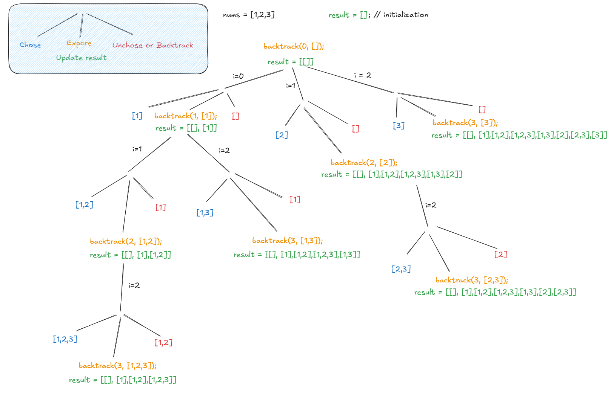
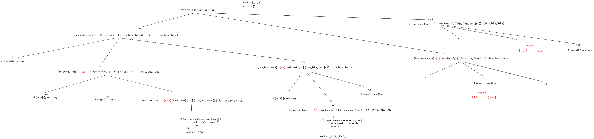
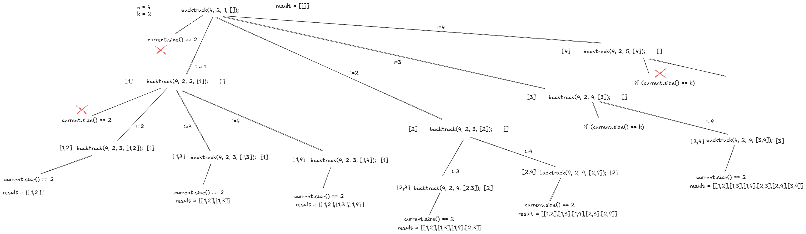

### 🧠 Generating Subsets, Permutations, Combinations → **Use Backtracking**

---

**📌 Overview:**
Backtracking is a general algorithmic technique used for solving problems recursively by building a solution incrementally and removing those solutions that fail to satisfy the constraints of the problem at any point (i.e., *"backtracking"* when a path is invalid).

When you're asked to **generate all possible subsets, permutations, or combinations**, backtracking is your go-to approach because it helps **explore all potential solution spaces** efficiently.

> Note : Backtracking is primarily associated with Depth-First Search (DFS).

---

### 🔹 1. Subsets (Power Set)

**Use Case:** Generate all subsets of a given set (with or without duplicates).

**Example:**
Input: `[1, 2]`
Output: `[[], [1], [2], [1, 2]]`

**Approach:**
Use DFS/backtracking, where at each step, we choose whether to **include or exclude** the current element.

**Java Template:** | ROTE IT!!

```java
List<List<Integer>> result = new ArrayList<>();

void backtrack(int[] nums, int start, List<Integer> current) {
    result.add(new ArrayList<>(current));
    for (int i = start; i < nums.length; i++) {
        current.add(nums[i]);
        backtrack(nums, i + 1, current);
        current.remove(current.size() - 1); // backtrack
    }
}
```


__Full code:__

Here is the **full working Java code** to generate all **subsets (power set)** of a given array using backtracking:

```java
import java.util.*;

public class SubsetsGenerator {
    List<List<Integer>> result = new ArrayList<>();

    public List<List<Integer>> subsets(int[] nums) {
        backtrack(nums, 0, new ArrayList<>());
        return result;
    }

    void backtrack(int[] nums, int start, List<Integer> current) {
        result.add(new ArrayList<>(current));
        for (int i = start; i < nums.length; i++) {
            current.add(nums[i]);
            backtrack(nums, i + 1, current);
            current.remove(current.size() - 1); // backtrack
        }
    }

    public static void main(String[] args) {
        SubsetsGenerator sg = new SubsetsGenerator();
        int[] nums = {1, 2, 3};
        List<List<Integer>> subsets = sg.subsets(nums);

        for (List<Integer> subset : subsets) {
            System.out.println(subset);
        }
    }
}
```

### Output for input `{1, 2, 3}`:

```
[]
[1]
[1, 2]
[1, 2, 3]
[1, 3]
[2]
[2, 3]
[3]
```

This is a canonical backtracking example you can memorize and reuse for similar problems.


__JavaScript equivalent:__

Here's the **JavaScript equivalent** of the `SubsetsGenerator` Java code that generates all **subsets (power set)** of a given array:

```javascript
function subsets(nums) {
    const result = [];

    function backtrack(start, current) {
        result.push([...current]); // Add a copy of current subset
        for (let i = start; i < nums.length; i++) {
            current.push(nums[i]);         // Choose
            backtrack(i + 1, current);     // Explore
            current.pop();                 // Unchoose (backtrack)
        }
    }

    backtrack(0, []);
    return result;
}

// Example usage
const nums = [1, 2, 3];
const allSubsets = subsets(nums);
console.log(allSubsets);
```

### Output:

```
[
  [], [1], [1,2], [1,2,3], [1,3],
  [2], [2,3], [3]
]
```

Same logic, just translated to idiomatic JavaScript.





---

### 🔹 2. Permutations

**Use Case:** Generate all possible orderings of given elements.

**Example:**
Input: `[1, 2, 3]`
Output: `[[1,2,3], [1,3,2], [2,1,3], [2,3,1], [3,1,2], [3,2,1]]`

**Approach:**
Choose each element once, mark it as used, and explore further. On backtrack, unmark it.





**Java Template:**

```java
List<List<Integer>> result = new ArrayList<>();

void backtrack(int[] nums, boolean[] used, List<Integer> current) {
    if (current.size() == nums.length) {
        result.add(new ArrayList<>(current));
        return;
    }
    for (int i = 0; i < nums.length; i++) {
        if (used[i]) continue;
        used[i] = true;
        current.add(nums[i]);
        backtrack(nums, used, current);
        current.remove(current.size() - 1);
        used[i] = false; // backtrack
    }
}
```

__Full code with JavaScript__

Here’s the **JavaScript equivalent** of your Java code, which generates **all permutations** of an array (like LeetCode 46: *Permutations*):

```javascript
function permute(nums) {
    const result = [];

    function backtrack(current, used) {
        if (current.length === nums.length) {
            result.push([...current]);
            return;
        }

        for (let i = 0; i < nums.length; i++) {
            if (used[i]) continue;

            used[i] = true;
            current.push(nums[i]);
            backtrack(current, used);
            current.pop();       // Backtrack
            used[i] = false;
        }
    }

    backtrack([], Array(nums.length).fill(false));
    return result;
}

// Example usage:
const nums = [1, 2, 3];
const permutations = permute(nums);
console.log(permutations);
```

### Output:

```
[
  [1,2,3], [1,3,2],
  [2,1,3], [2,3,1],
  [3,1,2], [3,2,1]
]
```

This matches the Java logic exactly — using a `used[]` array to track which elements are already in the current permutation.


---

### 🔹 3. Combinations

**Use Case:** Select `k` elements out of `n` without considering order.

**Example:**
Input: `n = 4, k = 2`
Output: `[[1,2],[1,3],[1,4],[2,3],[2,4],[3,4]]`

**Approach:**
Explore elements from `start` to `n`, reduce `k` as you pick elements.

**Java Template:**

```java
List<List<Integer>> result = new ArrayList<>();

void backtrack(int n, int k, int start, List<Integer> current) {
    if (current.size() == k) {
        result.add(new ArrayList<>(current));
        return;
    }
    for (int i = start; i <= n; i++) {
        current.add(i);
        backtrack(n, k, i + 1, current);
        current.remove(current.size() - 1); // backtrack
    }
}
```




There is a leetcode problem related to it.  

### 🔹 LeetCode Problem 77: **Combinations**

> **Given two integers** `n` and `k`, **return all possible combinations** of `k` numbers chosen from the range `[1, n]`.

---

### ✅ Example:

#### Input:

```java
n = 4, k = 2
```

#### Output:

```java
[
  [1, 2],
  [1, 3],
  [1, 4],
  [2, 3],
  [2, 4],
  [3, 4]
]
```

---

### 🔍 Constraints:

* `1 <= n <= 20`
* `1 <= k <= n`


---
Pre-requisite: 
Understand shallow and deep copy first before 
diving into backtracking : [See more...](http://localhost:3000/#/contents/full-stack-developer-course/data-structures/competitive-programming-cheat-sheet/dsa-patterns-cheatsheet/part-1-classic-cheat-sheet/array-string-input/generating-subsets-permutations-combinations/shallow-copy-deep-copy)

---


## Solution 

Here is the **full Java code** to generate combinations of size `k` from numbers `1` to `n` using the backtracking approach you mentioned:

```java
import java.util.*;

public class Combinations {
    List<List<Integer>> result = new ArrayList<>();

    public List<List<Integer>> combine(int n, int k) {
        backtrack(n, k, 1, new ArrayList<>());
        return result;
    }

    void backtrack(int n, int k, int start, List<Integer> current) {
        if (current.size() == k) {
            result.add(new ArrayList<>(current));
            return;
        }

        for (int i = start; i <= n; i++) {
            current.add(i);
            backtrack(n, k, i + 1, current);
            current.remove(current.size() - 1); // backtrack
        }
    }

    public static void main(String[] args) {
        Combinations obj = new Combinations();
        int n = 4, k = 2;
        List<List<Integer>> combinations = obj.combine(n, k);
        System.out.println("Combinations of " + k + " from 1 to " + n + ":");
        for (List<Integer> list : combinations) {
            System.out.println(list);
        }
    }
}
```

### ✅ Output for `n = 4`, `k = 2`:

```
[1, 2]
[1, 3]
[1, 4]
[2, 3]
[2, 4]
[3, 4]
```


---

### 🔁 Common Patterns in All Three:

* **Recursive tree traversal** through decision points
* **Backtrack** (undo choice) after recursive call
* **Avoid duplicates** using `used[]`, sorting, or `start` pointers
* Use **result.add(new ArrayList<>(current))** to clone current path

---

### 🔥 Bonus Tips:

* For subsets with duplicates: sort array and skip duplicates.
* For permutations with duplicates: sort + skip if used\[i - 1] and not used.
* Backtracking works best for **combinatorial enumeration** problems.

---

**🧠 Final Thought:**
Think of backtracking like exploring paths in a decision tree: **go deep, prune invalid paths, and explore all valid solutions**. It’s foundational for solving any problem that asks to "generate all..." variations.


