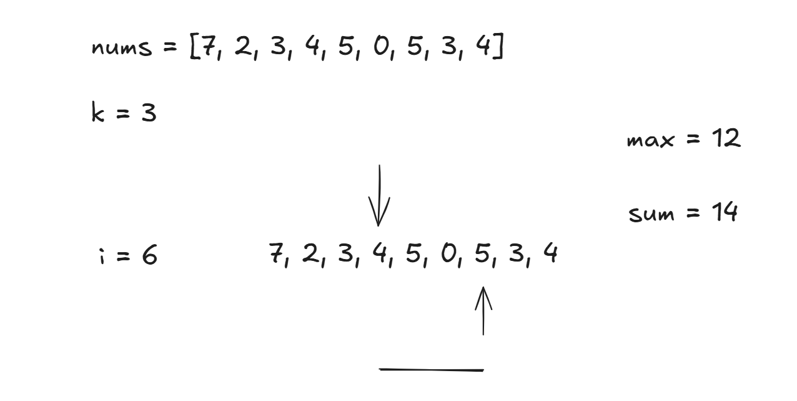

# 🔍 Need Substrings or Fixed-size Subarrays?


> Need substrings or fixed-size subarrays?
> → Apply Sliding Window with Two Pointers


---

## 🧠 Pattern Overview

When a problem asks you to find or count:

* **Substrings** of a string
* **Subarrays** of an array
  ...especially with **length constraints**, **frequency limits**, or **window size conditions**,
  → use the **Sliding Window** technique with **Two Pointers**.

---

## 🧰 Core Technique

### **What is a Sliding Window?**

A **window** is a range within the input array or string — typically defined by two pointers:

* `start` (left boundary)
* `end` (right boundary)

We **slide** the window across the input to track valid subarrays/substrings **without re-scanning** the entire window each time.

---

### 🔄 **Two Pointer Strategy**

* **Initialize** `start = 0`, `end = 0`
* Expand the `end` to grow the window
* Shrink the `start` when the window becomes invalid (violates constraint)
* Maintain counts or other data structures (like hash maps) as needed
* Capture results when the window meets the condition

---

## 🧪 Common Use Cases

| Problem Type               | Sliding Window Variation                 |
| -------------------------- | ---------------------------------------- |
| Fixed-size window          | Simple loop with size `k`                |
| Longest/shortest substring | Dynamic window with condition checking   |
| Count of valid subarrays   | Shrink/expand window with counting logic |

---

## 📘 Example 1: Fixed-Size Window Max Sum


**Problem**: Find max sum of any subarray of size `k`


```java
public int maxSum(int[] nums, int k) {
    int sum = 0, max = 0;
    for (int i = 0; i < nums.length; i++) {
        sum += nums[i];
        if (i >= k) sum -= nums[i - k];
        if (i >= k - 1) max = Math.max(max, sum);
    }
    return max;
}
```


> 
> Here if `k = 3`, and `nums.length = 8`, then `i` acts as end, `i-k` acts as start. The window size slides between size of 3 or 4. 
> The end increments by `1` and add to nums, while the start increment by `1` to subtract from nums. 
> Traverse through the code with [excildraw](https://excalidraw.com/) one more time if you want to get the mental map. 


Here's an input-output example for the `maxSum` function:


### 📘 **Problem**

Given an array `nums` and integer `k`, find the **maximum sum of any subarray of size `k`**.

---

### ✅ **Function**

```java
public int maxSum(int[] nums, int k)
```

---

### 📥 **Input**

```java
nums = [2, 1, 5, 1, 3, 2], k = 3
```

---

### 🧮 **Subarrays of size 3 and their sums:**

* \[2, 1, 5] → sum = 8
* \[1, 5, 1] → sum = 7
* \[5, 1, 3] → sum = 9 ✅
* \[1, 3, 2] → sum = 6

---

### 📤 **Output**

```java
9
```

This is the maximum sum of a subarray of size 3.


### ✅ Time: O(n) | Space: O(1)

---

## 📘 Example 2: Longest Substring Without Repeating Characters

**Problem**: LeetCode 3

```java
public int lengthOfLongestSubstring(String s) {
    Map<Character, Integer> map = new HashMap<>();
    int start = 0, maxLen = 0;
    for (int end = 0; end < s.length(); end++) {
        char c = s.charAt(end);
        if (map.containsKey(c)) {
            start = Math.max(map.get(c) + 1, start);
        }
        map.put(c, end);
        maxLen = Math.max(maxLen, end - start + 1);
    }
    return maxLen;
}
```

The given code examines the **length of the longest substring without repeating characters** in the input string `s`.

### For input `s = "hello world"`:

* The longest substring without repeating characters is `"lo world"` (length = **8**).

### What the code does:

* It uses a **sliding window** approach:

  * `start` and `end` define the current window of unique characters.
  * `map` stores the **last seen index** of each character.
  * If a character repeats, `start` is moved **just after** the last occurrence.
  * `maxLen` tracks the **maximum window length** with unique characters.

### So the function returns:

```java
lengthOfLongestSubstring("hello world") == 8
```


---

## 📘 Example 3: Longest Subarray with at Most K Distinct Elements

**Problem**: LeetCode 340

* Use `Map` to count frequencies
* Shrink from left if map size > k


Let’s solve **LeetCode 340: Longest Substring with At Most K Distinct Characters** (a variation of subarray problems).


### 🔹 **Problem Statement (Simplified)**

Given a string `s` and an integer `k`, return the length of the **longest substring** that contains **at most `k` distinct characters**.

---

### 📥 **Input Example**

```java
s = "eceba"
k = 2
```

**Output:** `3`
**Explanation:** `"ece"` is the longest substring with at most 2 distinct characters.

---

### ✅ **Sliding Window Java Solution**

```java
public int lengthOfLongestSubstringKDistinct(String s, int k) {
    if (k == 0 || s == null || s.length() == 0) return 0;

    Map<Character, Integer> map = new HashMap<>();
    int left = 0, maxLen = 0;

    for (int right = 0; right < s.length(); right++) {
        char c = s.charAt(right);
        map.put(c, map.getOrDefault(c, 0) + 1);

        while (map.size() > k) {
            char leftChar = s.charAt(left);
            map.put(leftChar, map.get(leftChar) - 1);
            if (map.get(leftChar) == 0) {
                map.remove(leftChar);
            }
            left++;
        }

        maxLen = Math.max(maxLen, right - left + 1);
    }

    return maxLen;
}
```

---

### 🔍 **Time and Space Complexity**

* **Time:** O(n) — Each character is visited at most twice (once by `right`, once by `left`)
* **Space:** O(k) — Map stores at most `k` characters


---

## 🛠 Tips & Gotchas

* Always shrink the left (`start`) **only when constraint is violated**
* Be careful with **inclusive vs exclusive** range bounds
* Use `end - start + 1` for window length
* Prefer **HashMap** when frequency tracking is needed
* Sliding window can be **fixed** (size `k`) or **dynamic** (based on constraint)

---

## 🧠 Pattern Triggers (When to Use It)

* “Find the longest/shortest substring/subarray...”
* “Find all substrings with at most/exactly `k`...”
* “Max sum of k elements...”
* “Count subarrays with some property...”

---

## 🔚 Summary

| When You See...       | Think...                         |
| --------------------- | -------------------------------- |
| Substrings/Subarrays  | Sliding Window                   |
| Max/min in range      | Sliding Window + Monotonic Queue |
| K distinct / unique   | Sliding Window + HashMap         |
| Fixed size `k` window | Sliding Window + Simple Loop     |

---

## 📌 Master These Problems

* LeetCode 3 – Longest Substring Without Repeating Characters
* LeetCode 76 – Minimum Window Substring
* LeetCode 438 – Find All Anagrams in a String
* LeetCode 567 – Permutation in String
* LeetCode 904 – Fruit Into Baskets
* LeetCode 1456 – Max Vowels in Substring of Given Length

---

Here is a clean **mind map-style cheatsheet** layout for:


## 🧠 **Sliding Window + Two Pointers Cheatsheet**

*“Need Substrings or Fixed-size Subarrays? Use Sliding Window”*

---

### 🎯 **Pattern Type**

* Operates on **arrays or strings**
* Tracks a **moving range** using two pointers: `start` and `end`
* Used for:

  * **Fixed-size windows** (e.g. max sum of k-length subarray)
  * **Dynamic-size windows** (e.g. longest substring with constraints)

---

### 🛠️ **Key Variants**

#### 1️⃣ **Fixed-size Window**

* Window size is constant (`end - start + 1 == k`)
* Grow to size `k`, then slide
* ⏱ Time: O(n)

**Use case**: Max sum of `k` elements

```java
for (int i = 0; i < n; i++) {
    sum += nums[i];
    if (i >= k) sum -= nums[i - k];
}
```

---

#### 2️⃣ **Variable-size Window**

* Window size grows and shrinks based on a constraint (e.g., unique chars ≤ K)
* Use `HashMap` or `Set` for frequency/constraint tracking

**Use case**: Longest substring without repeating characters

```java
while (condition violated) {
    shrink window from start
}
```

---

### 🔄 **Core Template**

```java
int start = 0;
for (int end = 0; end < n; end++) {
    // Expand window with nums[end]

    while (invalid window) {
        // Shrink window from start
        start++;
    }

    // Track result: end - start + 1
}
```

---

### 🧩 **Data Structures That Pair Well**

| Use Case                 | Data Structure |
| ------------------------ | -------------- |
| Frequency count          | HashMap        |
| Unique elements check    | HashSet        |
| Max/min in range         | Deque          |
| Top K elements in window | Heap           |

---

### 🚀 **Recognize This Pattern When You See**:

* “Find longest/shortest substring/subarray...”
* “At most / exactly K distinct...”
* “Maximum sum in subarray of size k”
* “Count valid substrings/subarrays”

---

### 📘 **Common Problems**

| Problem                                       | Type       | Link                      |
| --------------------------------------------- | ---------- | ------------------------- |
| Longest Substring Without Repeats (LC 3)      | Dynamic    | ✅ Must-practice           |
| Minimum Window Substring (LC 76)              | Dynamic    | 🌟 Trickier               |
| Max Vowels in Substring of Length K (LC 1456) | Fixed      | 🟢 Easy + clean logic     |
| Find All Anagrams (LC 438)                    | Dynamic    | 🎯 Great hashmap practice |
| Permutation in String (LC 567)                | Fixed-size | 🎯 Template fit           |
| Max Sum Subarray of Size K                    | Fixed-size | 📌 Classic entry point    |

---

### ⚠️ **Mistakes to Avoid**

* Using `while (map.size() > k)` instead of `>= k` (off-by-one errors)
* Forgetting to update `maxLength = end - start + 1`
* Not handling edge case where window shrinks below valid size
* Mutating hashmap incorrectly when shrinking window


