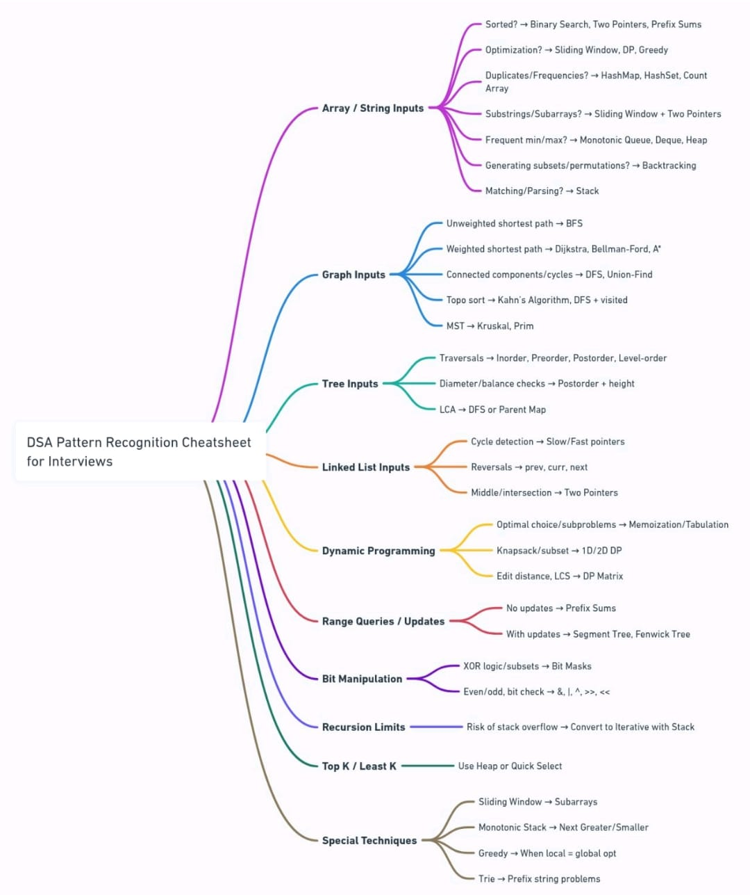

## 🧠 DSA Pattern Recognition Cheatsheet – Interview-Oriented Guide

This mindmap helps you **quickly identify the right algorithm or pattern** based on input type and problem behavior. It's a must-have for LeetCode, Codeforces, and FAANG interviews.

---

### 🟣 1. **Array / String Inputs**
Choose your approach based on the problem type:

- **Sorted?** → Use **Binary Search**, **Two Pointers**, or **Prefix Sums**
- **Optimization Problem?** → Try **Sliding Window**, **Dynamic Programming**, or **Greedy**
- **Duplicates/Frequencies?** → Go for **HashMap**, **HashSet**, or **Count Array**
- **Substrings/Subarrays?** → Use **Sliding Window** or **Two Pointers**
- **Frequent min/max?** → Use **Monotonic Queue**, **Deque**, or **Heap**
- **Subsets/Permutations?** → Use **Backtracking**
- **Matching/Parsing (e.g. brackets)?** → Use a **Stack**

---

### 🔵 2. **Graph Inputs**
Depends on whether the graph is weighted, directed, etc.

- **Unweighted Shortest Path** → **BFS**
- **Weighted Shortest Path** → **Dijkstra**, **Bellman-Ford**, or **A\***
- **Connected Components/Cycles** → **DFS**, **Union-Find**
- **Topological Sort** → **Kahn's Algorithm**, **DFS with visited**
- **Minimum Spanning Tree (MST)** → **Kruskal**, **Prim**

---

### 🟢 3. **Tree Inputs**
Great for recursion-based logic:

- **Traversals** → **Inorder**, **Preorder**, **Postorder**, **Level Order**
- **Diameter / Balance Check** → **Postorder traversal** with height tracking
- **LCA (Lowest Common Ancestor)** → **DFS** or **Parent Map**

---

### 🟠 4. **Linked List Inputs**

- **Cycle Detection** → Use **Slow/Fast pointers** (Floyd’s Algorithm)
- **Reversal** → Use three pointers: `prev`, `curr`, `next`
- **Find Middle / Intersection** → Use **Two Pointers**

---

### 🔴 5. **Dynamic Programming (DP)**

- **Optimal Substructure** → Use **Memoization** or **Tabulation**
- **Knapsack / Subset problems** → 1D/2D DP Table
- **Edit Distance, LCS** → **DP Matrix**

### 🔶 Kadane’s Algorithm (Max Subarray – Dynamic Programming)

- **Use case**: Find the maximum sum of a contiguous subarray in a given array.
- **Technique**: Track local max at each step and update global max.
- **Core Idea**:  

---

### 🟡 6. **Range Queries / Updates**

- **Static Array** → Use **Prefix Sums**
- **Dynamic Updates** → Use **Segment Tree**, **Fenwick Tree**

---

### 🟣 7. **Bit Manipulation**

- **Subsets / XOR Logic** → Use **Bit Masks**
- **Bitwise Checks** → `&`, `|`, `^`, `~`, `>>`, `<<`, etc.

---

### 🟤 8. **Recursion Limits**

- Risk of stack overflow? → Convert to **Iterative** using **Explicit Stack**

---

### 🟢 9. **Top K / Least K Elements**

- Use **Heap** (Min/Max Heap) or **Quick Select**

---

### ⚫ 10. **Special Techniques**

- **Sliding Window** → For **Subarrays** or **Fixed-size windows**
- **Monotonic Stack** → **Next Greater/Smaller Element**
- **Greedy** → When **local opt = global opt**
- **Trie** → For **Prefix-based problems**

---

## ✅ Final Note:

This cheatsheet is like a **DSA radar**:  
> “When I see _this type of input_ and _this kind of question_, I should try _this technique_.”

Use it to **reduce brute force** and move straight to **pattern-based efficient solutions**.

## 📌 Additional Classic Patterns (Not in Mindmap)

### 🔶 Merge Intervals
- **Use case**: Overlapping intervals, time slots
- **Technique**: Sort + Merge if overlapping
- **Common Problems**: Merge Intervals, Insert Interval, Interval List Intersections

### 🔶 Cyclic Sort
- **Use case**: Arrays with elements 1 to N
- **Technique**: Place elements at correct indices
- **Common Problems**: Find Missing Number, Find Duplicate, All Duplicates in Array

### 🔶 In-Place Linked List Reversal
- **Use case**: Reverse a list without extra space
- **Technique**: Use `prev`, `curr`, `next` pointers
- **Common Problems**: Reverse Linked List, Reverse Every K Nodes, Reverse Sublist

### 🔶 Two Heaps
- **Use case**: Continuous median, window medians
- **Technique**: Maintain maxHeap + minHeap balance
- **Common Problems**: Median of Stream, Sliding Window Median

### 🔶 K-Way Merge
- **Use case**: Merge multiple sorted arrays/lists
- **Technique**: Use MinHeap with indices tracking
- **Common Problems**: Merge K Lists, Kth Smallest in Sorted Matrix

### 🔶 Modified Binary Search
- **Use case**: Problems like rotated arrays, next greatest, ceiling/floor
- **Technique**: Tweaked binary search
- **Common Problems**: Bitonic Array Search, Order-agnostic Search

### 🔶 Multi-threaded Patterns
- **Use case**: Concurrent execution, semaphores
- **Technique**: Thread synchronization & parallelism
- **Common Problems**: H2O Generator, FizzBuzz Multithreaded

---

## 📌 Advanced & Niche Patterns (For FAANG L5+ / System Design Depth)

### 🔶 Union-Find with Path Compression
- **Use case**: Fast group merging & lookup in disjoint sets.
- **Technique**: Combine `find()` and `union()` with path compression & union by rank.
- **Common Problems**: Graph Redundant Connection, Number of Provinces, Kruskal's MST

---

### 🔶 Lazy Segment Tree (with Propagation)
- **Use case**: Range updates + range queries in large arrays.
- **Technique**: Use a tree with delayed updates to optimize bulk operations.
- **Common Problems**: Range Sum with Update, Interval Cover Queries

---

### 🔶 Mo’s Algorithm (Sqrt Decomposition)
- **Use case**: Answer offline range queries efficiently.
- **Technique**: Sort queries cleverly and use two pointers to maintain frequency/count.
- **Common Problems**: Frequency in range, Sum of distinct elements in subarray

---

### 🔶 Suffix Automaton / Trie / Tree
- **Use case**: Advanced string problems (like substring counts, lex order, compression).
- **Technique**: Build a DAG/tree that encodes all substrings.
- **Common Problems**: Number of Distinct Substrings, Substring Matching in Large Text

---

### 🔶 Rolling Hash (Rabin-Karp)
- **Use case**: Efficient substring matching.
- **Technique**: Use modular arithmetic to compare hash values instead of substrings.
- **Common Problems**: Substring Hash Match, Detect Duplicate Substrings, Plagiarism Detection

---

### 🔶 Heavy-Light Decomposition (HLD)
- **Use case**: Tree queries like path sum, LCA with fast updates.
- **Technique**: Decompose the tree into paths and build segment trees on them.
- **Common Problems**: Path Queries on Trees, Online Tree Queries

---

### 🔶 Binary Lifting (for LCA & K-th Ancestor)
- **Use case**: Quickly jump ancestors or find LCA in O(logN).
- **Technique**: Preprocess jump table for 2^i jumps.
- **Common Problems**: LCA in Tree, Ancestor Queries

---

### 🔶 Bit Trie (Binary Trie)
- **Use case**: Max XOR pair, number range queries.
- **Technique**: Trie nodes store bits instead of characters.
- **Common Problems**: Maximum XOR of Two Numbers, XOR Queries

----

Here are 20 LeetCode questions that can significantly boost problem-solving skills:

> 1️⃣ Merge Intervals 
> 2️⃣ Koko Eating Bananas     
> 3️⃣ Search in Rotated Sorted Array      
> 4️⃣ Detect a Cycle in Linked List       
> 5️⃣ Word Search II      
> 6️⃣ Gas Station     
> 7️⃣ Sliding Window Maximum      
> 8️⃣ Coin Change     
> 9️⃣ Word Break      
> 🔟 Edit Distance      
> 1️⃣1️⃣ Trapping Rainwater     
> 1️⃣2️⃣ Largest Rectangle in a Histogram       
> 1️⃣3️⃣ Rod Cutting        
> 1️⃣4️⃣ Binary Tree Maximum Path Sum       
> 1️⃣5️⃣ Number of Distinct Islands     
> 1️⃣6️⃣ Rotten Oranges     
> 1️⃣7️⃣ Course Schedule II     
> 1️⃣8️⃣ Pacific Atlantic Water Flow        
> 1️⃣9️⃣ Cheapest Flights Within K Stops        
> 2️⃣0️⃣ Min Cost to Connect All Points     